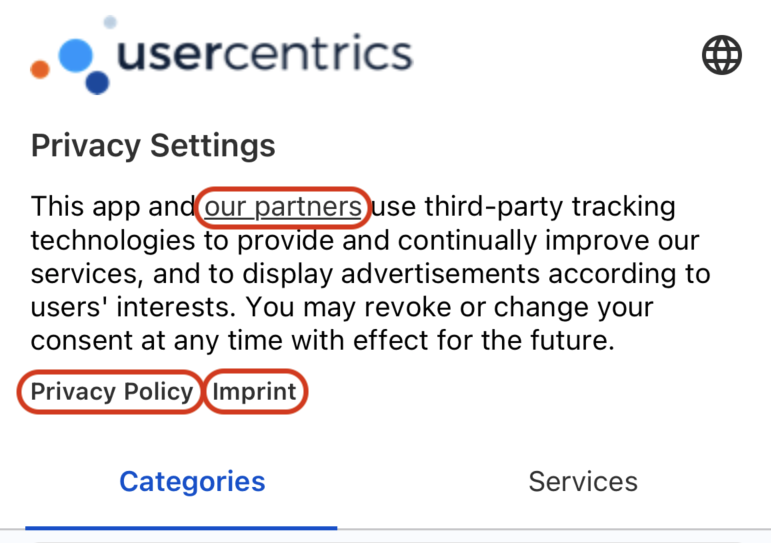

#Custom Hyperlinks

By default, when a user taps on any hyperlink available in the UsercentricsUI banner, the given URL will be opened in a browser.

{: .aligncenter .imageBorder width=300px }

If you wish to **customize this behaviour**, and capture these hyperlinks, you may leverage the already existing deeplink mechanism from iOS and Android, to capture hyperlinks.

##Define Deeplinks

Define a deeplink scheme for the links you will be catching, and provide the URL/s in our [Configuration Dashboard](https://admin.usercentrics.eu).

=== "Banner Message Links"

    {: .aligncenter .imageBorder width=600px }

=== "Legal Links"

    {: .aligncenter .imageBorder width=600px }

##Capture Deeplinks

=== "Swift<center><sub>iOS</sub></center>"

    **Configure Info.plist to listen a specific URL scheme**

    In order to capture Deep Links being clicked on your app, the first step is to configure `Info.plist`.

    {: .aligncenter .imageBorder width=800px }

    **Catch deeplink and provide custom implementation**

    Add a listener to `AppDelegate.swift`, and add the necessary logic for your custom implementation.

    ```swift
    // On AppDelegate
    func application(_ app: UIApplication, open url: URL, options: [UIApplication.OpenURLOptionsKey : Any] = [:]) -> Bool {
        return handleUrl(url)
    }

    func handleUrl(_ url: URL) -> Bool {
        if (url.scheme == "example" && url.host == "privacyPolicy") {
            // Custom Implementation for Link
            return true
        }
        return false
    }
    ```

=== "Kotlin<center><sub>Android</sub></center>"

    **Configure AndroidManifest.xml to listen a specific URL scheme**

    In order to capture deeplinks being triggered in your app, we should create an `Activity` on `AndroidManifest.xml` that will be responsible for receiving callbacks.

    ```xml
    <activity android:name=".DeepLinkActivity">

        <intent-filter android:label="deep link example">
            <action android:name="android.intent.action.VIEW" />

            <category android:name="android.intent.category.DEFAULT" />
            <data
                android:host="privacyPolicy"
                android:scheme="example" />
        </intent-filter>
    </activity>
    ```

    **Catch deeplink and provide custom implementation**

    On create, add the necessary logic for your custom implementation.

    ```kotlin
    class DeepLinkActivity: AppCompatActivity() {

        override fun onCreate(savedInstanceState: Bundle?) {
            super.onCreate(savedInstanceState)

            val data = intent?.data ?: return
            if (data.scheme == "example" && data.host == "privacyPolicy") {
                // Custom Implementation for Link
                finish()
            }
        }
    }
    ```
