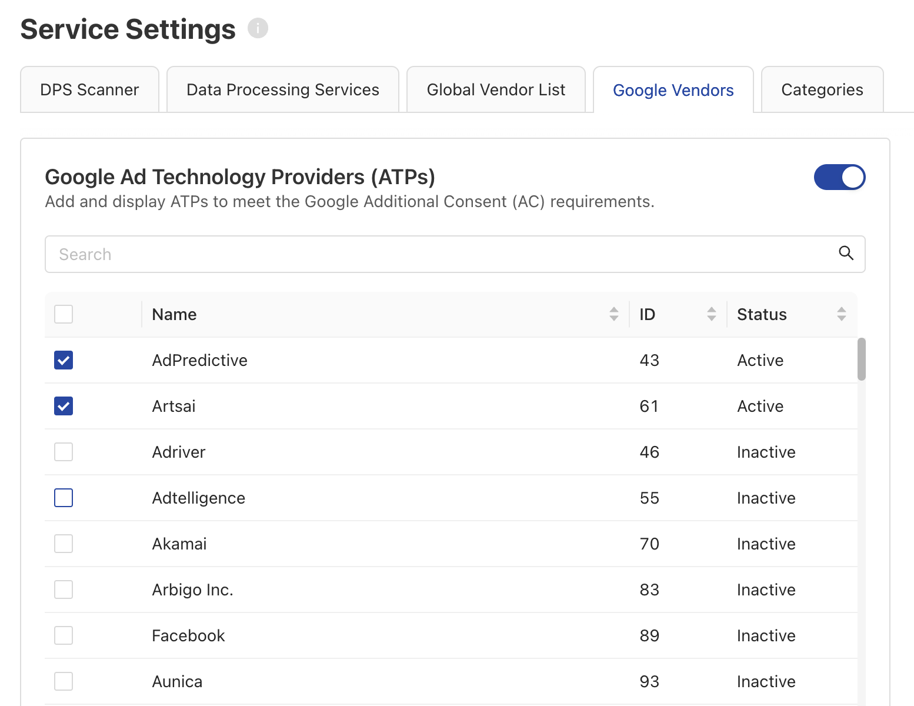

# Google Additional Consent

## What is Google Additional Consent?

Google’s Additional Consent is a technical specification designed to enable publishers to collect and signal additional consent for ad tech providers that are not part of the IAB Europe’s Transparency & Consent Framework (TCF) v2.2, but are listed on Google’s Ad Tech Providers (ATPs) [list](https://support.google.com/admanager/answer/9012903?sjid=6541888267895389824-EU). This specification is crucial for publishers that want to work with ad tech providers not using the TCF.
It is important to note that Google’s Additional Consent does not replace the standard IAB TCF v2.2 consent collection process, but supplements it, enabling an extra layer of consent collection for Google ATPs.

The Google Additional Consent V2 supports an Additional Consent (AC) String and to allow interoperability for CMPs that support TCF and Advertiser Consent Mode. For more information, please refer to this [guide](https://support.google.com/admanager/answer/9681920?hl=en).

## How to implement Google Additional Consent V2? 

Starting from version **2.11.0**, we are now supporting the Google Additional Consent V2.

To successfully incorporate Google Additional Consent V2 into your mobile application, there are a few essential steps to ensure a seamless integration process.

1. **Setup Google Ad Tech Providers in your configuration**:
    Please go to your configuration in Admin Interface settings, in Google Vendors tab, under Service Settings, please enable the Google Ad Technology Providers (ATPs) and select your desired providers.
       
    {: .center width=800px }

!!! success "That's it! 🚀 your app is now using the Google Additional Consent Mode V2."

To access the Additional Consent Mode Data generated by the SDK, please check the [following API](../api/core-api.md#getadditionalconsentmodedata).
