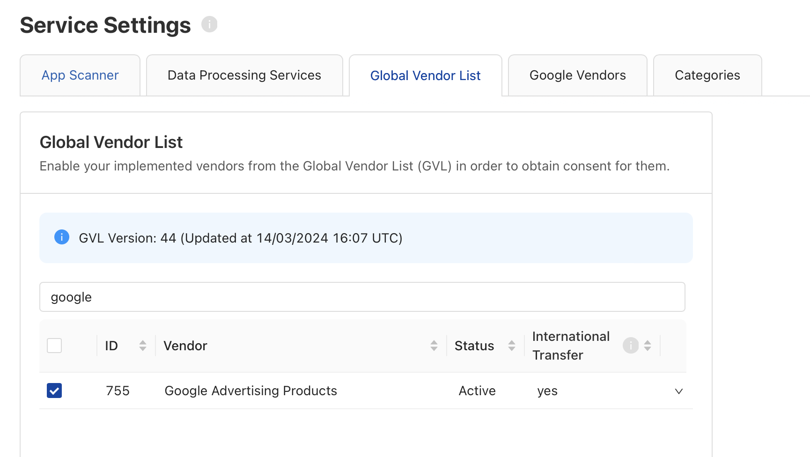
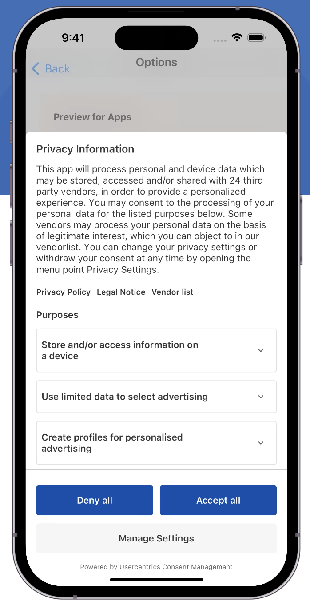
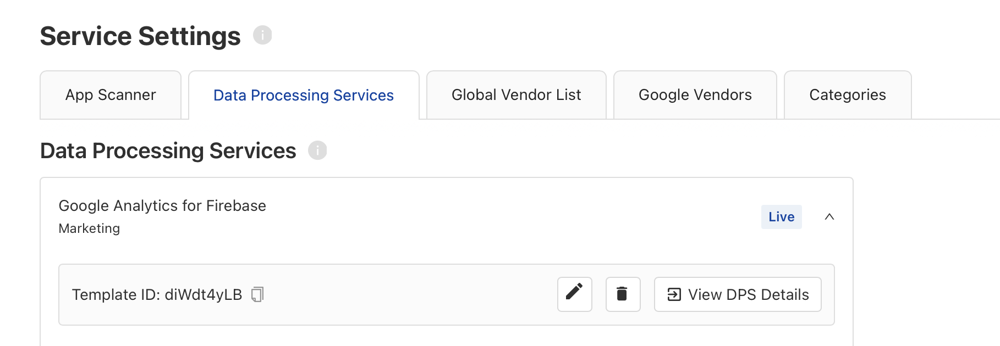

# Google Consent Mode

## What is Google Consent Mode?

[Google Consent mode](https://support.google.com/analytics/answer/9976101?hl=en) helps you to obtain your users consent and pass it to Google seamlessly. Consequently, Google tools
adjust their behaviors automatically. Google further supplements this by filling gaps through conversion modeling and behavioral modeling, aiding you in achieving your marketing
goals. For mobile applications, this is crucial to ensure the proper functioning of Firebase Services.

!!! warning "Those who do not have consent mode enabled will not be able to capture new EEA users in their audiences starting from March 2024."

## How to implement Google Consent Mode in your app

To successfully incorporate Google Consent Mode V2 into your mobile application, there are a few essential steps to ensure a seamless integration process.

### Consent Types

Google created four new types of consent types which includes:

| Consent Type            | Description                                                                                                             |
|-------------------------|-------------------------------------------------------------------------------------------------------------------------|
| ad_storage              | Enables storage, such as cookies (web) or device identifiers (apps), related to advertising.                            |
| ad_user_data            | Sets consent for sending user data to Google for online advertising purposes.                                           |
| ad_personalization      | Sets consent for personalized advertising.                                                                              |
| analytics_storage       | Enables storage, such as cookies (web) or device identifiers (apps), related to analytics, for example, visit duration. |

More details can be found in their [official documentation](https://developers.google.com/tag-platform/security/concepts/consent-mode#consent-behavior).

### Setting up Account Settings

To streamline all consent types to Google, it's crucial to adhere to the steps outlined below.
Following are instructions according to the chosen legal framework available on our Admin Interface.

=== "TCF 2.2 + GDPR"

    Google adheres entirely to TCF policies and is registered as a vendor with ID 755 on IAB Global Vendor List (check out the [Vendor List](https://iabeurope.eu/vendor-list-tcf/)).

    Therefore, it's **mandatory to select this vendor** from the Global Vendor List to enable the SDK to signal Consent Mode accurately.

    {: .aligncenter .imageBorder width=600px }

    _Full overview of the purposes and corresponding consent types can be found in the [official documentation](https://developers.google.com/tag-platform/security/guides/implement-TCF-strings#tag_behavior)._
      

    Example banner:

    {: .aligncenter .imageBorder width=200px }

    After end-user interacts with the banner, the following scenarios could happen:

    **- Accept All ✅**
     
    &emsp; All Consent Types will be set to `true`.

    **- Deny All ❌**
     
    &emsp; All Consent Types will be set to `false`.

    **- Save Settings (granular choices) 📋**
     
    &emsp; This is the trickiest scenario because the Consent Types may have different values, since it will vary according to the consent given to 
    Google Adverting Products TCF Vendor, Purposes being used and their Legal Basis.
     
    &emsp; Short example: 
     
    {: .aligncenter .imageBorder width=600px }
     
    &emsp; Above we have:
     
    &emsp;&emsp; - Google Adverting Products (**Vendor ID 755**) -> Consent ❌ Legitimate Interest ✅
      
    &emsp;&emsp; - Store and/or access information on a device (**Purpose 1**) -> Consent ❌
     
    &emsp;&emsp;&emsp; therefore `ad_storage = denied` and `ad_user_data = denied`
      
    &emsp;&emsp; - Create profiles for personalised advertising (**Purpose 3**) -> Consent ❌
     
    &emsp;&emsp;&emsp; therefore `ad_personalization = denied`
      
    &emsp;&emsp; - Use profiles to select personalised advertising (**Purpose 4**) -> Consent ❌
     
    &emsp;&emsp;&emsp; therefore `ad_personalization = denied`
      
    &emsp;&emsp; - Measure advertising performance (**Purpose 7**) -> Legitimate Interest ✅
     
    &emsp;&emsp;&emsp; therefore `ad_user_data = denied` since Purpose 1 Consent ❌  
     
    &emsp;&emsp; - Apply market research to generate audience insights (**Purpose 9**) -> Legitimate Interest ✅
     
    &emsp;&emsp;&emsp; therefore `analytics_storage = granted`, since Purpose 10 has Legitimate Interest ✅ 
      
    &emsp;&emsp; - Develop and improve services (**Purpose 10**) -> Legitimate Interest ✅
     
    &emsp;&emsp;&emsp; therefore `analytics_storage = granted` since Purpose 9 has Legitimate Interest ✅
       
    &emsp; This is just an example of how granular consents work, in order to gain a more detailed understanding, we recommend to follow Google's [official documentation](https://developers.google.com/tag-platform/security/guides/implement-TCF-strings#tag_behavior).
      
    &emsp; All the details on how Google will process the generated TCString, [click here](https://support.google.com/admob/answer/9461778?hl=en-GB).

=== "GDPR Only"

    When using GDPR only we will only update the value to the `analytics_storage` flag and set analytics collection enabled or disabled, according to the consent given to **Google Analytics for Firebase**.
    More details on how we implement the signaling, check out our [Consent Mediation documentation](./consent-mediation.md#google-analytics-for-firebase).

    Therefore, it's **mandatory to select this Data Processing Service** to enable the SDK to signal Consent Mode accurately.

    {: .aligncenter .imageBorder width=600px }
