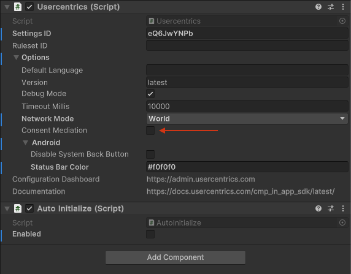

### Configuring the SDK


=== "iOS"

    1\. Integrate with Usercentrics SDK starting from version **2.13.2**.
    <br />
    
    2\. **Activate the Usercentrics Consent Mediation Feature**:
    
    ```swift
    let options = UsercentricsOptions(..., consentMediation: true)
    ```
    
    Refer to the specific set of the documentation for more [detailed instructions](consent-mediation.md) if needed.
    <br />

    3\. **Add Firebase Library to your app**:
    
    Use the minimum version of [10.17.0](https://firebase.google.com/support/release-notes/ios#version_10170_-_oct_30_2023).
    Please refer to its [guide](https://firebase.google.com/docs/analytics/get-started?platform=ios) for detailed instructions on integration.
    
    4\. **Add the Consent Mode keys to your app's info.plist file**:

    Assign `false` values to the keys to establish default permission where GDPR or another legal framework requires consent to be explicitly given.

    More information can be found [here](https://developers.google.com/tag-platform/security/guides/app-consent?platform=ios).

    ```
    <key>GOOGLE_ANALYTICS_DEFAULT_ALLOW_ANALYTICS_STORAGE</key> <false/>
    <key>GOOGLE_ANALYTICS_DEFAULT_ALLOW_AD_STORAGE</key> <false/>
    <key>GOOGLE_ANALYTICS_DEFAULT_ALLOW_AD_USER_DATA</key> <false/>
    <key>GOOGLE_ANALYTICS_DEFAULT_ALLOW_AD_PERSONALIZATION_SIGNALS</key> <false/>
    ```

=== "Android"

    1\. Integrate with Usercentrics SDK starting from version **2.13.2**.
    <br />
    
    2\. **Activate the Usercentrics Consent Mediation Feature**:
    
    ```kotlin
    val options = UsercentricsOptions(..., consentMediation = true)
    ```
     
    Refer to the specific set of the documentation for more [detailed instructions](consent-mediation.md) if needed.
    <br />
    
    3\. **Add Firebase Library to your app**:
    
    Use the minimum version of [21.5.0](https://firebase.google.com/support/release-notes/android#2023-10-30) or 32.5.0 if you want to use the Firebase Android BoM.
    Please refer to its [guide](https://firebase.google.com/docs/analytics/get-started?platform=android) for detailed instructions on integration.

    4\. **Add the consent mode keys to your app's AndroidManifest.xml file**:

    Assign `false` values to the keys to establish default permission where GDPR or another legal framework requires consent to be explicitly given.

    ```
    <meta-data android:name="google_analytics_default_allow_analytics_storage" android:value="false" />
    <meta-data android:name="google_analytics_default_allow_ad_storage" android:value="false" />
    <meta-data android:name="google_analytics_default_allow_ad_user_data" android:value="false" />
    <meta-data android:name="google_analytics_default_allow_ad_personalization_signals" android:value="false" />
    ```

=== "Unity"

    1\. Enable Consent Mediation on Usercentrics Prefab.

    {: .aligncenter .imageBorder width=500px }

    2\. Please use the minimum version of [11.7.0](https://firebase.google.com/support/release-notes/unity).
    
    3\. Please refer to its [guide](https://firebase.google.com/docs/unity/setup).

    4\. Make sure to add default keys for each platform to establish default permission where GDPR or another legal framework requires consent to be explicitly given.

    **Android** (AndroidManifest.xml):

    ```
    <meta-data android:name="google_analytics_default_allow_analytics_storage" android:value="false" />
    <meta-data android:name="google_analytics_default_allow_ad_storage" android:value="false" />
    <meta-data android:name="google_analytics_default_allow_ad_user_data" android:value="false" />
    <meta-data android:name="google_analytics_default_allow_ad_personalization_signals" android:value="false" />
    ```

    **iOS** (Info.plist):

    ```
    <key>GOOGLE_ANALYTICS_DEFAULT_ALLOW_ANALYTICS_STORAGE</key> <false/>
    <key>GOOGLE_ANALYTICS_DEFAULT_ALLOW_AD_STORAGE</key> <false/>
    <key>GOOGLE_ANALYTICS_DEFAULT_ALLOW_AD_USER_DATA</key> <false/>
    <key>GOOGLE_ANALYTICS_DEFAULT_ALLOW_AD_PERSONALIZATION_SIGNALS</key> <false/>
    ```


!!! success "That's it! 🚀 we will now apply the consent mode to Firebase Analytics SDK."
