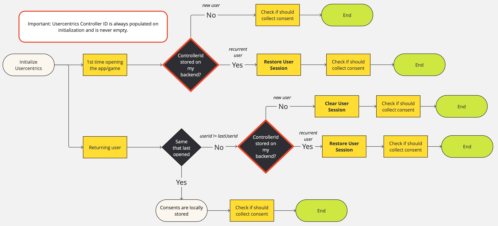

# Restoring a User Session & Cross-Device Consent Sharing

!!! tip "Premium Feature"
    Cross-Device Consent Sharing is a **Premium Feature** that is only enabled on request. Please reach out to your Customer Success Manager for more information.

### Overview

The 'Restore User Session' feature in our SDK is a specialized tool designed for a specific use case: retrieving user consents that were previously granted on a different device.
This feature is ideal for scenarios where users switch between devices, such as moving from a web interface to a smartphone.

#### Key Concept

**One-Time Restoration**: This feature is intended to restore consents only once from another system, ensuring a seamless user experience across devices.

### Examples of Use Cases

* **User Switching Devices**: A user grants consent on a web application and later accesses the mobile app. Using 'Restore User Session', the consents are carried over, eliminating the need for re-consent on the mobile app.
* **Login Process**: Integrate the 'Restore User Session' feature during the user login routine to seamlessly transition consents across different sessions or platforms.

## Implementation Guide

#### Prerequisites

* Consistent use of the **same Settings ID across your systems**.
* Secure storage of the Controller ID provided by Usercentrics.

#### Steps for Implementation

1. **Store Controller ID**: Save the Controller ID that Usercentrics provides. This ID is crucial for identifying the user session across different platforms
2. **API Invocation**: Call the `restoreUserSession` API immediately after initializing the SDK and checking if it's ready
3. **Session Restoration Callback**: After invoking the API, verify if the session was successfully restored. If the restoration fails, prompt the user to provide their consents again

## What is Controller ID?

A `controllerID` is a Usercentrics generated ID, used to identify a user's consent history. 

In the moment that a user provides consent, the SDK will generate a `controllerID` that identifies that specific user to it's privacy choices.
This ID will be stored locally and available to you after a user gives consent:

=== "Swift<center><sub>iOS</sub></center>"
         
    ```swift
    banner.showFirstLayer(...) { userResponse in
        let controllerID = userResponse.controllerId
    }
    ```    

=== "Kotlin<center><sub>Android</sub></center>"
    
    ```kotlin
    banner.showFirstLayer(...) { userResponse ->
        val controllerId = userResponse?.controllerId
    }
    ```

=== "Dart<center><sub>Flutter</sub></center>"

    ```dart
    final userResponse = await Usercentrics.showFirstLayer(...);
    val controllerId = userResponse?.controllerId
    ```

=== "Typescript<center><sub>React Native</sub></center>"

    ```typescript
    import { Usercentrics } from '@usercentrics/react-native-sdk';

    const userResponse = await Usercentrics.showFirstLayer(...);
    const controllerId = response.controllerId;
    ```

=== "C#<center><sub>Unity</sub></center>"

    ```c#
    Usercentrics.Instance.ShowFirstLayer(<UsercentricsLayout>, (userResponse) => {
        var controllerId = userResponse.controllerId;
    });
    ```

or you can get it by calling `getControllerId()` after the initialization:

=== "Swift<center><sub>iOS</sub></center>"

    ```swift
    let controllerID = UsercentricsCore.shared.getControllerId()
    ```
=== "Kotlin<center><sub>Android</sub></center>"

    ```kotlin
    val controllerId = Usercentrics.instance.getControllerId()
    ```

=== "Dart<center><sub>Flutter</sub></center>"

    ```dart
    final controllerId = await Usercentrics.getControllerId();
    ```

=== "Typescript<center><sub>React Native</sub></center>"

    ```typescript
    import { Usercentrics } from '@usercentrics/react-native-sdk';

    const controllerId = await Usercentrics.getControllerId();
    ```

=== "C#<center><sub>Unity</sub></center>"

    ```c#
    Usercentrics.Instance.GetControllerID();
    ```

## Implementation

You can now take this ID, and restore a user session in another Usercentrics supported platform, such as iOS, Android, TV, Web or Unity.
By using the method `restoreUserSession` and passing the controllerID:

=== "Swift<center><sub>iOS</sub></center>"   
         
    ```swift
    UsercentricsCore.shared.restoreUserSession(controllerId: controllerId) { status in
        // This callback is equivalent to isReady API
        if status.shouldCollectConsent {
            // Collect Consent
        } else {
            // Session restored: apply consent with status.consents
        }
    } onFailure: { error in
        // Handle non-localized error
    }
    ```
        
=== "Kotlin<center><sub>Android</sub></center>"
    
    ```kotlin
    Usercentrics.instance.restoreUserSession(controllerId, { status ->
        // This callback is equivalent to isReady API
        if (status.shouldCollectConsent) {
            // Collect Consent
        } else {
            // Session restored: apply consent with status.consents
        }
    }, { error ->
        // Handle non-localized error
    })
    ```

=== "Dart<center><sub>Flutter</sub></center>"

    ```dart
    try {
      final status = Usercentrics.restoreUserSession(controllerId: controllerId);

      if (status.shouldCollectConsent) {
        // Collect Consent
      } else {
        // Session restored: apply consent with status.consents
      }
    } catch (error) {
      // Handle non-localized error
    }
    ```

=== "Typescript<center><sub>React Native</sub></center>"

    ```typescript
    import { Usercentrics } from '@usercentrics/react-native-sdk';

    try {
      const status = Usercentrics.restoreUserSession(controllerId: controllerId);

      if (status.shouldCollectConsent) {
        // Collect Consent
      } else {
        // Session restored: apply consent with status.consents
      }
    } catch (error) {
      // Handle non-localized error
    }
    ```

=== "C#<center><sub>Unity</sub></center>"

    ```c#
    Usercentrics.Instance.RestoreUserSession(<controllerId>, (status) => {
        if (status.shouldCollectConsent)
        {
            // Collect Consent
        }
        else
        {
            // Session restored: apply consent with status.consents
        }
    }, (errorString) => {
        // Handle non-localized error
    });
    ```

## Graphical overview

{: .aligncenter .imageBorder width=800px }

## Best Practices

#### Avoid Routine Invocation

Do not invoke the `restoreUserSession` method as part of regular operations. It's best suited for specific instances, like during the login process.

#### Save controllerId only after user gave consent

The `controllerId` serves as a reference to the consents provided by the end-user. Therefore, it is recommended to store it on your premises only after the user has
interacted with the banner and the consents are ready to be processed.

#### Single-Use Restoration

Remember that this feature is designed for a one-time restoration of user consents from another system. Repeated attempts to restore the session using the same Controller ID
will not be successful.

!!! warning "What happens if I call `restoreUserSession` repeatedly?"
    The SDK is designed to only restore the session once. Repeated calls, especially with the same Controller ID, will not initiate additional session restorations.

!!! warning "CCPA/CPRA and US Frameworks (VCDPA, CPA, CTDPA, UCPA) are not supported"
    Cross-Device Consent Sharing is not supported for CCPA/CPRA and US Frameworks. The consent collected for these frameworks is only meant for the device the consent was given in.
