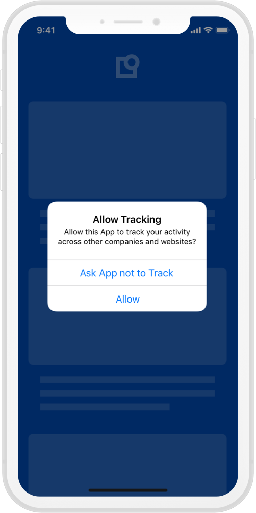
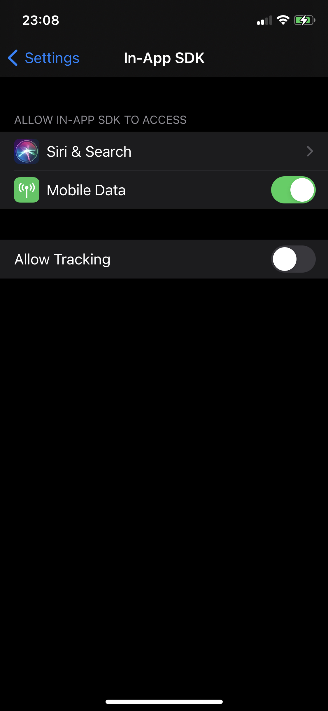

#AppTrackingTransparency Framework - iOS 14.5

Starting with iOS 14.5, Apple requires you to declare the type of data your app is tracking and ask users for permission to track them. For this, Apple has provided the [AppTrackingTransparency](https://developer.apple.com/documentation/apptrackingtransparency) framework. (ATT)

{: .aligncenter width=300px }

## Does ATT replace a CMP?

No, it does not. A CMP collects consent based on the legal requirements of a framework, such as GDPR or CCPA/CPRA, which are valid in their respective jurisdiction. Where as ATT is designed to provide transparency about the tracking practices of an App. The underlying value of ATT is to empower users, by giving them the control over who can have access to their Advertising Identifier (IDFA, an ID used by advertisers to identify a unique user/device and provide personalized ads), by signaling to the app developer, that tracking practices should/should not be enabled.   

## How to support ATT?

1. Add NSUserTrackingUsageDescription to your info.plist, with a description explaining why you want to track your user's data, Import the framework.

2. Create an iOS 14 or later function, and request permission with the AppTrackingTransparency framework.

    ```swift
    import AppTrackingTransparency
        
    @available(iOS 14, *)
    private func requestAppTrackingTransparencyPermission() {
        
        ATTrackingManager.requestTrackingAuthorization { status in
            switch status {
            case .authorized:
                // Handle Approve case
            case .denied:
                // Handle Deny case
            default:
                // Consider .restricted and .notDetermined states if needed
            }
        }
       
    }
    ```
   
3. Depending on your App Flow, you may request ATT permission whenever you deem convenient, but we recommend collecting both legal consent via the Usercentrics CMP and ATT permission in consecutive steps. 
    
    ```swift
    if #available(iOS 14, *) {
        self.requestAppTrackingTransparencyPermission()
    }
    ```

If permission has never been requested, the system will prompt the ATT pop-up, and the result will be return on the callback. 
Once permission has been collected, any future call to this function will directly return the permission status without presenting the pop-up. 

## Is it possible for a user to change their ATT decision?

In case you change your tracking practices and want to guide your users to re-evaluate their ATT decision, you can always facilitate the path to your App Settings, by calling the following method:

```swift
if let appSettings = NSURL(string: UIApplication.openSettingsURLString) {
    UIApplication.shared.open(appSettings as URL, options: [:], completionHandler: nil)
}
```   

This will forward users to your specific App settings, where they can change their settings if they so wish.

{: .aligncenter width=200px }   

!!! warning "Do NOT force users to give ATT permission"
    We highly discourage limiting functionality or blocking users, if they do not provide ATT permission.
