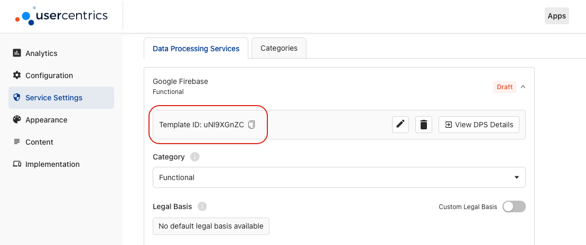
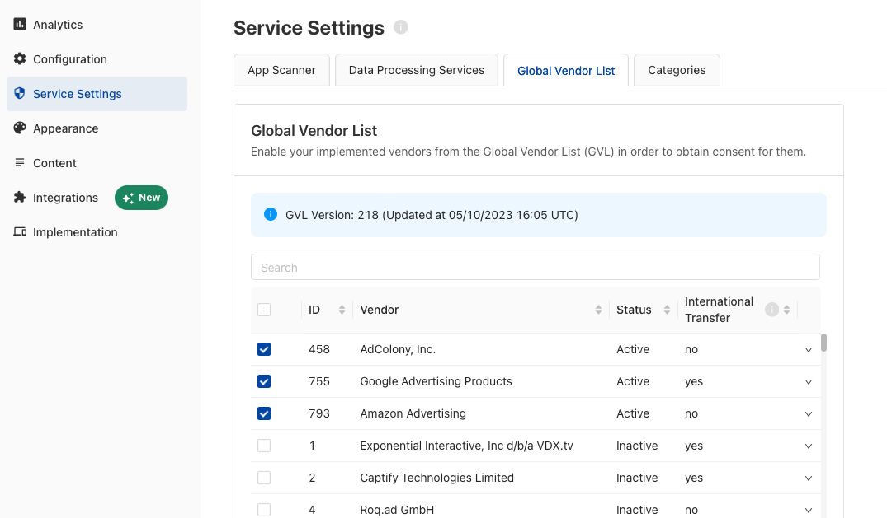

# Applying Consent

Now that you have collected consent, let's make sure to respect the user's choices by applying consent to each SDK.

!!! danger "IMPORTANT: Please review EVERY vendor's documentation to understand how each SDK expects consent to be passed."
    **DO NOT** assume consent is passed automatically to every SDK. Even if you are using the [TCF standard](#vendors-following-the-tcf-22-standard) or our [Consent Mediation](../features/consent-mediation.md) feature, please test and verify that consent is reaching the target SDKs.

First, we need a way to match the 3rd party technologies declared in your configuration, with the SDKs running in your App.

## When should you apply consent?

### After collecting consent
It is a given that consent will only change if the banner is shown to the user and an action is taken. 
When using the **UsercentricsUI**, the callback will return the new values, and you will need to use it to apply consent:

=== "Swift<center><sub>iOS</sub></center>"
    ```swift    
    let banner = UsercentricsBanner()
    banner.showFirstLayer(hostView: self) { userResponse in
        self.applyConsent(with: userResponse.consents)
    }
    ```

=== "Kotlin<center><sub>Android</sub></center>"
    ```kotlin
    val banner = UsercentricsBanner(<Context>)
    banner.showFirstLayer() { userResponse ->
        applyConsent(userResponse?.consents)
    }
    ```

=== "Dart<center><sub>Flutter</sub></center>"
    ```dart
    final userResponse = await Usercentrics.showFirstLayer();
    applyConsent(userResponse?.consents);
    ```

=== "Typescript<center><sub>React Native</sub></center>"
    ```typescript
    const userResponse = await Usercentrics.showFirstLayer();
    applyConsent(userResponse.consents);
    ```

In a similar manner, if you are **building your own UI**, you will need to apply consent after any consent storage action is triggered:

=== "Swift<center><sub>iOS</sub></center>"

    ```swift
    let consents = UsercentricsCore.shared.acceptAll(consentType: .explicit_) // also applies for "deny" and "save"
    self.applyConsent(with: consents)
    ```

=== "Kotlin<center><sub>Android</sub></center>"

    ```kotlin
    val consents = Usercentrics.instance.acceptAll(consentType = UsercentricsConsentType.EXPLICIT) // also applies for "deny" and "save"
    applyConsent(consents)
    ```

=== "Dart<center><sub>Flutter</sub></center>"

    ```dart
    final consents = Usercentrics.acceptAll(consentType: UsercentricsConsentType.explicit); // also applies for "deny" and "save"
    applyConsent(consents);
    ```

=== "Typescript<center><sub>React Native</sub></center>"

    ```typescript
    const consents = Usercentrics.acceptAll(UsercentricsConsentType.explicit); // also applies for "deny" and "save"
    applyConsent(consents);
    ```

### After a new app launch
The first time you launch the app with the Usercentrics SDK, no consent will have been collected, and the `status` returned in `isReady` will let you know if you should collect consent.

However, in any future initialization after the first one, you will already have a **consent status**, and you will only need to apply it.

=== "Swift<center><sub>iOS</sub></center>"

    ```swift
    UsercentricsCore.isReady { status in
        if status.shouldCollectConsent {
            // Collect Consent
        } else {
            self.applyConsent(with: status.consents)
        }
    } onFailure: { error in 
        // Handle non-localized error
    }
    ```

=== "Kotlin<center><sub>Android</sub></center>"

    ```kotlin
    Usercentrics.isReady({ status ->
        if (status.shouldCollectConsent) {
            // Collect Consent
        } else {
            applyConsent(status.consents)
        }
    },{ error ->
        // Handle non-localized error
    })
    ```

=== "Dart<center><sub>Flutter</sub></center>"

    ```dart
    try {
      final status = await Usercentrics.status;

      if (status.shouldCollectConsent) {
        //Collect Consent
      } else {
        applyConsent(status.consents);
      }
    } catch (error) {
      // Handle non-localized error
    }
    ```

=== "Typescript<center><sub>React Native</sub></center>"

    ```typescript
    import { Usercentrics } from '@usercentrics/react-native-sdk';

    try {
      const status = await Usercentrics.status();

      if (status.shouldCollectConsent) {
        //Collect Consent
      } else {
        applyConsent(status.consents);
      }
    } catch (error) {
      // Handle non-localized error
    }
    ```

!!! tip "Getting consent on demand"
    You may also call `UsercentricsCore.shared.getConsents()` to get the consent directly, but make sure to do so after the `isReady` callback has been triggered.


## How to apply consent?
SDKs that access and process user and/or device data, are **only allowed** to do so, if the user has given explicit consent.
In order to be compliant, please review **every** SDK in your App for the following cases:

### Data Processing Services (DPS)

#### How to match a DPS with an SDK?
Every service (DPS) available in our database, such as:

* Google Firebase
* Unity Ads
* Adjust
* AppLovin
* Vungle

will have a unique `templateID` to identify it. This ID can be found under **Service Settings > Data Processing Services > Service Extended Information**.

{: .aligncenter .imageBorder width=800px }

We will be using this ID to match every declared service with it's SDK.

#### SDKs with a consent API
SDKs that support data privacy compliance, will provide an API to set the user's consent status. The API and it's behaviour will be documented by the SDK's provider.

e.g.

* Google Analytics for Firebase's [Consent Mode](https://developers.google.com/tag-platform/devguides/app-consent)
* Unity Ad's [Privacy consent and data API](https://docs.unity.com/ads/ImplementingDataPrivacy.html)
* AppLovin's [Privacy API](https://dash.applovin.com/documentation/mediation/ios/getting-started/privacy)

!!! tip "Regulation dedicated APIs"
    Please note that most APIs are dedicated for a specific regulation. e.g. GDPR for Europe, CCPA/CPRA for US/California, COPPA for children protection, etc. Make sure to review the documentation and apply the consent for the correct regulation. 

To apply consent to these SDKs, [identify the target SDK](#how-to-match-a-dps-with-an-sdk) and implement the consent API as documented:


=== "Swift<center><sub>iOS</sub></center>"

    ```swift
    func applyConsent(with consents: [UsercentricsServiceConsent]) {
        for service in consents {
            switch service.templateId {
            case "diWdt4yLB": // Google Analytics for Firebase Template ID

                // Google Firebase Consent Mode API
                let firebaseConsentStatus = service.status ? .granted : .denied
                Analytics.setConsent([
                    .analyticsStorage: firebaseConsentStatus
                    .adStorage: firebaseConsentStatus
                ])
                initializeFirebase()

            case "x-XXXxXx": // Other Service Template ID
                // Pass consent to framework with service.status
            default:
                // Log a warning if a service was not caught or do nothing
            }
        }
    }
    ```

=== "Kotlin<center><sub>Android</sub></center>"

    ```kotlin
    fun applyConsent(consents: List<UsercentricsServiceConsent>?) {
        consents?.forEach { service ->
            when (service.templateId) {
                "diWdt4yLB" -> { // Google Analytics for Firebase Template ID

                    // Google Firebase Consent Mode API
                    val firebaseConsentStatus = if (service.status) ConsentStatus.GRANTED else ConsentStatus.DENIED
                    Firebase.analytics.setConsent {
                        analyticsStorage(firebaseConsentStatus)
                        adStorage(firebaseConsentStatus)
                    }
                    initializeFirebase()    

                }
                // Other Service Template ID
                "x-XXXxXx" -> {
                    // Initialize or pass consent to framework with service.status
                }
                else -> {
                    // Log a warning if a service was not caught or do nothing
                }
            }
        }
    }
    ```

=== "Dart<center><sub>Flutter</sub></center>"

    ```dart
    void applyConsent(List<UsercentricsServiceConsent>? consents) {
      consents?.forEach((service) {
        switch (service.templateId) {
          case "diWdt4yLB": // Google Analytics for Firebase Template ID

            // Google Firebase Consent Mode API
            applyConsentToFirebase(service.status) // See iOS and Android examples
            initializeFirebase()    

            break;
          case "x-XXXxXx": // Other Service Template ID
            // Initialize or pass consent to framework with service.status
            break;
          default:
            // Log a warning if a service was not caught or do nothing
        }
      });
    }
    ```
=== "Typescript<center><sub>React Native</sub></center>"

    ```typescript
    import { UsercentricsServiceConsent } from '@usercentrics/react-native-sdk';

    const applyConsents = (consents: [UsercentricsServiceConsent]) => {
        consents.forEach(service => {
            switch (service.templateId) {
                case "diWdt4yLB": // Google Analytics for Firebase Template ID

                    // Google Firebase Consent Mode API
                    applyConsentToFirebase(service.status) // See iOS and Android examples
                    initializeFirebase()
                    break;

                // Other Service Template ID
                case "x-XXXxXx":
                    // Initialize or pass consent to framework with service.status
                    break;

                default:
                    // Log a warning if a service was not caught or do nothing
            }
        });
    }
    ```

!!! danger "Not all APIs are created equal"
    Please make sure you read through each documentation, as many providers might require other steps to fully be complaint.

#### SDKs without a consent API

For SDKs that track user/device data and do not offer a consent API, the only solution is to not initialize those SDKs, when a user did not provide consent.

=== "Swift<center><sub>iOS</sub></center>"

    ```swift
    func applyConsent(with consents: [UsercentricsServiceConsent]) {
        for service in consents {
            switch service.templateId {
            case "x-XXXxXx": // Template ID

                // Only initialize an SDK if consent has been given
                if service.status { initializeSDK() }

            case "x-xXX-Xx": // Other Service Template ID
                //Initialize framework based on service.status
            default:
                // Log a warning if a service was not caught or do nothing
            }
        }
    }
    ```

=== "Kotlin<center><sub>Android</sub></center>"

    ```kotlin
    fun applyConsent(consents: List<UsercentricsServiceConsent>?) {
        consents?.forEach { service ->
            when (service.templateId) {
                "x-XXXxXx" -> { // Template ID
                    // Only initialize an SDK if consent has been given
                    if (service.status) {
                        initializeSDK()
                    }
                }
                "x-xXX-Xx" -> { // Other Template ID
                    //Initialize framework based on service.status
                }
                else -> {
                    // Log a warning if a service was not caught or do nothing
                }
            }
        }
    }
    ```

=== "Dart<center><sub>Flutter</sub></center>"

    ```dart
    void applyConsent(List<UsercentricsServiceConsent>? consents) {
      consents?.forEach((service) {
        switch (service.templateId) {
          case "x-XXXxXx": // Template ID
            // Only initialize an SDK if consent has been given
            if (service.status) {
              initializeFirebase();
            }
            break;
          
          case "x-xXX-Xx": // Other Template ID
            // Initialize framework based on service.status
            break;

          default:
            // Log a warning if a service was not caught or do nothing
        }
      });
    }
    ```
=== "Typescript<center><sub>React Native</sub></center>"

    ```typescript
    import { UsercentricsServiceConsent } from '@usercentrics/react-native-sdk';

    const applyConsents = (consents: [UsercentricsServiceConsent]) => {
        consents.forEach(service => {
            switch (service.templateId) {
                case "x-XXXxXx": // Template ID
                    // Only initialize an SDK if consent has been given
                    if (service.status) {
                        // initializeSDK();
                    }
                    break;

                // Other Service Template ID
                case "x-xXX-Xx":
                    // Initialize framework based on service.status
                    break;

                default:
                    // Log a warning if a service was not caught or do nothing
            }
        });
    }
    ```

### Vendors following the TCF 2.2 standard
When using third party services that are certified as [TCF Vendors](https://iabeurope.eu/vendor-list-tcf/), you will need to declare these services via the Global Vendor List (GVL) tab, in the Service Settings section of your TCF configuration.

{: .aligncenter .imageBorder width=800px }

Given you have selected your TCF Vendors in the GVL and published the changes, when a user provides consent, the SDK will generate an encoded string with the consent for these vendors according to the TCF 2.2 standard, called:

#### TC String

As [specified by the IAB](https://github.com/InteractiveAdvertisingBureau/GDPR-Transparency-and-Consent-Framework/blob/master/TCFv2/IAB%20Tech%20Lab%20-%20CMP%20API%20v2.md#in-app-details), the collected consent for IAB Vendors will be encoded into a [TCString](https://github.com/InteractiveAdvertisingBureau/GDPR-Transparency-and-Consent-Framework/blob/master/TCFv2/IAB%20Tech%20Lab%20-%20Consent%20string%20and%20vendor%20list%20formats%20v2.md#about-the-transparency--consent-string-tc-string) and stored locally in `NSUserDefaults`(iOS) or `SharedPreferences`(Android).

In most cases, the Vendor SDK might automatically pull the TCString, and [apply consent to itself automatically](https://github.com/InteractiveAdvertisingBureau/GDPR-Transparency-and-Consent-Framework/blob/master/TCFv2/IAB%20Tech%20Lab%20-%20CMP%20API%20v2.md#how-do-third-party-sdks-vendors-access-the-consent-information-in-app). In case the vendor SDK requires you to pass the TCString programmatically, you may use:

=== "Swift<center><sub>iOS</sub></center>"

    ```swift    
    UsercentricsCore.shared.getTCFData() { tcfData in
        let tcString = tcfData.tcString
    }
    ```

=== "Kotlin<center><sub>Android</sub></center>"

    ```kotlin
    Usercentrics.instance.getTCFData { tcfData ->
        val tcString = tcfData.tcString
    }
    ```

=== "Dart<center><sub>Flutter</sub></center>"

    ```dart
    Usercentrics.getTCString();
    ```

=== "Typescript<center><sub>React Native</sub></center>"

    ```typescript
    import { Usercentrics } from '@usercentrics/react-native-sdk';

    const tcString = await Usercentrics.getTCFString();
    ```

Alternatively, you can also find it directly in memory with their [specific Key](https://github.com/InteractiveAdvertisingBureau/GDPR-Transparency-and-Consent-Framework/blob/master/TCFv2/IAB%20Tech%20Lab%20-%20CMP%20API%20v2.md#what-is-the-cmp-in-app-internal-structure-for-the-defined-api).

=== "Swift<center><sub>iOS</sub></center>"

    ```swift
    let defaults = UserDefaults.standard
    let tcString = defaults.string(forKey: "IABTCF_TCString")
    ```

=== "Kotlin<center><sub>Android</sub></center>"

    ```kotlin
    val preferences = PreferenceManager.getDefaultSharedPreferences(this)
    val tcString = preferences.getString("IABTCF_TCString")
    ```
