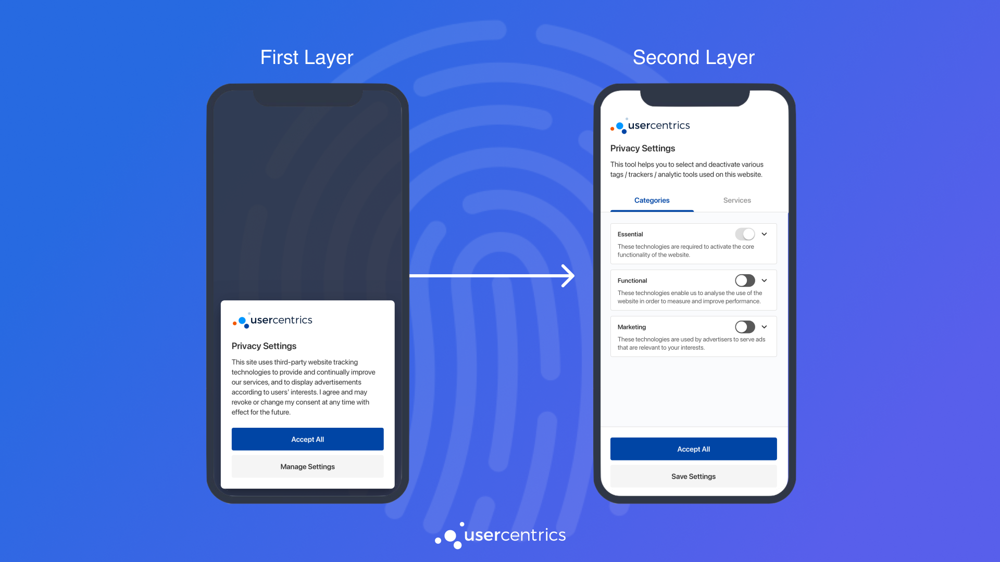
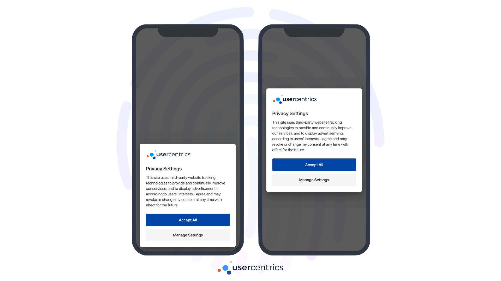
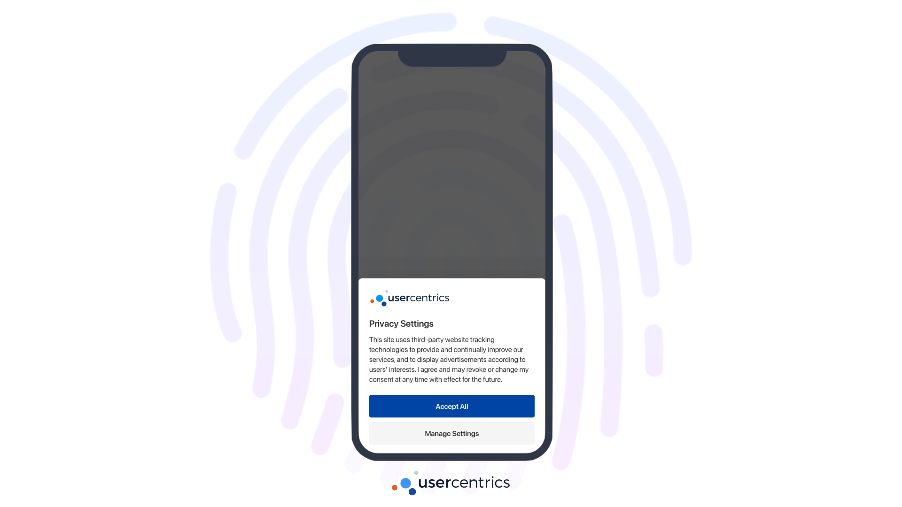
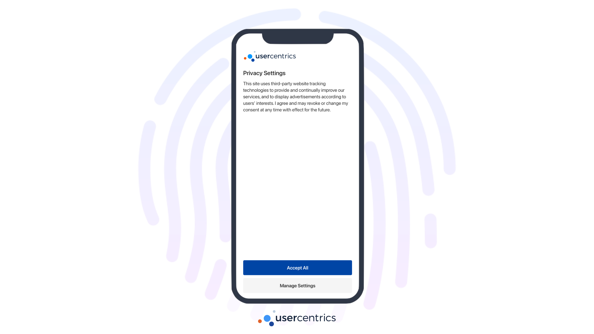
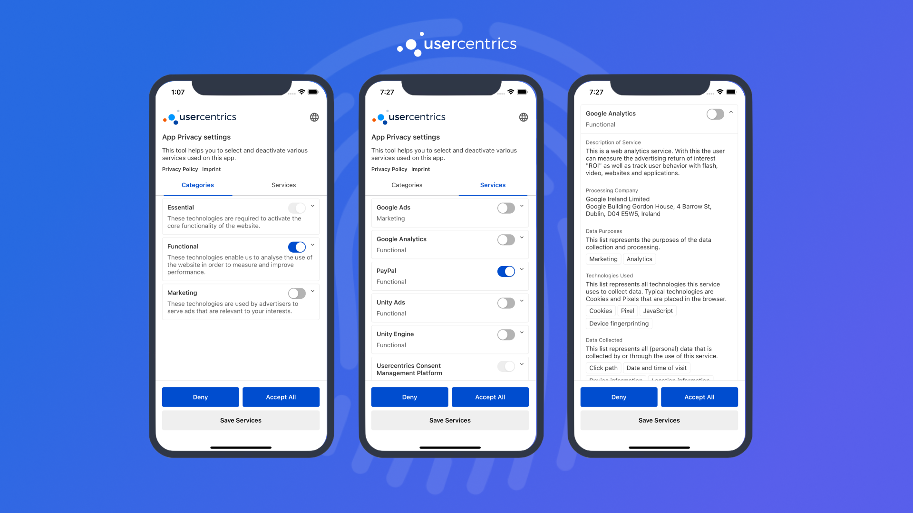

# Collecting Consent with Usercentrics UI 

**Usercentrics UI** is a native UI component designed to own all the complexity of compliance, while also allowing different levels of customization.

This component consists of 2 Layers:

{: .aligncenter .imageBorder width=800px } 

## First Layer

The **First Layer** is designed to be friendly to end-users, compact and highly customizable. This layer can be presented in 3 different ways:

=== "Popup"
    {: .aligncenter .imageBorder width=800px }

=== "Sheet"
    {: .aligncenter .imageBorder width=800px }
        
=== "Full"
    {: .aligncenter .imageBorder width=800px }

!!! tip "Recommendation"
    Use the **First Layer** when collecting consent for the first time or when prompting updates to the consent services. Remember that user's will be able to navigate from the **First Layer** to the **Second Layer**.

To present the **First Layer**, simply create an instance of `UsercentricsBanner`, and call `showFirstLayer()`. Once the user provides their consent choices, a [userResponse](#handling-userresponse) object will be returned.

=== "Swift<center><sub>iOS</sub></center>"
    ```swift
    let banner = UsercentricsBanner()
    banner.showFirstLayer() { userResponse in
        // Handle userResponse
    }
    ```
    ??? warning "Passing a specific HostView"
        You may also pass a specific HostView as a parameter of `showSecondLayer(hostView: <UIViewController>)`. If not provided, the SDK will resolve the HostView from the presented view controller of the first window.

    ??? tip "Support for Swift UI"
        Support for Swift UI is available starting **v2.7.6.** 
        On our [iOS Sample App](../samples.md) you can find an example of how to integrate with SwiftUI.
        ```
        let banner = UsercentricsBanner()
        banner.showFirstLayer(layout: <UsercentricsLayout>) { userResponse in
            // Handle userResponse
        }
        ```

=== "Kotlin<center><sub>Android</sub></center>"
    ```kotlin
    val banner = UsercentricsBanner(<Context>)
    banner.showFirstLayer() { userResponse ->
        // Handle userResponse
    }
    ```
    !!! warning "Use a valid Context"
        We are using the `Dialog` Android API for the Banner implementation. 
        It is recommended to use a `Context` that is an `Activity` or derived/wrapper from it.
        Note that the `Activity` has to be alive for the dialog to be displayed.
        
=== "Dart<center><sub>Flutter</sub></center>"
    ```dart
    final userResponse = await Usercentrics.showFirstLayer();
    // Handle userResponse
    ```

=== "Typescript<center><sub>React Native</sub></center>"
    ```typescript
    const userResponse = await Usercentrics.showFirstLayer();
    // Handle userResponse
    ```


## Second Layer

The **Second Layer** is designed to own all the complexity of compliance, declare all legally required information and allow for granular choices.

{: .aligncenter .imageBorder width=800px }

!!! tip "Recommendation"
    Use the **Second Layer** to allow users to review their choices from your apps settings.

To present the **Second Layer**, similarly create an instance of `UsercentricsBanner`, and call `showSecondLayer()`. The same [userResponse](#handling-userresponse) object will be returned here as well.

=== "Swift<center><sub>iOS</sub></center>"
    ```swift    
    let banner = UsercentricsBanner()
    banner.showSecondLayer() { userResponse in
        // Handle userResponse
    }
    ```

    ??? warning "Passing a specific HostView"
        You may also pass a specific HostView as a parameter of `showSecondLayer(hostView: <UIViewController>)`. If not provided, the SDK will resolve the HostView from the presented view controller of the first window.
    
    ??? tip "Support for Swift UI"
        Support for Swift UI is available starting **v2.7.6.** 
        On our [iOS Sample App](../samples.md) you can find an example of how to integrate with SwiftUI.
        ```
        let banner = UsercentricsBanner()
        banner.showSecondLayer() { userResponse in
            // Handle userResponse
        }
        ```

=== "Kotlin<center><sub>Android</sub></center>"
    ```kotlin
    val banner = UsercentricsBanner(<Context>)
    banner.showSecondLayer() { userResponse ->
        // Handle userResponse
    }
    ```
    !!! warning "Use a valid Context"
        We are using the `Dialog` Android API for the Banner implementation. 
        It is recommended to use a `Context` that is an `Activity` or derived/wrapper from it.
        Note that the `Activity` has to be alive for the dialog to be displayed.
        
=== "Dart<center><sub>Flutter</sub></center>"
    ```dart
    final userResponse = await Usercentrics.showSecondLayer();
    // Handle userResponse
    ```

=== "Typescript<center><sub>React Native</sub></center>"
    ```typescript
    const userResponse = await Usercentrics.showSecondLayer();
    // Handle userResponse
    ```

## Handling UserResponse 
    
The `userResponse` object provided in the callback of `UsercentricsBanner.showLayer()`, contains the following information:

| Properties      | Type                                                                          | Notes                                                                                                                                                                                                                      |
|-----------------|-------------------------------------------------------------------------------|----------------------------------------------------------------------------------------------------------------------------------------------------------------------------------------------------------------------------|
| consents        | [[UsercentricsServiceConsent](../api/core-api.md#usercentricsserviceconsent)] | List of the user's consent choices needed to [apply consent](./apply-consent.md).                                                                                                                                          |
| userInteraction | Enum                                                                          | <ul><li>**AcceptAll**: User accepted all services. <li>**DenyAll**: User denied all service. <li>**Granular**: User gave a granular choice, <li>**No Interaction**: User dismissed the Banner with no response. </ul>      |
| controllerId    | String                                                                        | A Usercentrics generated ID, used to identify a specific user. This value is required when using [Cross-Device Consent Sharing](../features/restore-user-sessions.md#restore-a-user-session-cross-device-consent-sharing). |

!!! success "You have successfully collected consent! 🚀"
    Now, it is **fundamental** that the user's privacy choices are applied to the 3rd party SDKs on you App.
    Please continue to [Apply Consent](./apply-consent.md).
