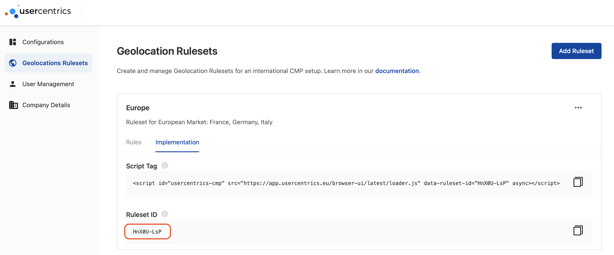
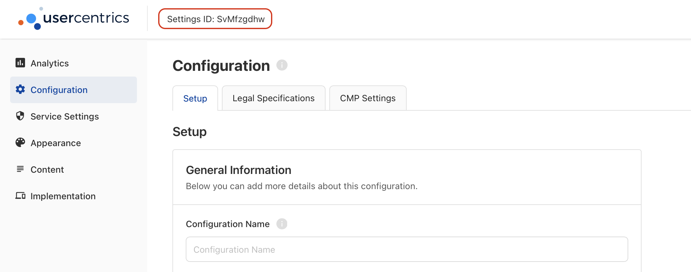
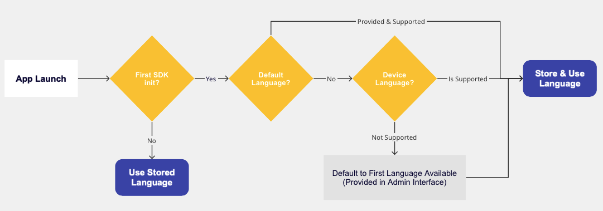

# Configuring Usercentrics

Once you have installed the Usercentrics SDK, you will need [an account](../../index.md#get-an-account) to configure your consent banner.

Depending on your setup, you may choose one of the following options:

* Initialize Usercentrics with a **RulesetID**, if you are using [GeoLocation Rules](../../config/account-config.md#geolocation-rulesets), and wish to **target users based on their location**.
* Initialize Usercentrics with a **SettingsID**, if you want to have one specific configuration, regardless of user location.

!!! warning "Both values **should not** be used at the same time"

??? tip "Where to find a **RulesetID** or **SettingsID**?"
    === "RulesetID"
        {: .aligncenter .imageBorder width=800px }
    === "SettingsID"
        {: .aligncenter .imageBorder width=800px }

## Device Options
In addition to the `SettingsID`, you may also configure the following options to control different behaviours at a device-level:

| Property         | Type   | Notes                                                                                                                                                                                                                                                                                                                                                                                                                                                                                                             |
|------------------|--------|-------------------------------------------------------------------------------------------------------------------------------------------------------------------------------------------------------------------------------------------------------------------------------------------------------------------------------------------------------------------------------------------------------------------------------------------------------------------------------------------------------------------|
| rulesetId        | String | A Usercentrics generated ID, used to identify a bundle of CMP configurations to be used depending on the user's location.                                                                                                                                                                                                                                                                                                                                                                                         |
| settingsID       | String | A Usercentrics generated ID, used to identify a unique CMP configuration.                                                                                                                                                                                                                                                                                                                                                                                                                                         |
| defaultLanguage  | String | Selected based on our [language selection hierarchy](#language-selection-hierarchy). This property defines the language used to render the banner.  e.g. "en", "de", "fr".                                                                                                                                                                                                                                                                                                                                        |
| version          | String | To freeze the configuration version shown to your users, you may pass a specific version here. You may find an overview of all versions in your [Configuration Dashboard](https://admin.usercentrics.eu) under Configuration > History > Settings History > Version (Column) or Implementation > Script Tag > Version History. e.g. "3.0.4". Passing **"latest"** (default) will fetch the latest version of your CMP configuration. Passing **"preview"** will fetch the latest draft of your CMP configuration. |
| timeoutMillis    | Int    | Timeout for network requests in milliseconds. We do **NOT** recommend overwriting this field unless absolutely necessary or for debugging reasons, as well as using any values under 5,000 ms. Default is **10,000 ms (10s)**.                                                                                                                                                                                                                                                                                    |
| loggerLevel      | Enum   | Provides a set of logs for operations being executed in the SDK.  <ul><li>**debug**: includes every other level <li>**warning**: non-problematic operations <li>**error**: relevant logs to any blocking problems <li>**none** (default) </ul>                                                                                                                                                                                                                                                                    |
| consentMediation | Bool   | Enable [Consent Mediation](../features/consent-mediation.md), an automated way to pass consent to 3rd party frameworks.                                                                                                                                                                                                                                                                                                                                                                                           |

## Language Selection Hierarchy
The SDK uses the following hierarchy, when deciding which language to load on init:

{: .aligncenter .imageBorder width=700px }

On first init, **Default Language[^1] [^2]** will have first priority, then **Device language[^1] [^2]** and finally a hard default to the first language available in your configuration. Once a language has been selected, it will be stored. Any following SDK initializations will use the **Stored Language [^3]**.

### TCF Special Cases

When implementing the TCF Framework, it's important to note that Usercentrics does not manage all the translations.
This responsibility falls to the IAB, the institution that owns the Framework.

**If a language is chosen in the Admin Interface that is not supported by the IAB, it will not appear in the language selector popup.**

To ensure a seamless integration, verify your desired language against the IAB's official list of supported languages
at [IABs official list](https://register.consensu.org/Translation) before launching the Banner in production. This proactive step is crucial for maintaining compliance and ensuring
a smooth user experience.

!!! warning "Dialects are supported and automatically used"
    If the language you pick in the Admin Interface has different dialects and the IAB doesn't support them, we'll automatically select the main dialect. This way, users won't miss out on seeing their language choice.

[^1]: To be supported, a language needs to be added and set as visible in the [Configuration Dashboard](https://admin.usercentrics.eu), under Configuration > Setup > Language Settings.
[^2]: This value will only be checked during the first SDK initialized. Afterwards, the stored languages will be used.
[^3]: If a user explicitly selects a new language in the Usercentrics UI, or the [language is changed programmatically](../api/core-api.md#changelanguage) after init, the stored languages will be updated and take priority in the future.
