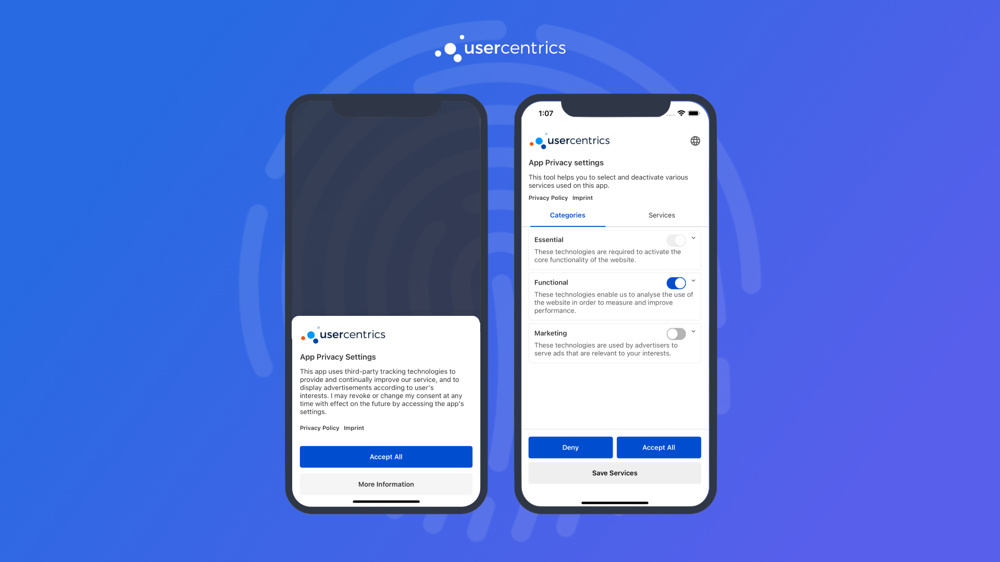
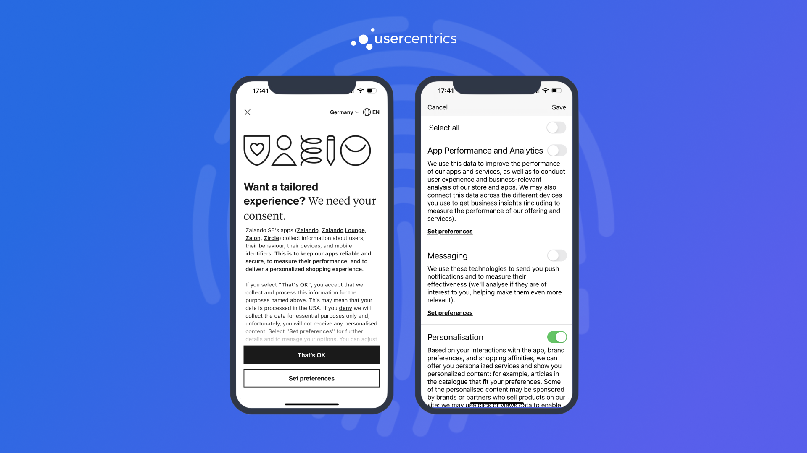
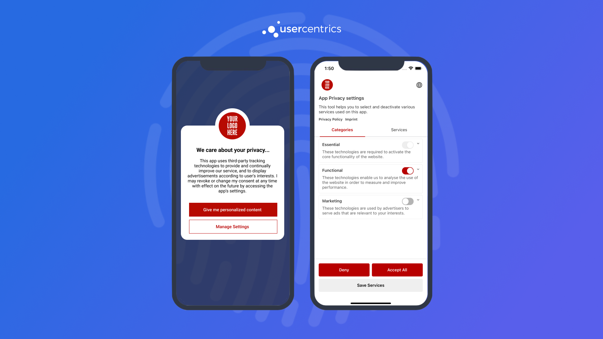

# Initializing Usercentrics
Before we get started with the integration, let's review some basics on when to initialize Usercentrics and legal requirements.

## When to present the banner?
In general, you are free to decide when to present the banner to your users. *e.g. Right after app launch, after login, during app onboarding, etc.*

There are only 2 requirements when deciding when to do this:

!!! danger "Requirement 1"
    Do **NOT** enable any data tracking from 3rd party services/SDKs before a user has given explicit consent. This would otherwise be a breach of data protection regulations, which can result in heavy fines.

!!! danger "Requirement 2"
    Don't forget **Requirement 1**.

## Initialize Usercentrics

=== "SettingsID"

    1. Import `Usercentrics`, configure your [options](configure.md#device-options) and call the init method of the SDK:
    
        === "Swift<center><sub>iOS</sub></center>"
        
            ```swift
            // On AppDelegate
            import Usercentrics
            
            let options = UsercentricsOptions(settingsId: <SettingsID>)
            UsercentricsCore.configure(options: options)
            ```
        
        === "Kotlin<center><sub>Android</sub></center>"
        
            ```kotlin
            // On Application
            import com.usercentrics.sdk.*
            
            val options = UsercentricsOptions(settingsId = <SettingsID>)
            Usercentrics.initialize(this, options)
            ```
        
        === "Dart<center><sub>Flutter</sub></center>"
            
            ```dart
            // e.g place this inside the [initState] of the Entry Point Widget
            import 'package:usercentrics_sdk/usercentrics_sdk.dart';
            
            Usercentrics.initialize(
                settingsId: <SettingsID>,
            );
            ```
            
        === "Typescript<center><sub>React Native</sub></center>"
         
            ```typescript
            // On your App entrypoint
            import { Usercentrics, UsercentricsOptions } from '@usercentrics/react-native-sdk';
            
            // React hooks
            useEffect(() => {
                let options = new UsercentricsOptions(<SettingsID>);
                Usercentrics.configure(options);
            }, []);
            
            // Or via constructor
            constructor(props: any) {
                super(props)
            
                let options = new UsercentricsOptions(<SettingsID>)
                Usercentrics.configure(options)
            }
            ```
    
        !!! tip "First Init"
            We recommend initializing the SDK in the background as soon as possible after app launch to avoid any loading delays.
            After the first init, the SDK will cache essential data and following initializations will be immediate.
            
    2. Use `isReady` to fetch the latest [consent status](../api/core-api.md#usercentricsreadystatus). This status will let you know if you need to show the banner to collect consent or only apply the already collected consent.
    
        === "Swift<center><sub>iOS</sub></center>"
        
            ```swift
            import Usercentrics
           
            UsercentricsCore.isReady { [weak self] status in
                guard let self = self else { return }
                if status.shouldCollectConsent {
                    // Show banner to collect consent
                } else {
                    // Apply consent with status.consents
                }
            } onFailure: { error in 
                // Handle non-localized error
            }
            ```
        
        === "Kotlin<center><sub>Android</sub></center>"
        
            ```kotlin
            import com.usercentrics.sdk.*
        
            Usercentrics.isReady({ status ->
                if (status.shouldCollectConsent) {
                    // Show banner to collect consent
                } else {
                    // Apply consent with status.consents
                }
            }, { error ->
                // Handle non-localized error
            })
            ```
        
        === "Dart<center><sub>Flutter</sub></center>"
           
            ```dart
            import 'package:usercentrics_sdk/usercentrics_sdk.dart';
        
            try {
                final status = await Usercentrics.status;
                if (status.shouldCollectConsent) {
                    // Show banner to collect consent
                } else {
                    // Apply consent with status.consents
                }
            } catch (error) {
                // Handle non-localized error
            }
            ```
        
        === "Typescript<center><sub>React Native</sub></center>"
           
            ```typescript
            import { Usercentrics } from '@usercentrics/react-native-sdk';
        
            try {
                const status = await Usercentrics.status();
                if (status.shouldCollectConsent) {
                    // Show banner to collect consent
                } else {
                    // Apply consent with status.consents
                }
            } catch(error) {
                // Handle error
            }
            ```
    
        !!! danger "Wait for isReady"
            It is required that you wait until **isReady** is called to use any SDK methods. Not doing so could lead to a crash, as methods called when the SDK has not finished initializing will return an exception.
    
    3. Once you are ready to collect consent, use the [status](../api/core-api.md#usercentricsreadystatus) object returned in `isReady` to know if you `shouldCollectConsent` or if consent has already been collected.
        
        === "Swift<center><sub>iOS</sub></center>"
            ```swift
            UsercentricsCore.isReady { [weak self] status in
                guard let self = self else { return }
                if status.shouldCollectConsent {
                    self.collectConsent()
                } else {
                    // Apply consent with status.consents
                }
            } onFailure: { error in
                // Handle non-localized error
            }
            ```
            
        === "Kotlin<center><sub>Android</sub></center>"
            ```kotlin
            Usercentrics.isReady({ status ->
                if (status.shouldCollectConsent) {
                    collectConsent()
                } else {
                    // Apply consent with status.consents
                }
            },{ error ->
                // Handle non-localized error
            })
            ```
                
        === "Dart<center><sub>Flutter</sub></center>"
            ```dart
            try {
                final status = await Usercentrics.status;
                if (status.shouldCollectConsent) {
                    collectConsent();
                } else {
                    // Apply consent with status.consents
                }
            } catch (error) {
                // Handle non-localized error
            }
            ```
        
        === "Typescript<center><sub>React Native</sub></center>"
            ```typescript
            try {
                const status = await Usercentrics.status();
                
                if (status.shouldCollectConsent) {
                    collectConsent();
                } else { 
                    // Apply consents with status.consents
                } 
            } catch(e) { 
                // Handle non-localized error 
            }
            ```
        
    Inside `collectConsent()`, you will be presenting the consent banner.

=== "RulesetID"

    1. Import `Usercentrics`, configure your [options](configure.md#device-options) and call the init method of the SDK:

        === "Swift<center><sub>iOS</sub></center>"
        
            ```swift
            // On AppDelegate
            import Usercentrics
            
            let options = UsercentricsOptions()
            options.ruleSetId = "<RulesetID>"

            UsercentricsCore.configure(options: options)
            ```
        
        === "Kotlin<center><sub>Android</sub></center>"
        
            ```kotlin
            // On Application
            import com.usercentrics.sdk.*
            
            val options = UsercentricsOptions(ruleSetId = "<RulesetID>")
            Usercentrics.initialize(this, options)
            ```
        
        === "Dart<center><sub>Flutter</sub></center>"
            
            ```dart
            // e.g place this inside the [initState] of the Entry Point Widget
            import 'package:usercentrics_sdk/usercentrics_sdk.dart';
            
            Usercentrics.initialize(
                ruleSetId: "<RulesetID>"
            );
            ```
            
        === "Typescript<center><sub>React Native</sub></center>"
         
            ```typescript
            // On your App entrypoint
            import { Usercentrics, UsercentricsOptions } from '@usercentrics/react-native-sdk';
            
            // React hooks
            useEffect(() => {
                let options: UsercentricsOptions = { ruleSetId: "<RulesetID>" };
                Usercentrics.configure(options);
            }, []);
            
            // Or via constructor
            constructor(props: any) {
                super(props)

                let options: UsercentricsOptions = { ruleSetId: "<RulesetID>" };
                Usercentrics.configure(options)
            }
            ```
    
        !!! tip "First Init"
            We recommend initializing the SDK in the background as soon as possible after app launch to avoid any loading delays.
            After the first init, the SDK will cache essential data and following initializations will be immediate.
            
    2. Use `isReady` to get the [geolocationRuleset](../api/core-api.md#geolocationruleset). This object will let you know if the banner is required according to the configurations and the user's location.
    
        === "Swift<center><sub>iOS</sub></center>"
        
            ```swift
            import Usercentrics
           
            UsercentricsCore.isReady { [weak self] status in
                guard let self = self else { return }

                if status.geolocationRuleset != null && status.geolocationRuleset.bannerRequiredAtLocation == false {
                    // banner is not required at this location
                    return
                }

                if status.shouldCollectConsent {
                    // Show banner to collect consent
                } else {
                    // Apply consent with status.consents
                }
            } onFailure: { error in 
                // Handle non-localized error
            }
            ```
        
        === "Kotlin<center><sub>Android</sub></center>"
        
            ```kotlin
            import com.usercentrics.sdk.*
        
            Usercentrics.isReady({ status ->

                if (status.geolocationRuleset != null && status.geolocationRuleset?.bannerRequiredAtLocation == false) {
                    // banner is not required at this location
                    return@isReady
                }

                if (status.shouldCollectConsent) {
                    // Show banner to collect consent
                } else {
                    // Apply consent with status.consents
                }
            }, { error ->
                // Handle non-localized error
            })
            ```
        
        === "Dart<center><sub>Flutter</sub></center>"

            ```dart
            import 'package:usercentrics_sdk/usercentrics_sdk.dart';
        
            try {
                final status = await Usercentrics.status;

                if (status.geolocationRuleset != null && status.geolocationRuleset?.bannerRequiredAtLocation == false) {
                    // banner is not required at this location
                    return;
                }

                if (status.shouldCollectConsent) {
                    // Show banner to collect consent
                } else {
                    // Apply consent with status.consents
                }
            } catch (error) {
                // Handle non-localized error
            }
            ```
        
        === "Typescript<center><sub>React Native</sub></center>"
           
            ```typescript
            import { Usercentrics } from '@usercentrics/react-native-sdk';
        
            try {
                const status = await Usercentrics.status();

                if (status.geolocationRuleset != null && status.geolocationRuleset?.bannerRequiredAtLocation == false) {
                    // banner is not required at this location
                    return
                }

                if (status.shouldCollectConsent) {
                    // Show banner to collect consent
                } else {
                    // Apply consent with status.consents
                }
            } catch(error) {
                // Handle error
            }
            ```
    
        !!! danger "Wait for isReady"
            It is required that you wait until **isReady** is called to use any SDK methods. Not doing so could lead to a crash, as methods called when the SDK has not finished initializing will return an exception.
    
    3. Once you are ready to collect consent, use the [status](../api/core-api.md#usercentricsreadystatus) object returned in `isReady` to know if you `shouldCollectConsent` or if consent has already been collected.

        === "Swift<center><sub>iOS</sub></center>"
            ```swift
            UsercentricsCore.isReady { [weak self] status in
                guard let self = self else { return }
                if status.shouldCollectConsent {
                    self.collectConsent()
                } else {
                    // Apply consent with status.consents
                }
            } onFailure: { error in
                // Handle non-localized error
            }
            ```
            
        === "Kotlin<center><sub>Android</sub></center>"
            ```kotlin
            Usercentrics.isReady({ status ->
                if (status.shouldCollectConsent) {
                    collectConsent()
                } else {
                    // Apply consent with status.consents
                }
            },{ error ->
                // Handle non-localized error
            })
            ```
                
        === "Dart<center><sub>Flutter</sub></center>"
            ```dart
            try {
                final status = await Usercentrics.status;
                if (status.shouldCollectConsent) {
                    collectConsent();
                } else {
                    // Apply consent with status.consents
                }
            } catch (error) {
                // Handle non-localized error
            }
            ```
        
        === "Typescript<center><sub>React Native</sub></center>"
            ```typescript
            try {
                const status = await Usercentrics.status();
                
                if (status.shouldCollectConsent) {
                    collectConsent();
                } else { 
                    // Apply consents with status.consents
                } 
            } catch(e) { 
                // Handle non-localized error 
            }
            ```
        
    Inside `collectConsent()`, you will be presenting the consent banner.

??? warning "Resetting the SDK"
    Use [reset()](../api/core-api.md#reset) to clean all local storage and release the initialized instance. You will need to initialize the SDK again after a reset.
    **Make sure you validate the expected behaviour, before using reset in production.**

??? tip "Switching SettingsIDs"
    If you need to switch SettingsIDs during runtime, just reinitialize the SDK with the new SettingsID. This will automatically trigger a reset(), and initialize the new configuration.

## Presenting the Consent Banner
In order to present the banner, we offer different options depending on your needs:

### UsercentricsUI

An out-of-the-box UI component, that owns all the complexity of compliance, designed to be highly customizable. [Continue to Collecting Consent with UsercentricsUI](collect-consent.md).

{: .aligncenter .imageBorder width=800px }

### Build you own UI

Use our SDK as a data source and render your own consent banner from scratch. [Continue to Build your own UI](../features/build_own_ui.md).

{: .aligncenter .imageBorder width=800px }

### Hybrid

If you need a "in between" solution, we encourage you to mix these two approaches to get the best of both worlds.

{: .aligncenter .imageBorder width=800px }
<figure markdown>
  <figcaption>e.g. Create your own first layer banner, and let UsercentricsUI take care of the complexity on a second layer.</figcaption>
</figure>
