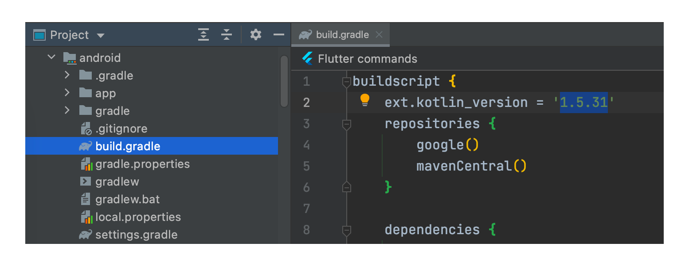
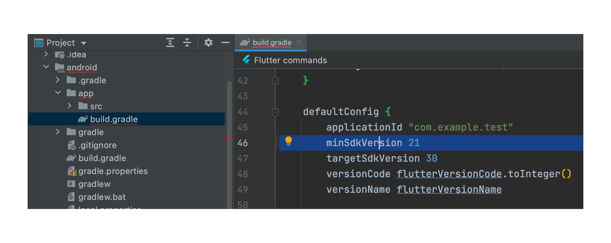
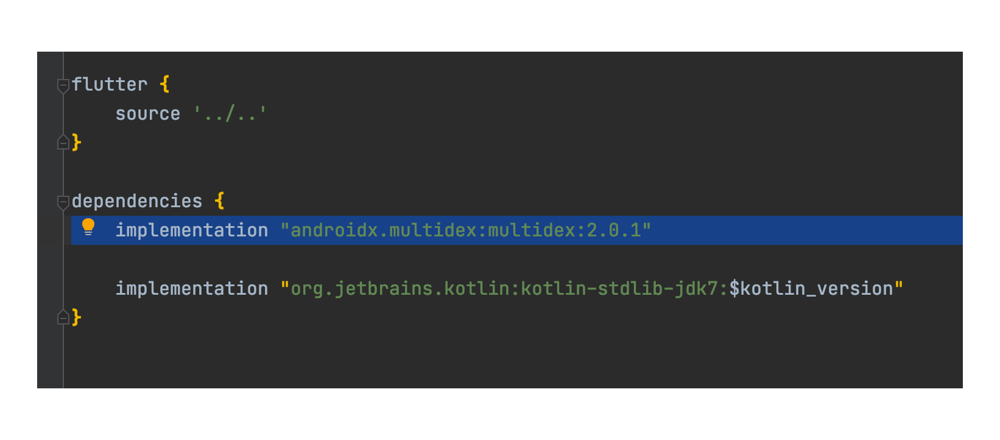
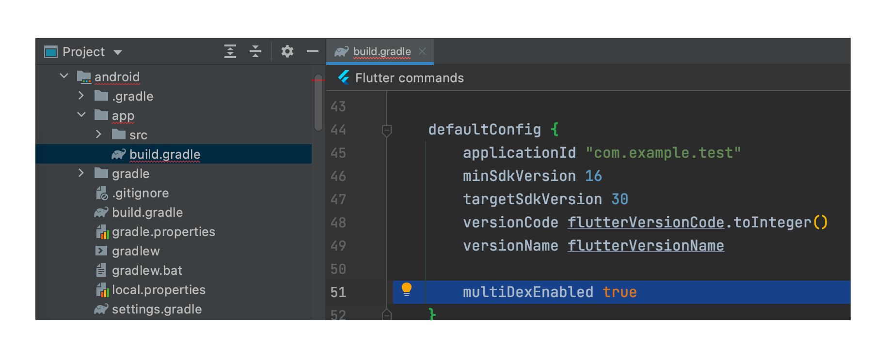
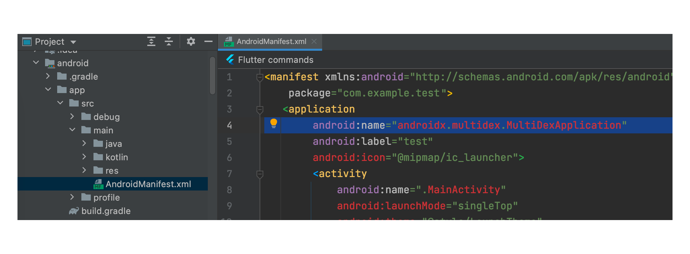
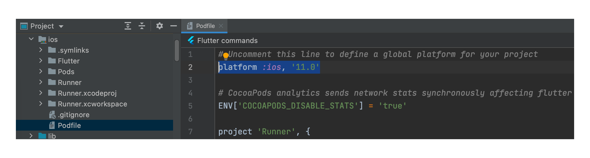
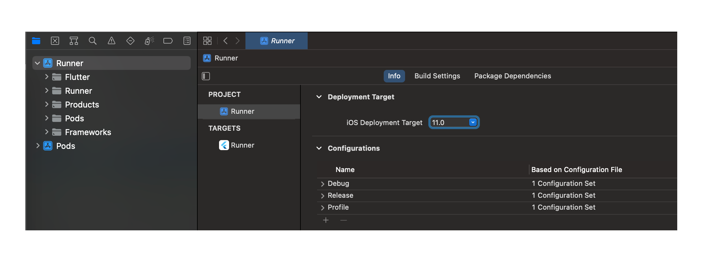

# Installing the Usercentrics SDK

=== "iOS"

    ##iOS
    !!! check "Prerequisites"
        * iOS 11 or higher

    ###CocoaPods
    1. In case you haven't, please [install CocoaPods](https://guides.cocoapods.org/using/getting-started.html) and follow [these instructions](https://guides.cocoapods.org/using/using-cocoapods.html) to setup you project.
    2. On your Podfile, add the following line:

        === "UsercentricsCore + Usercentrics UI"

            ```bash
            platform :ios, '11.0'
            use_frameworks!  
        
            pod 'UsercentricsUI'
            ```

        === "UsercentricsCore"

            ```bash
            platform :ios, '11.0'
            use_frameworks!  
        
            pod 'Usercentrics'
            ```

    3. On the root directory of your project, run the following command to install the pod.
    ```bash
    pod install
    ```

    4. Open your .xcworkspace file.
    
    !!! check "You are now ready to start integrating Usercentrics! 🚀"

    ###Swift Package Manager (SPM)
    From Xcode 11 and above, you can use [Swift Package Manager](https://swift.org/package-manager/) to install our SDK.

    1. On Xcode, Select File > Swift Packages > Add Package Dependency.

    2. Enter the package repository URLs:
    
        === "Usercentrics UI"

            ```bash
            https://bitbucket.org/usercentricscode/usercentrics-spm-ui
            ```
    
        === "UsercentricsCore"

            ```bash
            https://bitbucket.org/usercentricscode/usercentrics-spm-sdk
            ```

    4. Select the version you would like to use. We recommend sticking to "Up to Next Major" with the latest release as minor version.
    
    !!! check "You are now ready to start integrating Usercentrics! 🚀"

    ###Manual
    1. Download and unzip the latest version of our SDKs: [UsercentricsCore](https://bitbucket.org/usercentricscode/usercentrics-spm-sdk/downloads/) and [UsercentricsUI](https://bitbucket.org/usercentricscode/usercentrics-spm-ui/downloads/). 
    2. Drag and drop .xcframework file to your Xcode project.
    
    !!! check "You are now ready to start integrating Usercentrics! 🚀"

=== "Android"

    ##Android

    !!! check "Prerequisites"
        * Android 4.1 (API 16) and higher

    !!! warning "Android minimum SDK Version"
        Support for versions lower than Android 5.0 (API Level 20) is planned to be removed in releases starting from end of March/24

    ###Gradle
    1. If not present, add Maven Central repository URL to your top-level build.gradle file:
    ```kotlin
    allprojects {
        repositories {
            mavenCentral()
        }
    }
    ```
            
    2. Add the dependency to your app's build.gradle:
    
        === "UsercentricsCore + Usercentrics UI"

            ```kotlin
            dependencies {
                implementation "com.usercentrics.sdk:usercentrics-ui"
            }
            ```

        === "UsercentricsCore"

            ```kotlin
            dependencies {
                implementation "com.usercentrics.sdk:usercentrics"
            }
            ```
    
    !!! check "You are now ready to start integrating Usercentrics! 🚀"

    ###Manual
    1. Download and the latest version of our SDKs: [Usercentrics Core](https://central.sonatype.com/artifact/com.usercentrics.sdk/usercentrics) and [Usercentrics UI](https://central.sonatype.com/artifact/com.usercentrics.sdk/usercentrics-ui).
    2. Note that we are using other libraries that may be required to be download, the POM file is available in both links above.
    3. In case the dependencies are being handled manually, move all .aar and .jar files to your project, if not, upload them to your Nexus solution.
    
    !!! check "You are now ready to start integrating Usercentrics! 🚀"

=== "Flutter"

    ##Flutter
    !!! check "Prerequisites"
        * Android 4.1 (API 16) or higher with Kotlin 1.7 or higher
        * iOS 11 or higher
        * Dart 2.12 or higher
        * Flutter 1.20 or higher

    !!! warning "Android minimum SDK Version"
        Support for versions lower than Android 5.0 (API Level 20) is planned to be removed in releases starting from end of March/24

    To meet the prerequisites:

    ??? example "Android with Kotlin version lower than 1.7"
        If you have an incompatible Kotlin version you may see the following error when you run app on Android:
        ```
        e: Incompatible classes were found in dependencies. Remove them from the classpath or use '-Xskip-metadata-version-check' to suppress errors
        ```

        This error is easy to solve, you only need to increase the version that is usually in the `android/build.gradle` file. Use a recent stable Kotlin version, for example: `1.5.31`.
        {: .aligncenter width=600px }

    ??? example "Android version lower than 5.0 (API 21)"
        If you support an Android version lower than 5.0 (API 21) and you don't have the [multidex](https://developer.android.com/studio/build/multidex) enabled in your project, you may see the following error when you run your app on Android:
        ```
        D8: Cannot fit requested classes in a single dex file (# methods: 66055 > 65536)
        ```

        You can change the minimum version of your application to 5.0 (API 21). That configuration is usually in the `android/app/build.gradle` file. Make sure that `minSdkVersion` is `21` or higher.

        {: .aligncenter width=600px }

        Although Android 5.0 version already supports 99% of all devices, if you still want to have support for Android 4.1 (API 16) you have to do the following:
        
        1. Add the multidex library to your application dependencies that is usually in the `android/app/build.gradle` file.
            ```groovy
            implementation "androidx.multidex:multidex:2.0.1"
            ```
            {: .aligncenter width=600px }

        2. Enable the option in the application build `defaultConfig`. It is usually in the same `android/app/build.gradle` file.
            ```groovy
            multiDexEnabled true
            ```
            {: .aligncenter width=600px }

        3. Make your application class initialize multidex. There are several options to do that, in Flutter the easiest way is to add it to the manifest. The manifest is usually located at `android/app/src/main/AndroidManifest.xml`.
            ```groovy
            android:name="androidx.multidex.MultiDexApplication"
            ```
            {: .aligncenter width=600px }

        !!! warning "Android minimum SDK Version"
            Support for versions lower than Android 5.0 (API Level 20) is planned to be removed in releases starting from end of March/24

    ??? example "iOS version lower than 11"
        If you have a iOS target version lower than **11** or you have no version at all (it defaults to version 9) you may see the following error when you run your app on iOS:
        ```
        [!] Automatically assigning platform `iOS` with version `9.0` on target `Runner` because no platform was specified. Please specify a platform for this target in your Podfile. See `https://guides.cocoapods.org/syntax/podfile.html#platform`.
        ```
        
        This error is easy to solve, you have to do the following:

        1. Define or increase the version of your Podfile at least to version 11. It is usually located at `ios/Podfile`.
        ```ruby
        platform :ios, '11.0'
        ```
        {: .aligncenter width=600px }
        
        2. Run `flutter pub get` again and open the iOS project using Xcode. It is usually located at `ios/Runner.xcworkspace`. Now, you have to select the `Runner` project and change the `Deployment Target` to the same version.
        {: .aligncenter width=600px }

    ###Pub.dev

    1. Add Usercentrics to your project via [pub.dev](https://pub.dev/packages/usercentrics_sdk):

        ```bash
        flutter pub add usercentrics_sdk
        ```

    !!! check "You are now ready to start integrating Usercentrics! 🚀"

=== "React Native"

    ##React Native
    !!! check "Prerequisites"
        * Android 5.0 (API 21) or higher with Kotlin 1.7 or higher
        * iOS 11 or higher
        * React Native 0.65 or higher
        * React 17.0 or higher

    ###npm

    1. Add Usercentrics to your project using [npm](https://www.npmjs.com/package/@usercentrics/react-native-sdk):

        ```bash
        npm i @usercentrics/react-native-sdk
        ```

    !!! check "You are now ready to start integrating Usercentrics! 🚀"
