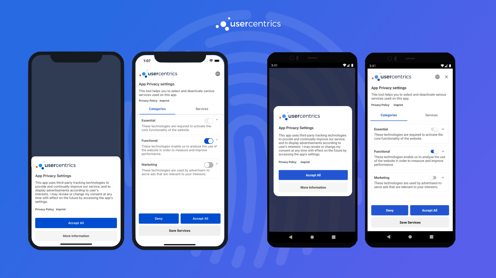

#Welcome!
You are now one step closer from making **privacy** a core feature in your application. We are very happy that you decided to make this a priority. We are here to help you **build trust** with your users.

##The Usercentrics Apps SDK
The Usercentrics Apps SDK is a native Consent Management Platform solution for mobile apps, mobile games & TV applications, that enables the collection, documentation, and management of your user's privacy choices, in order to ensure legal compliance for legal regulations around the world.

{: .aligncenter .imageBorder width=800px }

Our SDK consists of 2 main components:

**UsercentricsCore**
:   Contains all core functionality to collect, document and manage consent, as well as usability features like language detection and geolocation. You may use this component by itself, if you are planing to build your own UI.

**UsercentricsUI**
:   UI Component that hooks to our UsercentricsCore to provide a ready to use consent banner solution. This component is design to own all the complexity of compliance, while also providing several levels of customization.

## Get started
Please create a [Usercentrics account](https://usercentrics.com/in-app-sdk/) or starting a [free trial](https://usercentrics.com/free-trial-app/) in order to test the Usercentrics SDK.

## Supported Legal Frameworks
* 🇪🇺 GDPR - European Union's General Data Protection Regulation
* 🌎 TCF 2.2 - IAB's Transparency & Consent Framework 2.2
* 🇺🇸 CCPA/CPRA and other US Frameworks - Regulations in US States
* 🇧🇷 LGPD - Brazil’s Lei Geral de Proteção de Dados
* and many more...

## Features
* Easy installation via a package manager
* Methods to collect & update consent
* Up-to-date legal information on more than 1,000 technology vendors
* **UsercentricsUI** is a plug & play CMP solution with endless customization options
* Build your own CMP with our **UsercentricsCore** module, an API that provides all necessary data and action delegates
* Device language detection
* tvOS and Android TV support only when building your own CMP
* Share the same settingsID between multiple apps and web applications
* Cross-Device consent sharing
* Consent continuity between the app and embedded WebViews. (Browser SDK is required)
* Offline Handling
* Support for Landscape Mode
* Reporting of service Opt-In rates
* Reporting of User Interactions

