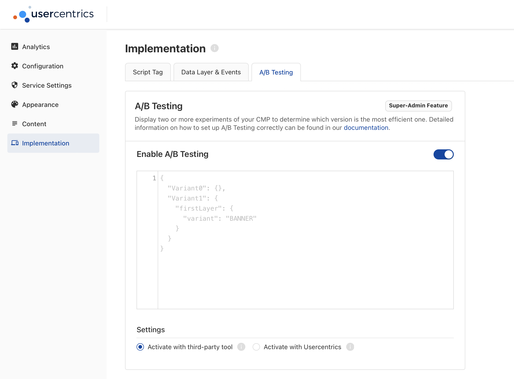
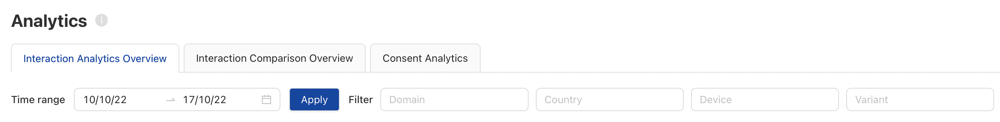
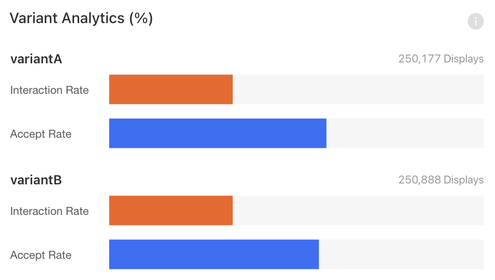
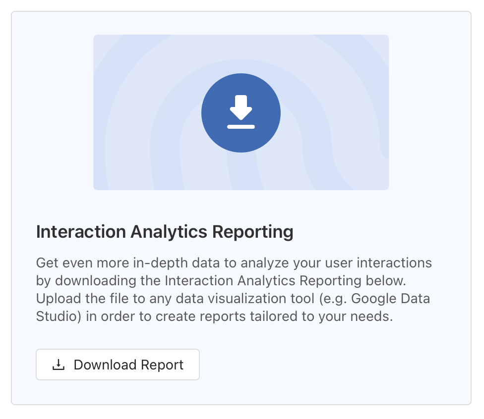

# A/B Testing

!!! danger "BETA"
    This feature is currently in **beta**, and only available starting **v2.7.4**. Please make sure you validate the functionality before pushing to production.

In order to optimize the performance of your Consent Banner, we have enabled A/B Testing capabilities, to make your life easier.

## Enabling A/B Testing

Go to the **Implementation** section in your **Configuration Dashboard** and select the **A/B Testing** tab. Here you will find a toggle to enable the feature.

{: .aligncenter .imageBorder width=600px }

Once enabled, you will see the the A/B Testing configuration options.

## Using Usercentrics 

!!! tip "Activate with Usercentrics"
    To use the Usercentrics tools for A/B Testing, please select the checkbox at the bottom of the A/B Testing configuration options: "Activate with Usercentrics".

### Defining Variants

Using the JSON input field, define the variants names with an empty values. 

```json
{
    "variantA": {},
    "variantB": {}
}
```

Now, in your project, fetch the variant names programmatically, and return a Banner Configuration for each one using the **BannerSettings** object:

=== "Swift<center><sub>iOS</sub></center>"

    ```swift
    switch UsercentricsCore.shared.getABTestingVariant() {
    case "variantA": return BannerSettings(/* variantA configuration */)
    case "variantB": return BannerSettings(/* variantB configuration */)
    default: return BannerSettings(/* default configuration */)
    }
    ```    

=== "Kotlin<center><sub>Android</sub></center>"

    ```kotlin
    val bannerSettings = when (Usercentrics.instance.getABTestingVariant()) {
        "variantA" -> BannerSettings(/* variantA configuration */)
        "variantB" -> BannerSettings(/* variantB configuration */)
        else -> BannerSettings(/* default configuration */)
    }
    ```

=== "Dart<center><sub>Flutter</sub></center>"
    
    ```dart
    final variant = await Usercentrics.aBTestingVariant;
    switch(variant) {
        case "variantA": {_showFirstLayer(/* variantA Settings */);}
        break;
        case "variantB": {_showFirstLayer(/* variantB Settings */);}
        break;
        default: {_showFirstLayer(/*Default*/);}
        break;
    }
    ```

=== "Typescript<center><sub>React Native</sub></center>"

    ```typescript
     const variant = await Usercentrics.getABTestingVariant()
     let bannerSettings: BannerSettings;
     switch (variant){
         case "variantA":
             return bannerSettings = {/* settings for the banner with variantA */};
         case "variantB":
             return bannerSettings = {/* settings for the banner with variantB */};
         default:
             return bannerSettings = {/* default banner settings*/};
    ```


!!! tip "Always fallback to a Default"
    Always have a fallback default configuration. This will allow you to turn off, or change the variants you are testing dynamically.

!!! tip "Even distribution"
    The distribution between variants will be even. *e.g. 50:50 for two variants, 33:33:33 for three variants.*

### Tracking Results

Once you have generated variant interactions, all results will be available in the **Analytics** section of your **Usercentrics Dashboard**.

**Interaction Analytics**

Overview your Interaction and Acceptance rates by filtering for specific Variants.

{: .aligncenter .imageBorder width=800px }

**Comparison Analytics**

Get a direct comparison of interactions and acceptance rates for each variant.

{: .aligncenter .imageBorder width=400px }

**Download Raw Data**

For in-depth insights and custom analysis, we recommend downloading a raw-data report available at the bottom of the **Interaction Analytics** section. In this report, an additional "variant" column will tell you which variant was used for each entry in the data.

{: .aligncenter .imageBorder width=400px }

!!! tip "Keep A/B Testing feature ON"
    To see variant analytics data, the A/B Testing feature needs to be ON. If you wish to stop running specific variants. Just delete the variants in the JSON input field.

## Using a Third Party Tool

!!! tip "Activate with third-party tool"
    To use a third-party tool for A/B Testing, please select the checkbox at the bottom of the A/B Testing configuration options: "Activate with third-party tool".

### Defining Variants

When using a third-party tool, you may pass variant names directly via the Customization API as such:

=== "Swift<center><sub>iOS</sub></center>"

    ```swift
    let variant = AnyABTestTool.getVariants()
    switch variant {
    case "variantA": return BannerSettings(/* variantA configuration */ variantName: "variantA")
    case "variantB": return BannerSettings(/* variantA configuration */ variantName: "variantB")
    default: return BannerSettings(/* default configuration */)
    }
    ```    

=== "Kotlin<center><sub>Android</sub></center>"

    ```kotlin
    val variant = AnyABTestTool.getVariants()
    val bannerSettings = when (variant) {
        "variantA" -> BannerSettings(variantName = "variantA", /* variantA configuration */)
        "variantB" -> BannerSettings(variantName = "variantB", /* variantB configuration */)
        else -> BannerSettings(/* default configuration */)
    }
    ```

=== "Dart<center><sub>Flutter</sub></center>"

    ```dart
    final variant = await AnyABTestTool.aBTestingVariant;
    switch(variant) {
        case "variantA": {_showFirstLayer(/* variantA Settings */);}
        break;
        case "variantB": {_showFirstLayer(/* variantB Settings */);}
        break;
        default: {_showFirstLayer(/*Default*/);}
        break;
    }
    ```

=== "Typescript<center><sub>React Native</sub></center>"

    ```typescript
     const variant = await AnyABTestTool.getABTestingVariant()
     let bannerSettings: BannerSettings;
     switch (variant){
         case "variantA":
             return bannerSettings = {/* settings for the banner with variantA */};
         case "variantB":
             return bannerSettings = {/* settings for the banner with variantB */};
         default:
             return bannerSettings = {/* default banner settings*/};
    ```


??? tip "Supporting your self-built UI"
    If you have your own UI and you want Usercentrics to know which A/B Testing variant from your Third-Party Tool you are using, so that the events you track in the Usercentrics analytics API (`track()`) have the variant data. Then you have to inject the variant programmatically with this API:
    === "Swift<center><sub>iOS</sub></center>"
        ```swift
        UsercentricsCore.shared.setABTestingVariant(variant: <VariantName>)
        ```
    === "Kotlin<center><sub>Android</sub></center>"
        ```kotlin
        Usercentrics.instance.setABTestingVariant(<VariantName>)
        ```
    === "Dart<center><sub>Flutter</sub></center>"
        ```dart
        UsercentricsCore.setABTestingVariant(variant: <VariantName>)
        ```
    === "Typescript<center><sub>React Native</sub></center>"
        ```typescript
        Usercentrics.setABTestingVariant(<VariantName>)
        ```

### Tracking Results

Implement the tracking mechanism of your third-party tool, when processing the `UsercentricsConsentUserResponse`, available in the callback of the banner presentation.
