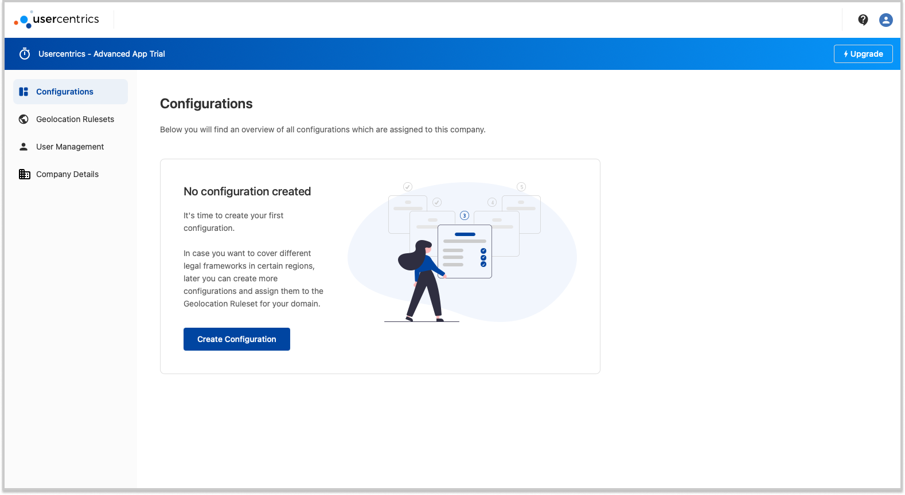
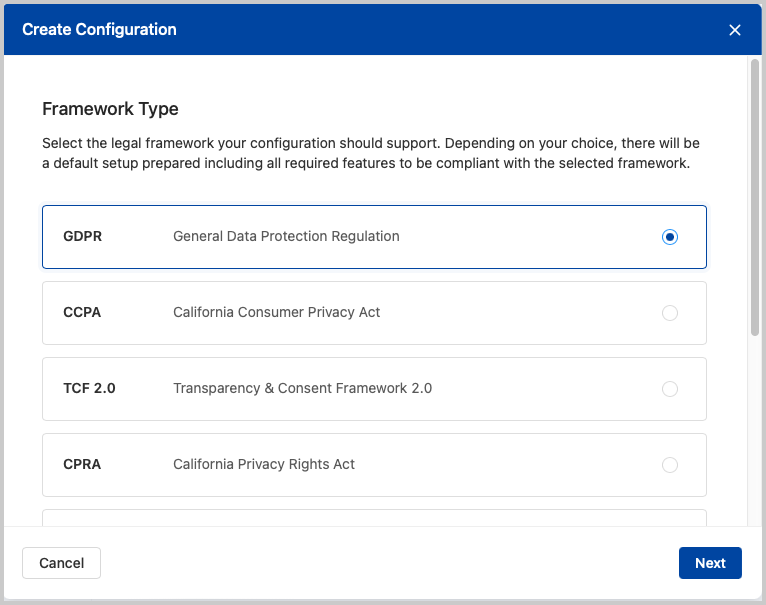
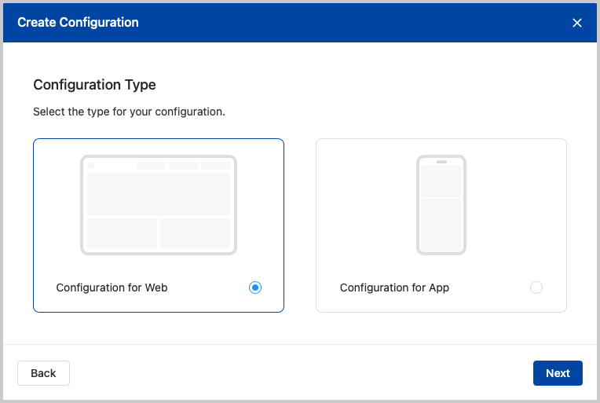
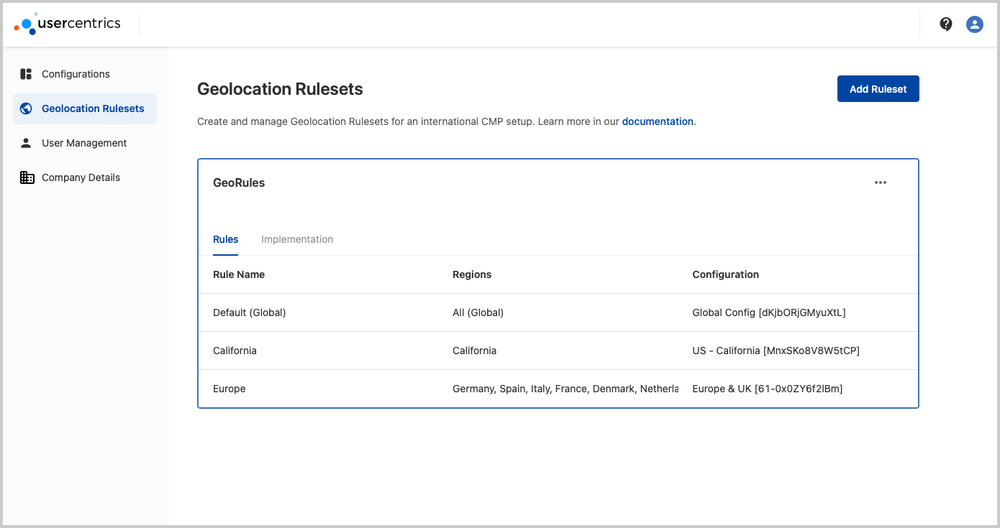
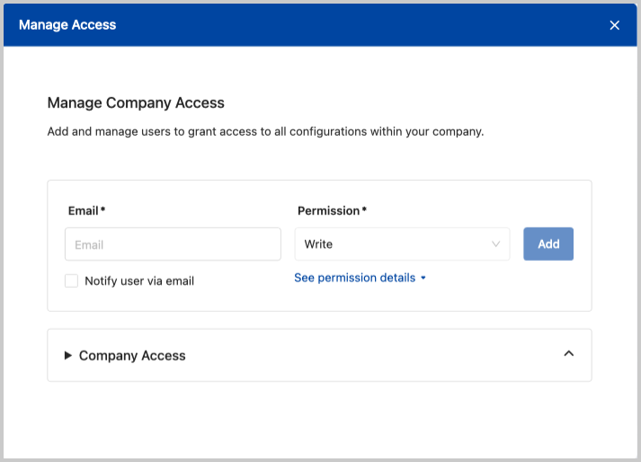

# Setting up your Account

Welcome to Usercentrics! Let's get you started with setting up your account, and making sure you are making the best out of our CMP.

First, log in to your [account](https://account.usercentrics.eu) with the email you registered during signup. 

{: .aligncenter .imageBorder width=800px }

Once logged in, you will have access to your dashboard:

## Configurations

Here you can create new configurations with the following criteria: 

* **Legal Framework**: Choose the **legal framework** that you would like to target to a region or country.

    {: .aligncenter .imageBorder width=500px }

* **Platform**: Our CMP has dedicated features and configurations for **Web and Apps**.

    !!! tip "Dependent on your Subscription"
        Given your subscription or trial, all configuration will default to the platform that you selected during signup. In case you have a subscription to both platforms, during the configuration creation flow, you will be able to choose a Platform.

        {: .aligncenter .imageBorder width=500px }

* **Configuration Details**: Configuration metadata to keep things in order.

Now that you have a new configuration, you may continue to [Banner Configuration](banner-config.md)

## Geolocation Rulesets

Here you can define regions to target specific configuration. You may also define a default, which will be used to target any user that is outside of the defined regions. In this case, you may choose to not show a banner at all.

{: .aligncenter .imageBorder width=800px }

## User Management

Invite and Manage User permission for stakeholders in your organization.

{: .aligncenter .imageBorder width=500px }

## Company Details

Overview of your company details, and edit Mode.

## Do you need further help?
See our [Customer Support Portal](https://usercentricssupport.zendesk.com/hc/)
