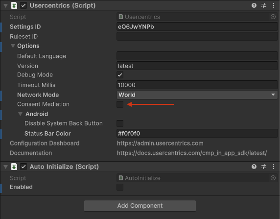

# Consent Mediation

This feature was introduced in its beta version with the release of 2.7.0. Starting from version 2.11.0, it has transitioned to a stable version, offering enhanced functionality.

!!! danger "IMPORTANT"
    Please make sure to follow all the steps outlined below and that consent is being passed correctly before pushing this feature to production.

To simplify the process of signalling consent to third-party SDKs, we added a mediation feature, that works with APIs of SDKs listed below.
This feature **will update the consent when necessary within your application**.
Moreover, this functionality allows you to effortlessly activate [Google Consent Mode](google-consent-mode.md) and connect to advertising and mediation tools that, for instance,
may not be part of TCF.

Once correctly implemented, this feature simplifies the transmission of the consent signal and privacy choices to selected third-party SDKs.

However, it is always advisable to review and assess the documentation, privacy policy, and privacy section of third-party vendor SDKs before deciding to work 
with them or integrating any.

Please note that Usercentrics cannot fully guarantee the compliance of collection mechanisms of third-party vendors and SDKs.

## How it works?

The Consent Mediation feature on Unity operates by integrating SDKs APIs in order to stream user consent.

Most Unity SDKs use a native implementation, serving as a bridge to their respective native platforms.
Our approach integrates with these native libraries designed for Android and iOS.

The supported SDKs listed below all utilize this integration method.
If you encounter a library that doesn't follow a native implementation, please let us know by providing feedback. 

You can access a comprehensive overview of the native implementations for mediating consents [here](../../apps/features/consent-mediation.md#our-integration-with-sdks).

## Enable Mediation

{: .aligncenter .imageBorder width=500px }

!!! success "That's it! 🚀 we will now apply consent automatically to all [supported SDKs](#supported-sdks)."
    Make sure you [apply consent](../integration/apply_consent.md) to not supported SDKs as well.

<!--
if this table gets updated ---> change /apps version as well
-->

## Supported SDKs

| SDK                           | Template ID | Added in version | Source                                                                                                                                                                                                                                                           |
|-------------------------------|-------------|------------------|------------------------------------------------------------------------------------------------------------------------------------------------------------------------------------------------------------------------------------------------------------------|
| Google Analytics for Firebase | diWdt4yLB   | 2.7.0            | [Analytics data collection and usage](https://firebase.google.com/docs/analytics/configure-data-collection)                                                                                                                                                      |
| Unity Ads                     | hpb62D82I   | 2.7.0            | [Privacy consent and data APIs](https://docs.unity.com/ads/ImplementingDataPrivacy.html)                                                                                                                                                                         |
| AppLovin                      | fHczTMzX8   | 2.7.0            | Privacy-Consent and Data API for [iOS](https://dash.applovin.com/documentation/mediation/ios/getting-started/privacy) and [Android](https://dash.applovin.com/documentation/mediation/android/getting-started/privacy)                                           |
| ironSource                    | 9dchbL797   | 2.7.0            | Regulation Advanced Settings for [iOS](https://developers.is.com/ironsource-mobile/ios/regulation-advanced-settings) and [Android](https://developers.is.com/ironsource-mobile/android/regulation-advanced-settings)                                             |
| Crashlytics                   | cE0B0wy4Z   | 2.7.12           | Privacy-Consent and Data API for [iOS](https://firebase.google.com/docs/crashlytics/customize-crash-reports?platform=ios#enable-reporting) and [Android](https://firebase.google.com/docs/crashlytics/customize-crash-reports?platform=android#enable-reporting) |
| Adjust                        | Jy6PlrM3    | 2.7.12           | Privacy-Consent and Data API for [iOS](https://help.adjust.com/en/article/privacy-features-ios-sdk) and [Android](https://help.adjust.com/en/article/privacy-features-android-sdk)                                                                               |
| Chartboost                    | IEbRp3saT   | 2.11.0           | Privacy API for [iOS](https://docs.chartboost.com/en/monetization/integrate/ios/sdk-privacy-methods/) and [Android](https://docs.chartboost.com/en/monetization/integrate/android/sdk-privacy-methods/)                                                          |

It is essential to thoroughly review the documentation of each SDK to identify the specific APIs necessary for accurately signaling user consent.

Be aware that some SDKs, such as [Crashlytics](https://firebase.google.com/docs/crashlytics), may automatically collect data by default.

Although most SDKs maintain consistent contracts for Privacy APIs in their updates, any changes must be noted, and the appropriate API should be used accordingly.
Remember, rigorous testing is vital for success. While our feature addresses a majority of scenarios, it is imperative that you personally verify the expected behavior in your specific use case.

!!! warning
    Ensure that the version of the SDK in your application matches the one we currently support.

## Supported Mediation SDKs
These SDKs mediate consent for selected SDKs themselves. Make sure you set up the correct TemplateIDs to automatically pass consent to mediated SDKs.

#### Adjust

Check out the [documentation page](https://help.adjust.com/en/article/privacy-features-ios-sdk#available-partners) to get an insight on the Partners API.
Note that we only support the ones listed below.

| SDK                       | Template ID    |
|---------------------------|----------------|
| Apple Ads                 | weoN4Lb_MjWLuu |
| Facebook                  | ocv9HNX_g      |
| Google Ads                | S1_9Vsuj-Q     |
| Google Marketing Platform | t-TPeXsRi      |
| Snapchat                  | QcD9GVNXZ      |
| Tencent                   | tMLzMavbHZoxW0 |
| TikTokSan                 | 6-qobRfu       |
| Twitter                   | Skj79NodobQ    |
| Yahoo Gemini              | HJSPc4ids-Q    |
| Yahoo Japan Search        | gUbemZYaQwqxss |

## Debugging

!!! tip "Debug Mode"
    To see debug messages, please set the SDK's [loggerLevel](../integration/configure.md#device-options) to DEBUG.

When running your application with Consent Mediation enabled, you should expect the following events:

**Enable Confirmation**

Immediately after initialization, you will get a confirmation that Consent Mediation is Enabled:
```
[USERCENTRICS] Consent Mediation is Enabled
```

**Scan**

After your configuration has been loaded, the SDK will provide an overview of the supported services:
```
[USERCENTRICS][Mediation] 2/6 Services are supported: Unity Ads | Google Analytics for Firebase
```

**Mediation**

Whenever a user provides consent or the SDK has been initialized, the SDK will apply the latest user choices to each supported SDK:

```
[USERCENTRICS][Mediation] ✅ Google Analytics for Firebase: TRUE
[USERCENTRICS][Mediation] ✅ Unity Ads: FALSE
```

!!! warning "Default Consent"
    On first launch, you will see consent is applied immediately after initialization, even when a user still has not given consent. This happens because the **default consent** provided in your configuration is being applied.

!!! warning
    If your workflow requires simultaneous initialization of certain SDKs alongside Usercentrics, be aware of potential racing conditions.

    These can arise when the Mediation routine is executed while an SDK is still in the process of initialization.
    To mitigate such issues, we strongly advise initializing SDKs only after obtaining user consent.
    For more detailed guidance on this approach, please refer to our further recommendations [here.](../integration/apply_consent.md)
