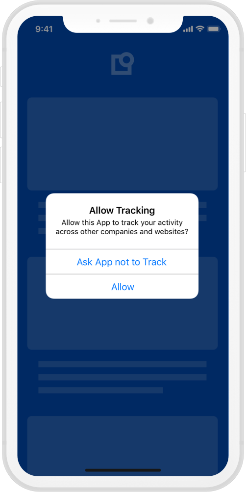
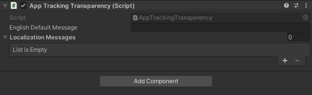

#AppTrackingTransparency Framework - iOS 14.5

Starting with iOS 14.5, Apple requires you to declare the type of data your app is tracking and ask users for permission to track them. For this, Apple has provided the [AppTrackingTransparency](https://developer.apple.com/documentation/apptrackingtransparency) framework. (ATT)

{: .aligncenter width=300px }

## Does ATT replace a CMP?

No, it does not. A CMP collects consent based on the legal requirements of a framework, such as GDPR or CCPA/CPRA, which are valid in their respective jurisdiction. Where as ATT is designed to provide transparency about the tracking practices of an App. The underlying value of ATT is to empower users, by giving them the control over who can have access to their Advertising Identifier (IDFA, an ID used by advertisers to identify a unique user/device and provide personalized ads), by signaling to the app developer, that tracking practices should/should not be enabled.

## How to support ATT?

1. Depending on your App Flow, you may request ATT permission whenever you deem convenient, but we recommend collecting both legal consent via the Usercentrics CMP and ATT permission in consecutive steps.
   The system will handle showing the popup, you will just need to call this function.

    ```c#
    AppTrackingTransparency.Instance.PromptForAppTrackingTransparency((status) =>
    {
        switch (status)
        {
            case AuthorizationStatus.AUTHORIZED:
                // You may enable tracking frameworks
            case AuthorizationStatus.DENIED:
                // You should disable tracking frameworks
            case AuthorizationStatus.NOT_DETERMINED:
                // State before prompt is shown. No further action.
            case AuthorizationStatus.RESTRICTED:
                // Restricted. See: https://developer.apple.com/documentation/apptrackingtransparency/attrackingmanager/authorizationstatus/restricted
        }
    });
    ```  
2. Also depending on your App Flow, you can retrieve the current Authorization Status. You just need to call this function. Please note that, if user has not yet given consent, the obtained status will be `AuthorizationStatus.NOT_DETERMINED`.

    ```c#
    AppTrackingTransparency.Instance.GetAuthorizationStatus((status) =>
    {
        switch (status)
        {
            case AuthorizationStatus.AUTHORIZED:
                 // You can enable tracking frameworks
            case AuthorizationStatus.DENIED:
                // You should disable tracking frameworks
            case AuthorizationStatus.NOT_DETERMINED:
                // State before prompt is shown. No further action.
            case AuthorizationStatus.RESTRICTED:
                // Restricted. See: https://developer.apple.com/documentation/apptrackingtransparency/attrackingmanager/authorizationstatus/restricted
        }
    });
    ```  

## How to support internationalization with ATT?

!!! warning "Possible Plugin conflict"
    If you use an localization plugin and our solution, please be aware that they may conflict.

1. Drag the ATTManager game object into your scene and **set an english default message**.
   {: .aligncenter width=400px }

    !!! warning "Set an english default message"
        If you do not set the english default message, the ATT support will not be enabled!

2. ATT supports localization for several languages. You can also configure it with messages for other languages.
   {: .aligncenter width=400px }

    1. Note that the English default message message will only be displayed if the device's language is set to English or if the device's language is set to a language that does not have a corresponding localized message.
    2. On Localization Messages, click the __+__ sign and choose the desired language from the dropdown menu.
    3. Write the localized message for the selected language.
       {: .aligncenter width=400px }
    4. If you wish to add a message for a language that is not available on the dropdown menu:
        1. Select __Other__.
        2. You will have a __Manual Iso Code__ field, where you can pass the language ISO code. __Please use two-letter ISO 639-1 or three-letter ISO 639-2 language codes with optional region or script designators__.
           {: .aligncenter width=400px }

!!! info "Handling for versions under iOS 14"
    Since ATT permission is not supported in versions lower than iOS 14. We will always return AUTHORIZED, if this method is called in not supported versions.

If permission has never been requested, the system will prompt the ATT pop-up, and the result will be return on the callback.
Once permission has been collected, any future call to this function will directly return the permission status without presenting the pop-up.
