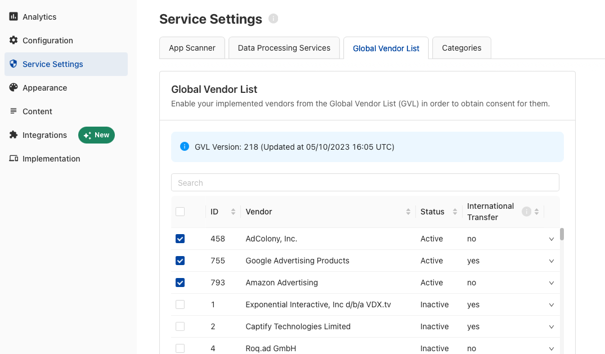

# Applying Consent

Now that you have collected consent, let's make sure to respect the user's choices by applying consent to each SDK.

!!! danger "IMPORTANT: Please review EVERY vendor's documentation to understand how each SDK expects consent to be passed."
    **DO NOT** assume consent is passed automatically to every SDK. Even if you are using the [TCF standard](#tcf-vendors) or our [Consent Mediation](../features/consent-mediation.md) feature, please test and verify that consent is reaching the target SDKs.

First, we need a way to match the 3rd party technologies declared in your configuration, with the SDKs running in your Game.

## When should you apply consent?

### After collecting consent the first time
The first time you launch the app with the Usercentrics SDK, no consent will have been collected and `status.shouldCollectConsent` returned in `isReady` will be **TRUE**, letting you know that you should collect consent by showing the banner.
Once a user has responded, a `userResponse` will be returned on the banner callback, which will contain the consent object.
```c#
Usercentrics.Instance.ShowFirstLayer(<UsercentricsLayout>, (userResponse) => {
    applyConsent(userResponse.consents);
});
```

### As early as possible on any future app launch
In any future initialization after collecting consent for the first time, you will already have a **consent status** stored on device, and you will only need to apply it as early as possible in the app cycle.
In this case, the callback of the initialization will return **FALSE** for `status.shouldCollectConsent`, and you may apply consent directly.

```c#
Usercentrics.Instance.Initialize((status) => {
    if (status.shouldCollectConsent) {
        // Collect Consent
    } else {
        applyConsent(status.consents);
    }
},(errorMessage) => {
    // Failure: Returns non-localized error
});
```
## How to apply consent?
SDKs that access and process user and/or device data, are **only allowed** to do so, if the user has given explicit consent.
In order to be compliant, please review **every** SDK in your Game for the following cases:

### TCF Vendors
When using third party services that are certified as [TCF Vendors](https://iabeurope.eu/vendor-list-tcf/), you will need to declare these services via the Global Vendor List (GVL) tab, in the Service Settings section of your TCF configuration. 

{: .aligncenter .imageBorder width=800px }

Given you have selected your TCF Vendors in the GVL and published the changes, when a user provides consent, the SDK will generate an encoded string with the consent for these vendors according to the TCF 2.2 standard, called:

#### TC String

As [specified by the IAB](https://github.com/InteractiveAdvertisingBureau/GDPR-Transparency-and-Consent-Framework/blob/master/TCFv2/IAB%20Tech%20Lab%20-%20CMP%20API%20v2.md#in-app-details), the collected consent for IAB Vendors will be encoded into a [TCString](https://github.com/InteractiveAdvertisingBureau/GDPR-Transparency-and-Consent-Framework/blob/master/TCFv2/IAB%20Tech%20Lab%20-%20Consent%20string%20and%20vendor%20list%20formats%20v2.md#about-the-transparency--consent-string-tc-string) and stored locally in `NSUserDefaults`(iOS) or `SharedPreferences`(Android).
You may access these values with their [specific Keys](https://github.com/InteractiveAdvertisingBureau/GDPR-Transparency-and-Consent-Framework/blob/master/TCFv2/IAB%20Tech%20Lab%20-%20CMP%20API%20v2.md#what-is-the-cmp-in-app-internal-structure-for-the-defined-api).

In most cases, the Vendor SDK might automatically pull the TCString, and [apply consent to itself automatically](https://github.com/InteractiveAdvertisingBureau/GDPR-Transparency-and-Consent-Framework/blob/master/TCFv2/IAB%20Tech%20Lab%20-%20CMP%20API%20v2.md#how-do-third-party-sdks-vendors-access-the-consent-information-in-app). In case the vendor SDK requires you to pass the TCString programmatically, you may use:

```c#
Usercentrics.Instance.GetTCFData((tcfData) => {
    var tcString = tcfData.tcString;
});
```

!!! warning "Consent for Non-IAB vendors NEEDS to be [applied programmatically](#sdks-with-a-consent-api)"


### Non-TCF Vendors

#### How to match a service with an SDK?
Every service (DPS) available in our database, such as:

* Google Firebase
* Unity Ads
* Adjust
* AppLovin
* Vungle

will have a unique `templateID` to identify it. This ID can be found under **Service Settings > Data Processing Services > Service Extended Information**.

{: .aligncenter .imageBorder width=800px }

We will be using this ID to match every declared service with it's SDK.

#### SDKs with a consent API
SDKs that support data privacy compliance, will provide an API to set the user's consent status. The API and it's behaviour will be documented by the SDK's provider.

e.g.

* Google Analytics for Firebase's [Consent Mode](https://developers.google.com/tag-platform/devguides/app-consent)
* Unity Ad's [Privacy consent and data API](https://docs.unity.com/ads/ImplementingDataPrivacy.html)
* AppLovin's [Privacy API](https://dash.applovin.com/documentation/mediation/ios/getting-started/privacy)

!!! tip "Regulation dedicated APIs"
    Please note that most APIs are dedicated for a specific regulation. e.g. GDPR for Europe, CCPA/CPRA for California, COPPA for children protection, etc. Make sure to review the documentation and apply the consent for the correct regulation.

To apply consent to these SDKs, [identify the target SDK](#how-to-match-a-service-with-an-sdk) and implement the consent API as documented:

```c#
private void applyConsent(List<UsercentricsServiceConsent> consents){
    foreach (var serviceConsent in consents) {
        switch (serviceConsent.templateId) {
            case "hpb62D82I": // Unity Ads Template ID
                // UnityAdsConsentAPI.Enabled = service.consent.status;
                break;
            case "YYyyYyYYY": // Other SDK Template ID
                // Pass consent to framework with service.status
                break;
            default:
                // Log a warning if a service was not caught or do nothing
                break;
        }
    }
}
```

!!! danger "Not all APIs are created equal"
    Please make sure you read through each documentation, as many providers might require other steps to fully be complaint.

#### SDKs without a consent API
For SDKs that track user/device data and do not offer a consent API, the only solution is to not initialize those SDKs, when a user did not provide consent.

```c#
private void applyConsent(List<UsercentricsServiceConsent> consents){
    foreach (var serviceConsent in consents) {
        switch (serviceConsent.templateId) {
            case "x-XXXxXx": // Template ID
                // Only initialize an SDK if consent has been given
                if (service.status) { initializeSDK() }
                break;
            case "YYyyYyYYY": // Other SDK Template ID
                //Initialize framework based on service.status
                break;
            default:
                // Log a warning if a service was not caught or do nothing
                break;
        }
    }
}
```
