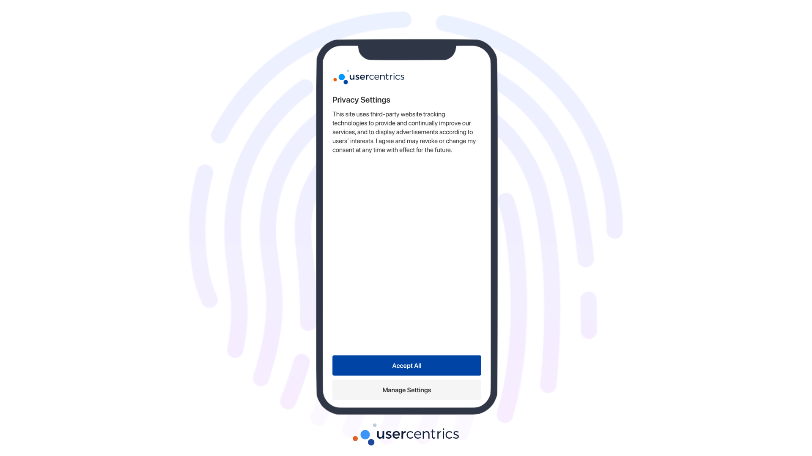
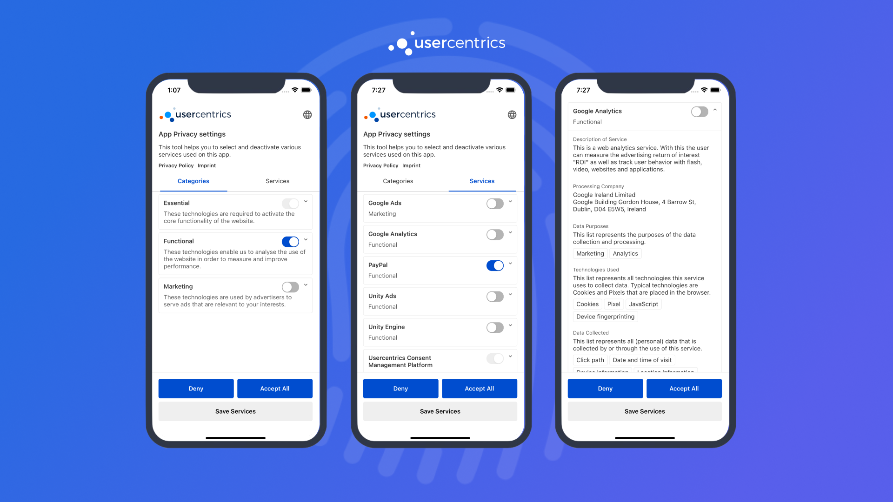

# Collecting Consent with Usercentrics UI

**Usercentrics UI** is a native UI component designed to own all the complexity of compliance, while also allowing different levels of customization.

This component consists of 2 Layers:

{: .aligncenter .imageBorder width=800px }

## First Layer

The **First Layer** is designed to be friendly to end-users, compact and highly customizable. This layer can be presented in 3 different ways:

=== "Popup"
    
    {: .aligncenter .imageBorder width=800px }

=== "Sheet"
    
    {: .aligncenter .imageBorder width=800px }

=== "Full"

    {: .aligncenter .imageBorder width=800px }

!!! tip "Recommendation"
    Use the **First Layer** when collecting consent for the first time or when prompting updates to the consent services. Remember that user's will be able to navigate from the **First Layer** to the **Second Layer**.

To present the **First Layer**, simply call `showFirstLayer()` from a `Usercentrics` instance. Once the user provides their consent, a [userResponse](#handling-userresponse) object will be returned.

```c#
Usercentrics.Instance.ShowFirstLayer(<UsercentricsLayout>, (userResponse) => {
    // Handle userResponse
});
```

## Second Layer

The **Second Layer** is designed to own all the complexity of compliance, declare all legally required information and allow for granular choices.

{: .aligncenter .imageBorder width=800px }

!!! tip "Recommendation"
    Use the **Second Layer** to allow users to review their choices from your game settings. Allowing for review and editing of consent is part of privacy compliance.

To present the **Second Layer**, similarly call `showSecondLayer()` from a `Usercentrics` instance, and . The same [userResponse](#handling-userresponse) object will be returned here as well.

```c#
Usercentrics.Instance.ShowSecondLayer(<showCloseButton>, (userResponse) => {
    // Handle userResponse
});
```

## Handling UserResponse

The `userResponse` object provided in the callback of UsercentricsUI, contains the following information:

| Properties      | Type                                                                                  | Notes                                                                                                                                                                                                               |
|-----------------|---------------------------------------------------------------------------------------|---------------------------------------------------------------------------------------------------------------------------------------------------------------------------------------------------------------------|
| consents        | [[UsercentricsServiceConsent](../../apps/api/core-api.md#usercentricsserviceconsent)] | List of the user's consent choices needed to [apply consent](./apply_consent.md).                                                                                                                                   |
| userInteraction | Enum                                                                                  | Response given by user: **AcceptAll**: User accepted all services, **DenyAll**: User denied all service. **Granular**: User gave a granular choice, **No Interaction**: User dismissed the Banner with no response. |
| controllerId    | String                                                                                | A Usercentrics generated ID, used to identify a specific user. This value is required when using [Cross-Device Consent Sharing](../../apps/features/restore-user-sessions.md).                                      |

!!! success "You have successfully collected consent! 🚀"

Now, it is **fundamental** that the user's privacy choices are applied to the 3rd party SDKs on you App.
Please continue to [Apply Consent](./apply_consent.md).
