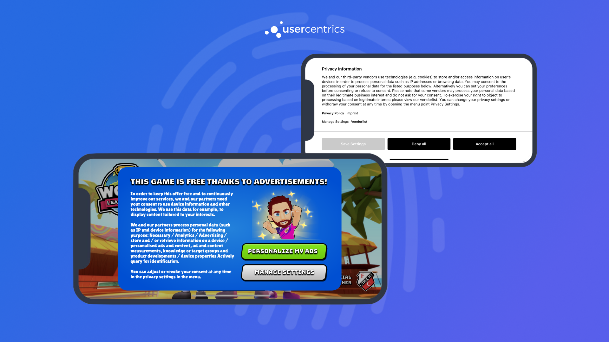

# Initializing Usercentrics
Before we get started with the integration, let's review some basics on when to initialize Usercentrics and legal requirements.

## When to present the banner?
In general, you are free to decide when to present the banner to your users. *e.g. Right after app launch, after login, during app onboarding, etc.*

There are only 2 requirements when deciding when to do this:

!!! danger "Requirement 1"
    Do **NOT** enable any data tracking from 3rd party services/SDKs before a user has given explicit consent. This would otherwise be a breach of data protection regulations, which can result in heavy fines.

!!! danger "Requirement 2"
    Don't forget **Requirement 1**. 

## Initializing the SDK
There are two ways you can initialize the SDK:

### Auto Init

!!! tip "Use Case"
    Use **Auto Init** to present the banner automatically when a scene starts. This integration only supports using our [Usercentrics UI](#usercentricsui), which can be customized via our [Configuration Dashboard](https://admin.usercentrics.eu). To have more control over when to show the banner, please continue to [Programmatic Init](#programmatic-init).

1. Enable **Auto Initialize** in the Inspector Tab. When the Scene is shown for the first time, the consent banner will appear automatically when needed. 

{: .aligncenter .imageBorder width=300px }

!!! check "Done! 🚀 The SDK will now be initialized when the scene starts. Please continue to [Apply Consent](apply_consent.md) to finish the integration."

### Programmatic Init

!!! tip "Use Case"
    Use **Programmatic Init** to have control over when to present the banner in a given scene. This integration supports creating your own Banner, which can unlock a much higher performance for opt-in rates.

!!! warning "Disable Auto Initialize"
    For a custom integration, please make sure Auto Initialize is **disabled**.

#### Steps

Import `Usercentrics` to the Scene 
    ```c#
    using Unity.Usercentrics;
    ```

On Scene start, call `Initialize()` from a `Usercentrics` instance. On success, evaluate `status.shouldCollectConsent`, examples:

=== "SettingsID"

    ```c#
    Usercentrics.Instance.Initialize((status) => {
        if (status.shouldCollectConsent) 
        { 
            // Collect Consent
        }
        else
        {
            // Apply Consent with status.consents
        }
    },(errorMessage) => {
        // Failure: Returns non-localized error
    });    
    ```

=== "RulesetID"

    ```c#
    Usercentrics.Instance.Initialize((status) => {

        if (status.geolocationRuleset.bannerRequiredAtLocation == false)
        {
            return;
        }

        if (status.shouldCollectConsent)
        { 
            // Collect Consent
        } 
        else
        {
            // Apply Consent with status.consents
        }

    },(errorMessage) => {
        // Failure: Returns non-localized error
    });    
    ```

    !!! tip "Handling `status.shouldCollectConsent`"
        `shouldCollectConsent` will let you know if you should present the banner. e.g If consent has never been collected, or if the banner needs to be shown again do to changes on your configuration.
    
        If consent has already been collected, you can simply apply the consent given, which will be available in `status.consent`

Present the Consent Banner when `status.shouldCollectConsent` is TRUE or apply consent if `status.shouldCollectConsent` is FALSE. 

!!! warning "Handle init errors"
    In case of an error on init (most likely caused by connection issues), please catch this error and continue the user flow as expected. We recommend to treat this as if the user did not give consent. The next time the SDK is initialized correctly you should collect consent normally.

## Presenting the Consent Banner
In order to present the banner, we offer different options depending on your needs:

### UsercentricsUI

Use our out-of-the-box UI component, that owns all the complexity of compliance, and can be customized via our Configuration Dashboard. [Continue to Collecting Consent with UsercentricsUI](./collect-consent.md).

{: .aligncenter .imageBorder width=800px }

### Build you own Banner

Build a Banner that fits your game design language, and let us take care of the rest. [Continue to Build your own UI](../features/build_own_ui.md).

{: .aligncenter .imageBorder width=800px }

!!! warning "Only for IAB TCF 2.2 certified customers"
    Currently you can only use this solution if you are building a Banner that adheres to the IAB's TCF 2.2 Standard. For this you will need to be [certified as a CMP by the IAB](https://iabeurope.eu/tcf-for-cmps/).

### Hybrid

If you need a "in between" solution, we encourage you to mix these two approaches to get the best of both worlds. *e.g. Create your own first layer banner, and let UsercentricsUI take care of the complexity on a second layer.*
