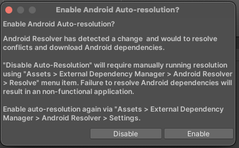

# Installing the Usercentrics Unity Package

### Download
Download the latest release of our [Unity Package](https://bitbucket.org/usercentricscode/unity-sdk/downloads/).

??? tip "Static Linkage Support for iOS"
    Because we use ExternalDependencyManager, the project output when building for iOS, will be a CocoaPods workspace, which offers an option to Link frameworks statically.
    If you need support for Static Linkage on iOS, please download the latest package with the `-static` suffix. *e.g. `Usercentrics-2.X.X-static.unitypackage`.

### Install
!!! check "Prerequisites"
    * Android 5.0 (API 21), or higher, for the Minimum API Level and Android 12 (API 31) for the Target API Level
  * Java version 8 or 11 depending on the [Unity Version](https://docs.unity3d.com/Manual/android-sdksetup.html)
  * Kotlin 1.7 or higher
  * iOS 11 or higher

#### On Unity IDE

1. Drag and drop `Usercentrics.unitypackage` into your Unity project. Alternatively, you can select the package from the menu `Assets > Import Package > Custom Package`

    !!! warning "ExternalDependencyManager"
        If you have already imported [ExternalDependencyManager](https://github.com/googlesamples/unity-jar-resolver) for Unity in your project, you can deselect it in the pop-up, to keep your previous configuration.
        
        {: .aligncenter .imageBorder width=300px }

2. Click on "Import".
3. From `Usercentrics/Prefabs`, drag `Usercentrics` prefab into your Scene, this will represent the Game Object for our Banner.

   {: .aligncenter .imageBorder width=500px }

!!! warning "The name of this object needs to be `Usercentrics`." 

!!! check "Usercentrics Package is now installed, lets continue to [Configure](configure.md)! 🚀"

### Troubleshooting

=== "Unity"

    !!! warning "Unity Editor is NOT Supported"
        The Unity Editor is not supported at the moment. In order to test and debug the CMP you will need to run the project on a simulator or real device.

=== "iOS Setup"

    !!! tip "Supporting iOS & Xcode"
        Cocoapods must be installed for iOS builds to work, check their [installation guide.](https://cocoapods.org/#install)

        When opening the project built by Unity, you should **always** select the .xcworkspace file created by Cocoapods.

=== "Android Setup"

    !!! tip "Dependencies"
        When Android is selected as Build Platform, the dependency manager will ask you to download the dependencies that Usercentrics needs. We recommend enabling Android Auto-resolution to handle this. Make sure you have downloaded all Android Build Support Modules including OpenJDK.

    !!! warning "Internet Access is Required"
        The Usercentrics SDK needs internet in order to initialize. Make sure you enable a required connection in your Android Player Settings. File > Build Settings > Android (selected) > Player Settings > Other Settings > Internet Access > Required

    !!! warning "ExternalDependencyManager and Building"
        When using this plugin for the first time, a popup will appear asking if you want to enable "Android Auto-resolution", we highly recommend to enable, since it's natural for some Android libraries
        have conflicting dependencies. Enabling this "auto-resolution", the plugin will take care of everything for you.
    
        {: .aligncenter .imageBorder width=300px }

    !!! warning "Dependency conflicts (Duplicate classes) or ExternalDependencyManager fails to resolve dependencies"
        If the auto-resolution process fails to resolve any conflicts, we advise you to modify your project's build configuration for Android.
        By doing so, you will not depend solely on the ExternalDependencyManager to download all dependencies.
        Instead, you allow Gradle to handle the resolution of dependencies and any emerging conflicts.
        
        To do that you just need to follow these steps:

        - Go to File -> Build Settings -> Switch platform to Android

        - Go to Player Settings

        - Scroll to the last section "Publishing Settings"

        - Enable "Custom Main Gradle Template"

        - Enable "Custom Gradle Properties File"

        - Save & close

        - Go to Assets -> External Dependency Manager -> Android Resolver -> Settings

        - Make sure "Patch mainTemplate.gradle" & "Patch gradleTemplate.properties" are both enabled

