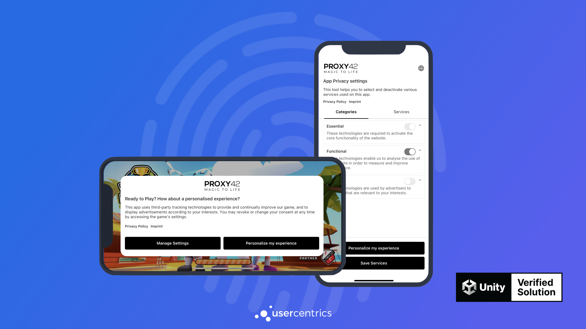

# Welcome!
We know **monetization and user retention** is important to you, and it's easy to think that privacy will be an obstacle for these metrics. But we are here **to show you a better way**, where you can improve your monetization strategy, boost user retention and become compliant with privacy regulations all at the same time.

## The Usercentrics Unity SDK
The Usercentrics Unity SDK helps you become compliant with privacy regulations such as **GDPR (Europe) & CCPA (US/California)** and compliance standards like the IAB's **TCF 2.2**.

{: .aligncenter .imageBorder width=800px }

With our **Drag and Drop** integration, you will be compliant from the get go, and will have all our optimization and analytics features to unlock a better performance for your monetization and retention, while also being compliant with privacy compliance regulations.

## Get started
Please create a [Usercentrics account](https://usercentrics.com/in-app-sdk/) or starting a [free trial](https://usercentrics.com/free-trial-app/) in order to test the Usercentrics SDK.

## Supported Legal Frameworks
* 🇪🇺 GDPR - European Union's General Data Protection Regulation
* 🌎 TCF 2.2 - IAB's Transparency & Consent Framework 2.2
* 🇺🇸 CCPA/CPRA and other US Frameworks - Regulations in US States
* 🇧🇷 LGPD - Brazil’s Lei Geral de Proteção de Dados
* and many more...

## Features
* Easy installation via a package manager
* Methods to collect & update consent
* Up-to-date legal information on more than 1,000 technology vendors
* **UsercentricsUI** is a plug & play CMP solution with endless customization options
* Build your own CMP with our **UsercentricsCore** module, an API that provides all necessary data and action delegates
* Device language detection
* tvOS and Android TV support only when building your own CMP
* Share the same settingsID between multiple apps and web applications
* Cross-Device consent sharing
* Consent continuity between the app and embedded WebViews. (Browser SDK is required)
* Offline Handling
* Support for Landscape Mode
* Reporting of service Opt-In rates
* Reporting of User Interactions
