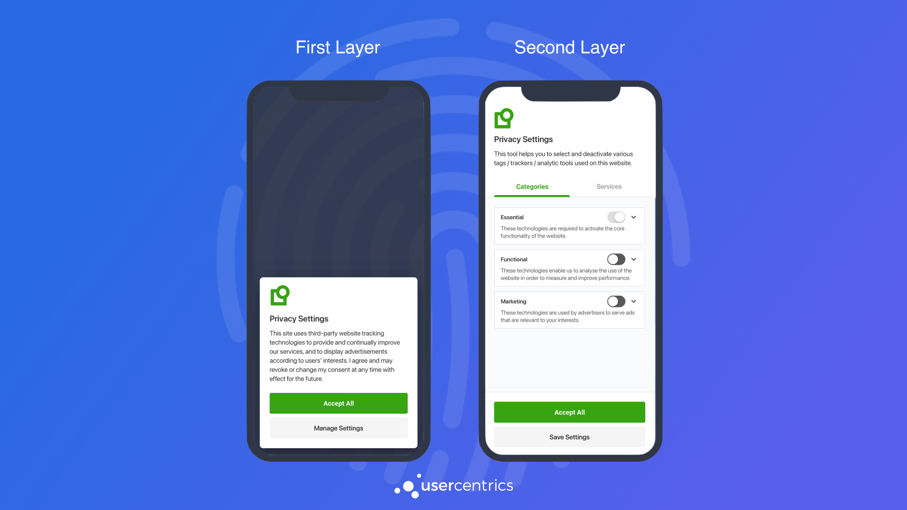
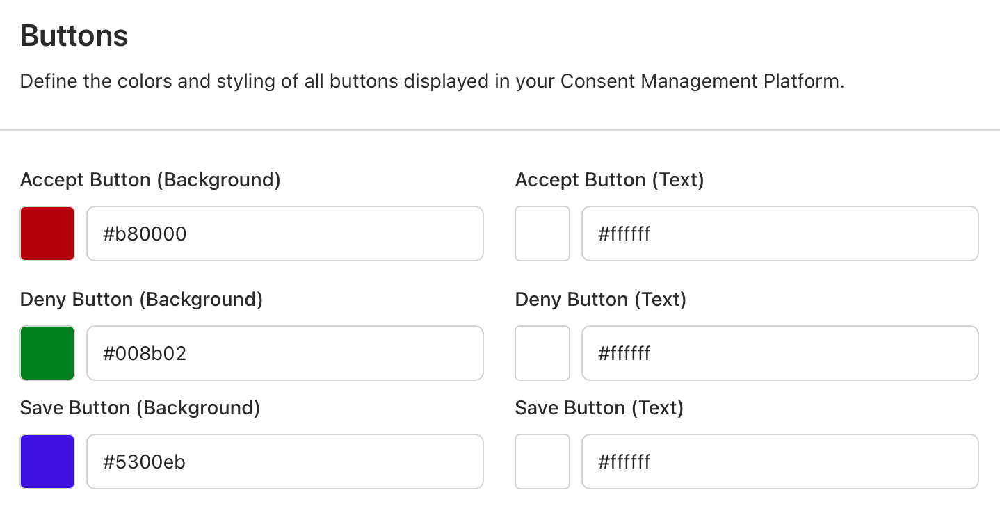
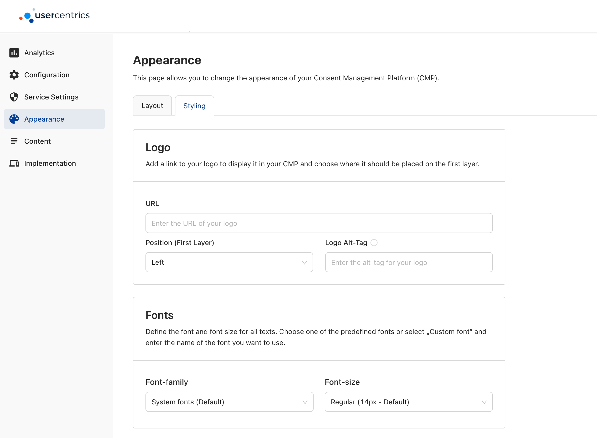
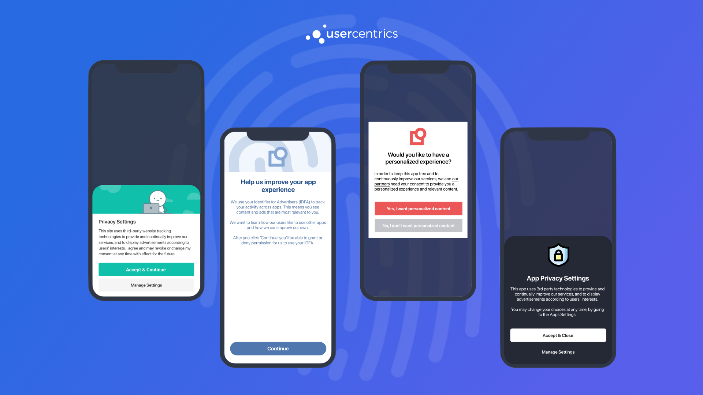

# Customization
User experience is a relevant variable when collecting consent. We highly encourage you to take advantage of our customization features, in order to provide a branded and user friendly banner to your users.

## Remote Customization
Use our **Remote Customization** options, for a quick out-of-the-box branding that covers all the basics.

{: .aligncenter .imageBorder width=800px }

In the **Appearance** section of our Admin Interface, you will find the **Layout** and **Styling** tabs:

=== "Layout"

    Under **Display Options**, you will find the following options:

    * Hide "Deny All" button
    * Hide Language switch

    !!! tip "Showing the Language Switch"
        The language switch will only be shown in the **Second Layer**, and both of the following requirements need to be fulfilled:
        
        * Multiple **visible languages** are added in the **Configuration** section of the Admin Interface.
        * The "Hide language switch" option is disabled in the **Appearance** section of the Admin Interface, under the "Layout" tab.

=== "Styling"

    **Colors:** Set individual colors by providing a specific HEX or using our color picker for the following banner elements:

    * Background Color
    * Text Color
    * Links Color
    * Tab Color
    * Accent Color
    * Button Colors
    * Tabs Color
    * Toggle Colors

    {: .aligncenter .imageBorder width=500px }

    **Text Font and Size:** Only supported via [Programmatic Customization](#programmatic-customization).

    **Logo:** Set an image to appear at the top of your banner by providing a URL, as well as it's position:

    {: .aligncenter .imageBorder width=500px }

    ??? tip "Supported URL Image Formats"
        When passing a URL to fetch an image, the SDK supports: **iOS**: PNG and JPEG. **Android**: PNG, JPEG, BMP, GIF and WebP.

{: .aligncenter .imageBorder width=600px }

Any changes to the properties available here, will only take effect with a new init of the SDK and clean/updated cache.

!!! tip "Forcing configuration updates during Testing"
    You may force a configuration update by using the [reset()](../api/core-api.md#reset) function, or by deleting the app and installing it again. **We only recommend doing this when integrating and testing the SDK**.

!!! tip "Configuration updates in Production"
    The SDK caches essential data on device after the first successful init, in order to be efficient with resources and provide offline capabilities. This cache is kept for several days, depending on app usage. Which means user's will not get "Published" changes from the Admin Interface immediately, but we can guaranty changes will take effect for 100% of your user base latest within a week.

## Programmatic Customization
Use our **Programmatic Customization** API, to create advance banner designs and run-time variants. Using this API unlocks features like [A/B Testing](ab-testing.md#ab-testing).

??? danger "Compliance Note"
    Because the **Programmatic API** enables many customization options, it is important that your DPO (Data Protection Officer) reviews and approves the compliance of your design:

    e.g.

    * A user should always have clear options to accept, deny or save granular choices available as call to actions in the 1st or 2nd layer.
    * The **First Layer** should always allow a path to the **Second Layer**.
    * Calls to action should be equally prominent.

{: .aligncenter .imageBorder width=800px }

When creating the UsercentricsUI banner, a `BannerSettings` property will be available for you to customize any element of the banner.

=== "C#"
    ```c#
    var bannerSettings = BannerSettings(generalStyleSettings: new GeneralStyleSettings(),
                                        firstLayerStyleSettings: new FirstLayerStyleSettings(),
                                        secondLayerStyleSettings: new SecondLayerStyleSettings());
    ```

###General Style Settings

!!! warning "Style Settings values overwrite Remote Style values"

| Properties                     | Type   | Notes                                                                                                                                      |
|--------------------------------|--------|--------------------------------------------------------------------------------------------------------------------------------------------|
| androidDisableSystemBackButton | Bool   | Disable Android system back button.                                                                                                        |
| androidStatusBarColor          | String | Android status bar color represented in HEX.                                                                                               |
| textColor                      | Color  | Edit the text color for both **First Layer** and **Second Layer**.                                                                         |
| layerBackgroundColor           | Color  | Edit the color of the **First Layer**, and Header and Footer of the **Second Layer**.                                                      |
| layerBackgroundSecondaryColor  | Color  | Edit the color of the background in the content section.                                                                                   |
| linkColor                      | Color  | Edit the color of all available links.                                                                                                     |
| tabColor                       | Color  | Edit the color of the Category and Services Tabs.                                                                                          |
| bordersColor                   | Color  | Edit the color for the borders of the Category and Services content section, Category and Service components and Service Information Tags. |
| toggleStyleSettings            | Object | Edit the toggle colors for: **Active**, **Inactive** and **Disabled** states.                                                              |
| logoImageUrl                   | String | Pass an image URL to be rendered as a logo in both **First Layer** and **Second Layer**.                                                   |
| links                          | Enum   | Customize the visibility of the legal links: **.both** (default), **.firstLayerOnly**, **.secondLayerOnly** and **.hidden**.               |

###First Layer Style Settings

| Properties      | Type   | Notes                                                                                                                                                                                     |
|-----------------|--------|-------------------------------------------------------------------------------------------------------------------------------------------------------------------------------------------|
| layout          | Enum   | Select the Layout of the First Layer: **Sheet**, **Popup Center**, **Popup Bottom**, **Full**.                                                                                            |
| headerImage     | Object | Customize the layout of the image at the top of your banner: **.logo** (default), **.extended** or **.hidden**.                                                                           |
| title           | Object | Customize the appearance of the title label: **Text Size**, **Text Color** and **Text Alignment**.                                                                                        |
| message         | Object | Customize the appearance of the message label: **Text Size**, **Text Color**, **Text Alignment**, **Link Text Color** and **Link Text Underline**.                                        |
| buttonLayout    | Object | Customize the layout of the action buttons: **.column** (default), **.grid**, **.row**. You may also pass an array of [ButtonSettings] to define the order and appearance of the buttons. |
| backgroundColor | String | Edit the color of the **First Layer** background in HEX.                                                                                                                                  |
| cornerRadius    | Float  | Edit the corner radius of the banner.                                                                                                                                                     |
| overlayColor    | String | Edit the color of the **First Layer** overlay in HEX.                                                                                                                                     |
| overlayAlpha    | Float  | Edit the alpha of the overlay color.                                                                                                                                                      |

###Second Layer Style Settings

| Properties      | Type | Notes                                                                                                     |
|-----------------|------|-----------------------------------------------------------------------------------------------------------|
| showCloseButton | Bool | Show a close button in the **Second Layer** to allow users to dismiss the banner without editing consent. |
