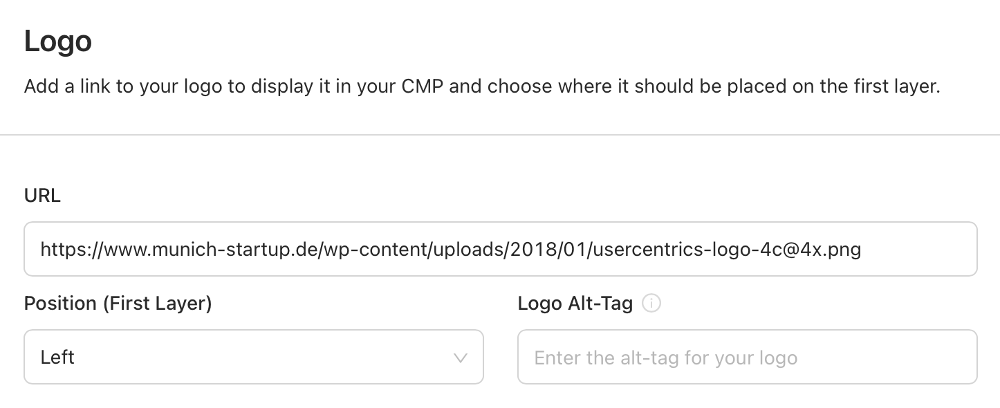

# Configuring the Banner

## Remote Customization

### Logo

Set an image to appear at the top of your banner by providing a URL:

{: .aligncenter .imageBorder width=500px }

!!! tip "Supported URL Image Formats"
    When passing a URL to fetch an image, the SDK supports: **iOS**: PNG and JPEG. **Android**: PNG, JPEG, BMP, GIF and WebP.

## Programmatic Customization

### BannerSettings

#### Logo

=== "tvOS"
    ```swift
    import UsercentricsUI

    let bannerSettings = BannerSettings(logo: <UIImage?>)
    let banner = UsercentricsBanner(bannerSettings: bannerSettings)
    ```

=== "AndroidTV"
    ```kotlin
    import com.usercentrics.sdk.ui.tv.BannerSettings
    import com.usercentrics.sdk.ui.tv.UsercentricsBanner
    import com.usercentrics.sdk.UsercentricsImage

    val image1 = UsercentricsImage.ImageDrawableId(<Int>)
    val image2 = UsercentricsImage.ImageDrawable(<Drawable>)
    val image3 = UsercentricsImage.ImageBitmap(<Bitmap>)
    val image4 = UsercentricsImage.ImageUrl(<String>)
    
    val bannerSettings = BannerSettings(
        logo = image,
    )

    val banner = UsercentricsBanner(
        context = <Context>,
        settings = bannerSettings
    )
    ```

#### Font

=== "AndroidTV"
    ```kotlin
    import com.usercentrics.sdk.ui.tv.BannerSettings
    import com.usercentrics.sdk.ui.tv.UsercentricsBanner
    
    val font1 = Typeface.createFromAsset(<Context>.assets, <String>)
    val font2 = ResourcesCompat.getFont(<Context>, <Int>)
    
    val bannerSettings = BannerSettings(
        font = font1,
    )
    
    val banner = UsercentricsBanner(
        context = <Context>,
        settings = bannerSettings
    )
    ```
