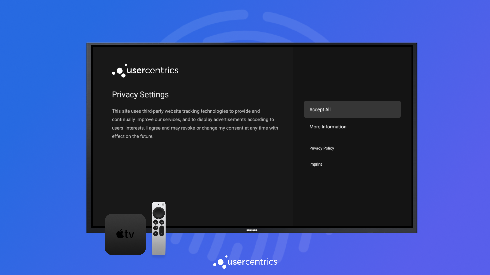

# The Usercentrics TV SDK

We have officially launched Consent Management Platform support for TV platforms: **tvOS** and **AndroidTV**.

Support for **Tizen (Samsung)**, **webOS Smart TV (LG)** and **Roku** will be coming next.

{: .aligncenter .imageBorder width=800px }

Taking advantage of the native design language of each platform, our new TV SDK brings all the features of our CMP to a bigger screen. With a really simple integration and out-of-the-box solution, we are confident we are continuing our high standard of developer experience and ease of integration.

Please note that **there are some differences when integrating the TV CMP**, and we have highlighted them in this section. For the rest, please follow our [standard documentation](../apps/integration/configure.md#configuring-the-sdk).
