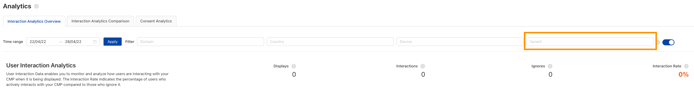

## Step 1: Admin Interface Setup

### Enabling A/B Testing in Admin Interface

The first step to enable A/B Testing is to enable it in your Admin Interface. We added the option to enable it via the Implementation tab (in the left menu in the Admin Interface). After opening the Implementation tab, click on A/B Testing and you will be presented with the following page.

On this page, click on the toggle to enable A/B Testing and a popup will appear. Please read the information shown there carefully and then click Enable a/B Testing to enable the functionality.


### Defining the Variants

After enabling the A/B testing tools you will be shown a page with the Configuration tab. On it, you can add your different Variants into JSON. Variants are the different versions of the Consent Management Platform that you want to test against each other on your page.

To understand this better, we provide the following example with two different variants, Variant0 and Variant1:

``` json
  {
    "variant0": {},
    "variant1": {
      "firstLayer": {
        "variant": "BANNER"
      }
    }
  }
```

!!! note ""
    `variant0` shows empty JSON, meaning that it is not modified and represents the Consent Management Platform that you configured inside the Admin Interface. In this case, we assume you have enabled the Privacy Wall in the Admin Interface.

!!! note ""
    `variant1` shows JSON with a rule for the First Layer Layout, determining that in Variant1 the First Layer Layout will be a BANNER instead of a WALL.

### Preview

You can use the preview in the Admin Interface, to compare and test the Variants you defined. To use the preview, please click on the preview button in the bottom left corner of the Admin Interface. 

Once you decided if the Draft or Live version should be displayed, a drop down menu in the preview allows you to switch between the different variants.


## Step 2: Performing the A/B Test

After you have set up the A/B test in your admin interface, we offer two ways to deploy the different variants.

You can use our internal feature or you can use all common third party A/B testing tools.


### Usercentrics Internal A/B Testing

You can enable the internal A/B testing by selecting the "Activate with Usercentrics" option in the Admin Interface under Implementation / A/B Testing. When using Usercentrics to display your variants, they are always evenly distributed (e.g. 50:50 in case of two variants).

!!! warning "Note"
    Make sure the toggle "Enable results for AbVariant" is enabled to display the data from your A/B test at the top right corner under Interaction Analytics Overview.

To get insights into the performance of the different variants, different options are provided within the Analytics section in the Admin Interface:

!!! abstract "Option 1: Interaction Analytics Overview"
    Filter the analytics data for one of the variants under Interaction Analytics Overview. To do this, select the respective variant in the "variant" dropdown at the top right corner.

    

!!! abstract "Option 2: Interaction Analytics Comparison"
    Directly compare the interaction and accept rates for the variants under Interaction Analytics Comparison / Variant Analytics.

    

!!! abstract "Option 3: Interaction Analytics Reporting"
    Download and use the Interaction Analytics Reporting to get in-depth insights. An additional "variant" column will tell you which variant was used for each entry in the data.

### A/B Testing with Third-Party Tool

To get even more detailed insights into your A/B test, we also offer the possibility to perform it with third-party A/B testing tools. Before diving into the different setups, we would like to give some general technical insights and recommendations.

!!! tip "UC_AB_VARIANT"
    This variable defines what A/B variant you will be testing on. As this variable will be delivered by the Usercentrics Consent Management Platform to the A/B testing tool to display the different variants, it needs to be set before the Consent Management Platform is loaded.

!!! tip "Script Order"
    We recommend that you add your A/B testing tool script in the `<head>` section of your code before the Usercentrics Consent Management Platform, since the A/B testing tool needs to be loaded before the Consent Management Platform to do the splitting properly.

!!! tip "UC_UI_CMP_EVENT"
    We defined various UI events that can be used in your A/B testing tool to track the interactions of your users with the different variants. For example, these events include ACCEPT_ALL (user clicks on accept all) or SAVE (user clicks on the save button).

Currently, we provide a setup guide for Optimizely and Kameleoon. Soon we will add guides for various other tools, like Google Optimize, Optimizely, and trbo.

- [Optimizely](./third-party-tool-guides/optimizely.md)
- [Kameleoon](./third-party-tool-guides/kameleoon.md)
- [trbo](./third-party-tool-guides/trbo.md)
- [Dynamic Yield](./third-party-tool-guides/dynamic-yield.md)
- [Google Optimize](./third-party-tool-guides/google-optimize.md)