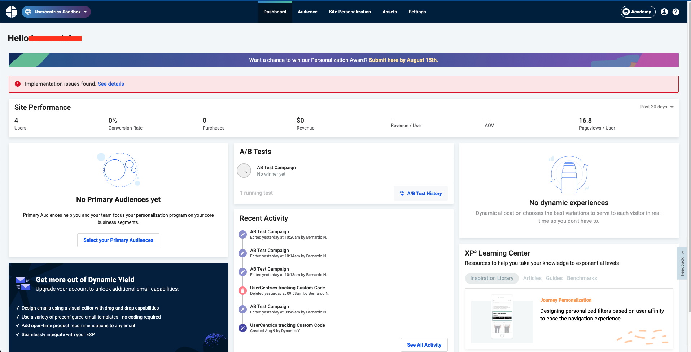
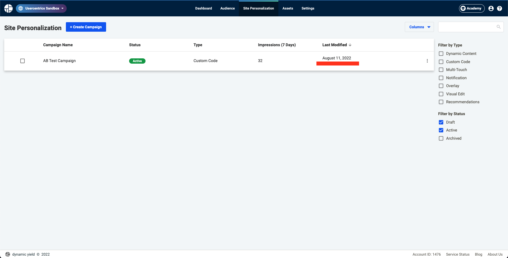
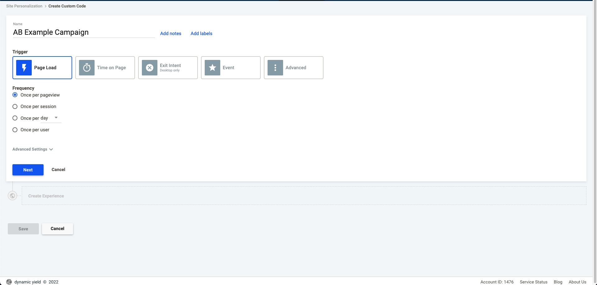
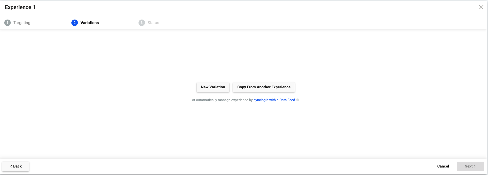
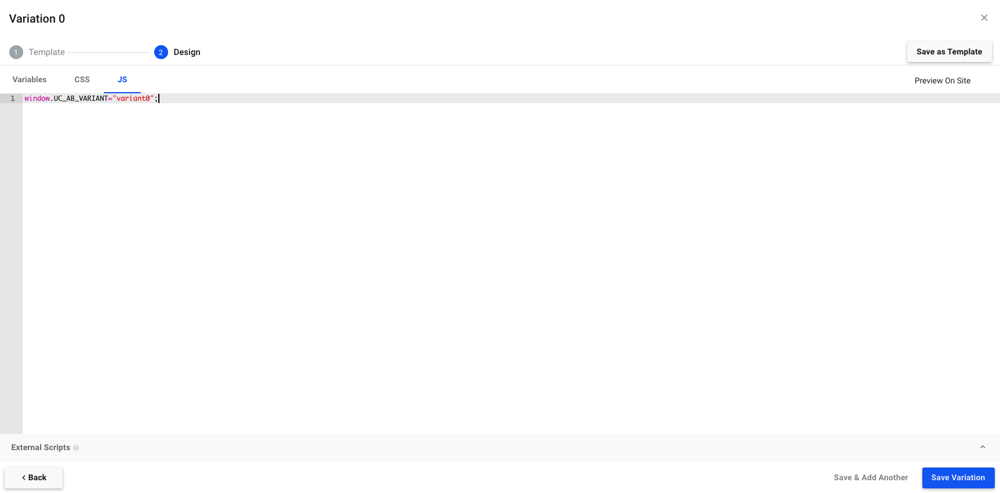
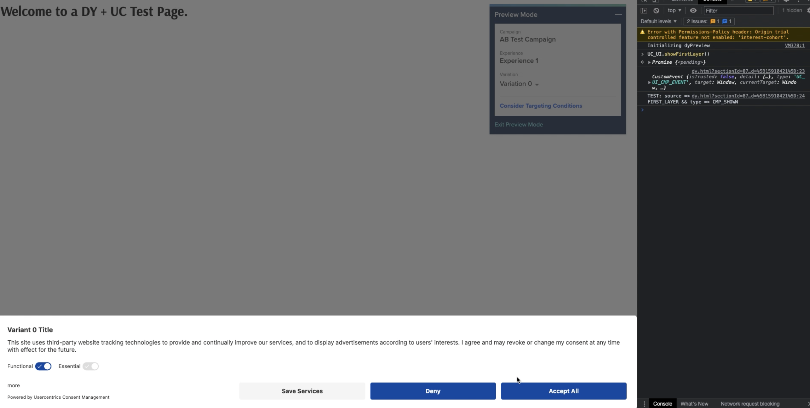
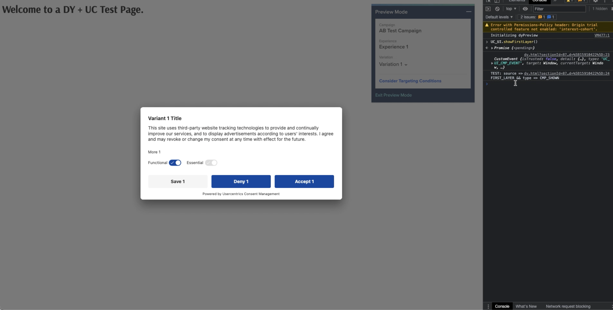
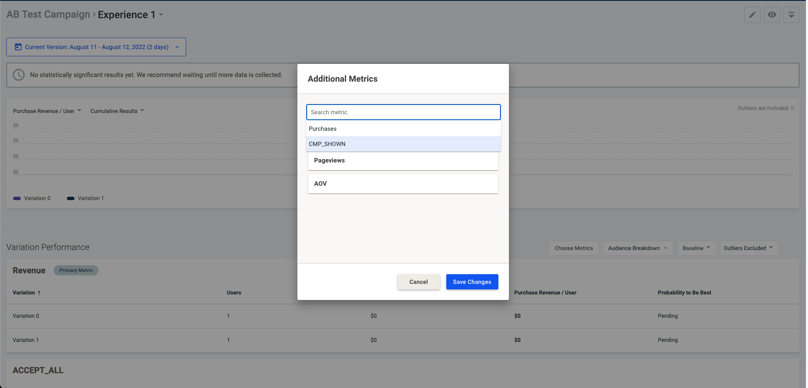
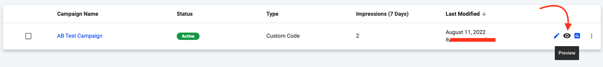

!!! note ""
    When using an A/B Testing Tool (eg. Kameleoon, Optimizely, ...), please check if you made any script adjustments on A/B testing tool script. If so, you will need to remove these adjustments on A/B testing tool script, because they break the functionality of the A/B Testing Tool.

## Setup Guide

Before approaching Dynamic Yield, we would suggest you take a look into its [documentation](https://support.dynamicyield.com/hc/en-us).

For this guide, you will need to have an Dynamic Yield account.

Assuming that you followed all the steps mentioned before in the A/B Testing Documentation, you can move to the Dynamic Yield configuration.

Login into your Dynamic Yield account. After logging in you will be sent to the main dashboard:



To create an A/B Testing campaign, click on Site Personalization, which will redirect you to this page:



To proceed with the creation of the campaign click "**+ Create Campaign**”, which will open a modal showing the different campaign types. Now click on the type “**Custom Code**” to define the variants. After clicking, a new page will load, where you can edit the Campaign as you like. We suggest the following settings:



Click **“Next”** and then we will define our Experience. Give it a suitable name, and define Targeting for All Users (default values).
After that click **Next** to define the Variants



Click “**New Variation**”, this will open a pop-up that will guide you through the creation of your Variation

- For the Template, choose Custom Code
- For the Code, enter the following JavaScript (make sure you choose JS) snippet for the first Variation - `window.UC_AB_VARIANT="variant0";` - , the name of the first variant is based on the variant name defined in the [first steps of the A/B Testing documentation](../setup.md#defining-the-variants).



Repeat the same process for the “variant1” and all the other A/B testing variants you have defined in the Admin Interface.

Hit Next and then save the changes as a Draft for further testing or hit Publish. Your A/B Testing Campaign is now created and published. You can preview the current campaign by clicking on the “eye” icon right beside the campaign:


The preview of the variants looks something like this:

- For `variant0`:


- For `variant1`:


!!! note ""
    The command that was used to call the Banner was `UC_UI.showFirstLayer()`

### Track Usercentrics CMP Events

The only missing step now is to track the Usercentrics CMP Events. For this step you will need to add a small piece of code to your source code. This code will add a new event to track on your campaign, so you will need first to add the code, use the page for then Dynamic Yield to detect these new events.

- Go to your Source Code and add this code snippet

``` html
<script type="text/javascript">
    window.addEventListener('UC_UI_CMP_EVENT', (data) => {
        DY.API("event", {
            name: data.detail.type,
            properties: {
                data:{
                    detail:{
                        source: data.detail.source,
                        type: data.detail.type
                    }
                }
            }
        });
    });
</script>
```

!!! note ""
    - This code will trigger every time a `UC_UI_CMP_EVENT` is fired (read more [here](../available-events.md))
    - Every time one of those events is fired, we will send to Dynamic Yield a call to store that event on our campaign and track it

- After using the page with this new code added, go to your Campaign
- Hit view report
- On the Variation Performance, hit Choose Metrics, and here Dynamic Yield will show all of the triggered Usercentrics Events. This however may take some time to show, since the tracking will need some time to load the recent visits to your page.



If you cannot add any kind of code to your page, because of any limitations regarding your code and/or platform, you can add this code snippet to all of your campaign variants, that you’ve defined before:



``` javascript
window.UC_AB_VARIANT="xxxxx"
window.addEventListener('UC_UI_CMP_EVENT', (data) => {
    DY.API("event", {
        name: data.detail.type,
        properties: {
            data:{
                detail:{
                    source: data.detail.source,
                    type: data.detail.type
                }
            }
        }
    });
});
```

!!! tip "Learn more"
    You can read more about Dynamic Yield in the [DY Knowledge Base](https://support.dynamicyield.com/hc/en-us).
