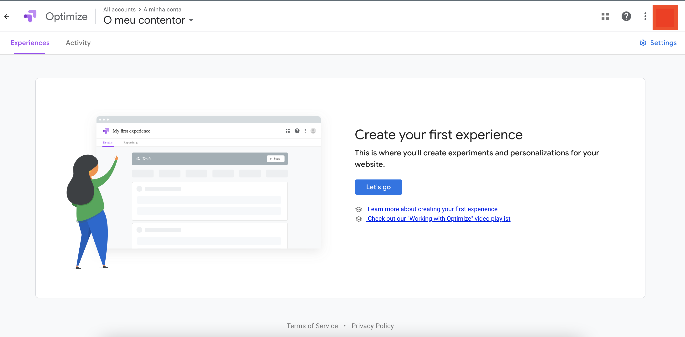
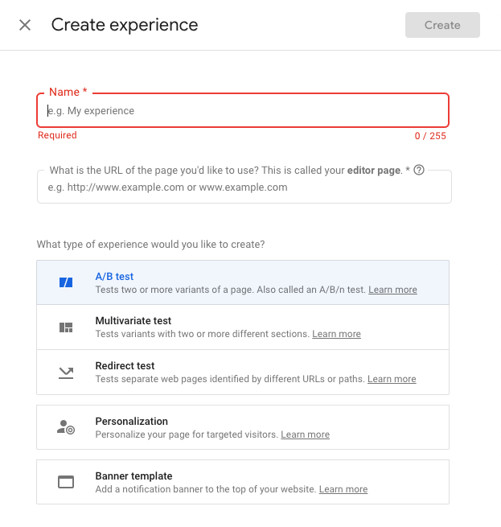
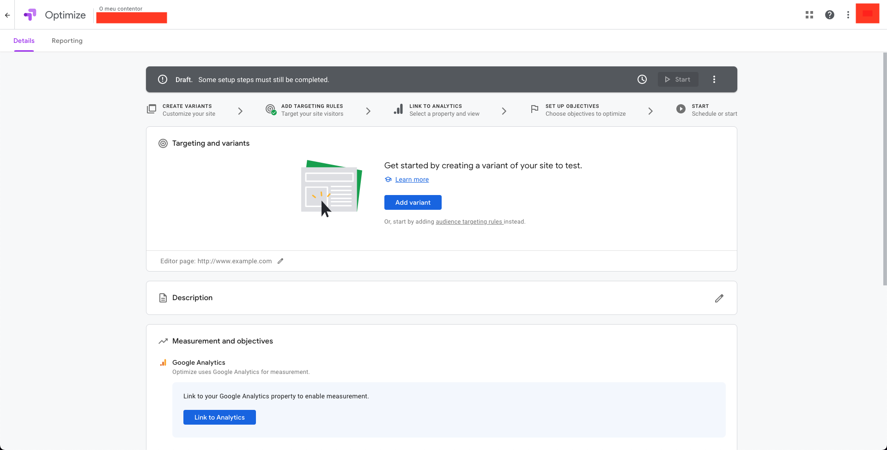
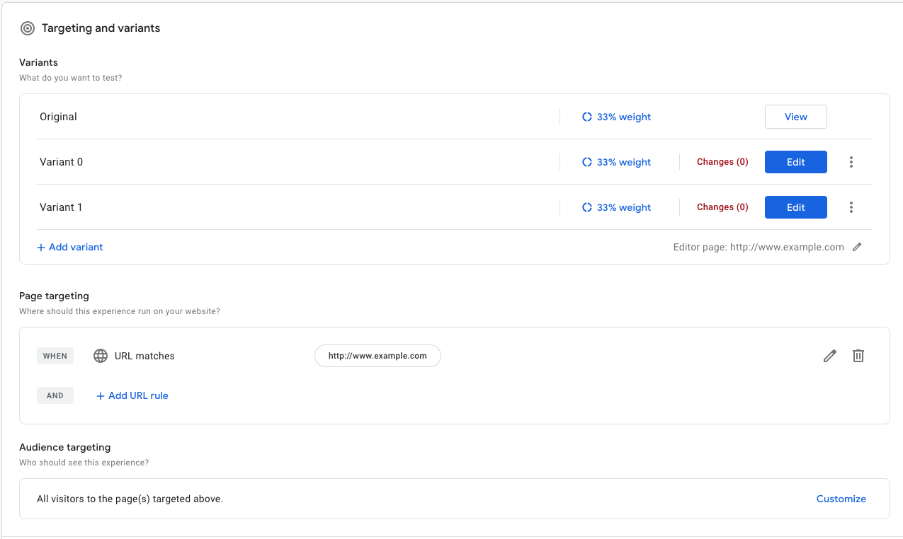
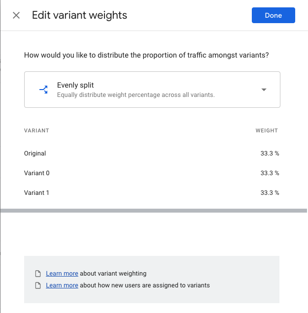
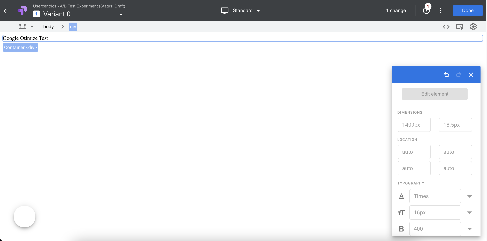
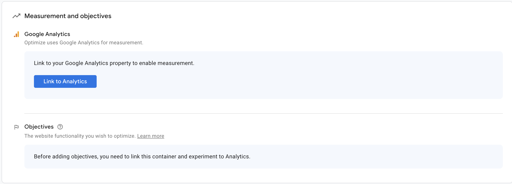
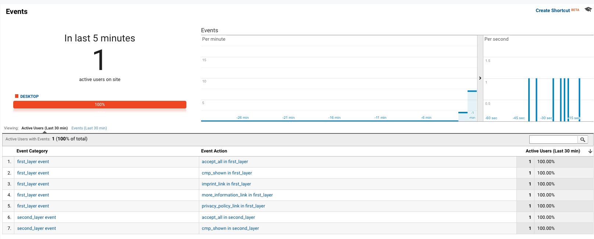
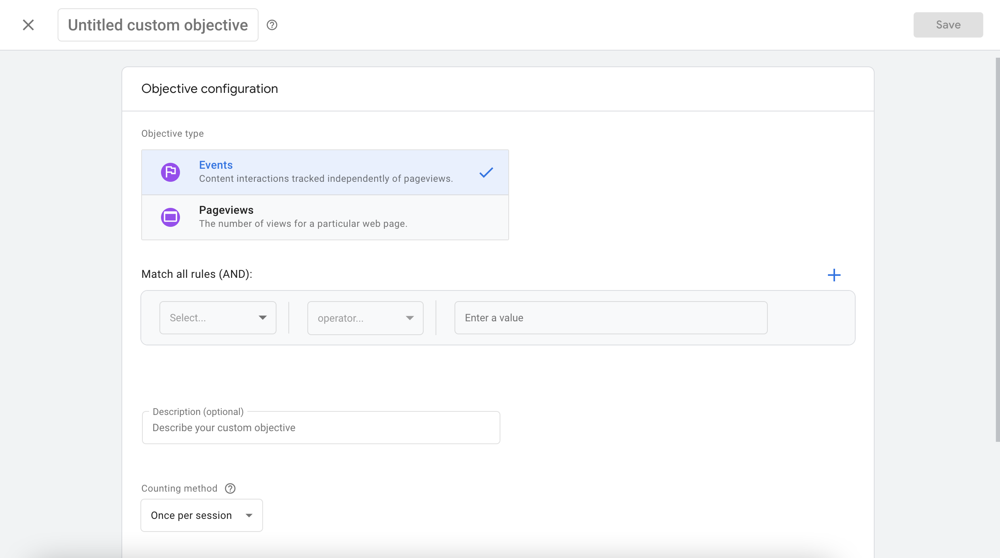

!!! note ""
    When using an A/B Testing Tool (eg. Kameleoon, Optimizely, ...), please check if you made any script adjustments on A/B testing tool script. If so, you will need to remove these adjustments on A/B testing tool script, because they break the functionality of the A/B Testing Tool.

## Setup Guide

Before approaching Google Optimize, we would suggest you take a look into [Google Optimize Resource Hub](https://support.google.com/optimize) and [Google developers page about Google Optimize](https://developers.google.com/optimize/devguides/experiments). We also suggest to read the [Google Analytics documentation](https://developers.google.com/analytics), since we will need to work with it for this guide.

For this guide, you will need to have an Google account, to access both Google Optimize and Google Analytics.

Assuming that you followed all the steps mentioned before in the A/B Testing documentation, you can move to the Google Optimize configuration.

### Create Experience

Login into your Google Optimize account. After logging in you will be sent to the main dashboard:



Click "**Let's Go**" to start your first Experience. If you already have one Experience, click "**Create Experience**".



After clicking, this modal will appear and ask you to fill the required fields - Name, URL of the page you'd like to use and the type of Experience would you would like to create. Define both Name and URL to suit your needs and choose A/B Test as the Experience type. Click "**Create**".

This is your Experience dashboard:



First step will be adding the Variants. Click "**Add Variant**" and name it based on the given names for the first part of the A/B testing documentations. In this guide we will suggest "Variant 0" for the first Variant. Click "**Done**" and repeat the process to create another Variant called "Variant 1".

Now your dashboard should look like this:



Since we only want to work with our defined Variants 0 & 1 and cannot change the "Original" Variant that is automatically defined by Google Optimize, we need to change the weight of the Variants. To do so click on one of the "**33% weight**" links. This will open the following modal:



We now want to change the weight of the "Original" Variant to 0% and the other two Variants to 50%. Click on "**Evenly Split**" and change to "Custom Percentages". Define the "Original" variant with 0% weight and the other two with 50% weight. Hit "**Done**".

After changing the weight, the next step will be to edit those Variants. Click "**Edit**" on "Variant 0". This will open the URL that you defined before with the Google Optimize editor.



On the top menu bar, click on the “**Add Code**” button (the “**< >**” button) and then click “Global JavaScript”. Here add the following line of code:

``` javascript
window.UC_AB_VARIANT="variant0";
```

Hit "**Apply**" and then click "**Done**". Repeat this process on the "Variant 1" with the following piece of code:

``` javascript
window.UC_AB_VARIANT="variant1";
```

### Create Objectives

The next step will be to create the **Objectives**.

!!! info "Objectives"
    Objectives are metrics or activities that your variants are measured against. Your **experience objective** determines your experience’s status and which variant is the leader. You can create more than one objective, but **additional objectives do not affect status or leader declarations**.

Before you can add any Objective that will be defined by our CMP Events, you need to make two different steps:

1. Link your Google Analytics account to your Google Optimize Experience


Click "**Link to Analytics**" and link it to an existing property - or in Google Analytics, create a new Property to link with this one. You can read more [here](https://support.google.com/analytics/answer/10269537?ref_topic=1009620).

Then after linking your Google Analytics Property with your Google Optimize Experience, you will need to install your Google Analytics code before your Google Optimize code. Your code will look something like this:

``` html
<!-- Global site tag (gtag.js) - Google Analytics -->
<script async src="[https://www.googletagmanager.com/gtag/js?id=UA-XXXXXXXX](https://www.googletagmanager.com/gtag/js?id=UA-XXXXXXXX)-X”></script>
<script>
  window.dataLayer = window.dataLayer || [];
  function gtag(){dataLayer.push(arguments);}
  gtag('js', new Date());

  gtag('config', '[UA-XXXXXXXX](https://www.googletagmanager.com/gtag/js?id=UA-XXXXXXXX)-X');
</script>
```

2. Track and send Usercentrics Events to Google Analytics

To add any event as an objective, you need Google Analytics to track them. For this you need the following code snippet added to your `<body>` tag, before anything else:

``` html
<script type="text/javascript">
window.addEventListener('UC_UI_CMP_EVENT', (data) => {
window.dataLayer = window.dataLayer || [];
function gtag(){dataLayer.push(arguments);}
gtag('event', `${data.detail.type.toLowerCase()} in ${data.detail.source.toLowerCase()}`, {
   'event_category': `${data.detail.source.toLowerCase()} event`,
   'event_label': `${data.detail.type.toLowerCase()}`,
  })
});
</script>

```

This Event listener will fire whenever an event from the banner fires ([Read more about the available UI events](../available-events.md)) and then it will run that gtag event to the  `dataLayer`. This gtag event follows the syntax for Google Analytics Events ([see the documentation about measuring Google Analytics events](https://developers.google.com/analytics/devguides/collection/gtagjs/events)) and will track this event on the associated GA measurement page (which you can see it above the Objectives Tab).

!!! info "Explanation"
    To Explain some of the values of this event ([read more here](../available-events.md)):
    - `data.detail.source` - Shows in what layer does the event happen (`FIRST_LAYER`,  `SECOND_LAYER`,  `PRIVACY_BUTTON`)
    - `data.detail.type` - Shows the type of event

!!! warning ""
    After adding this code snippet, you need to render all the [Available UI Events](../available-events.md), for them to show up in Google Analytics. After testing all of them, we can finally add them as objectives to Google Optimize.

After adding the code snippet and linking your Google Analytics, you should be able to see the Usercentrics Events just like this in Google Analytics (this was tested on a low traffic test environment):



In the Objectives, you need to create an Primary Objective, which determines your experience’s status and which variant is the leader. Click “**Add Experience Objective**” and then click “**Create Custom**”



In the Objectives modal, click "**Events**" and for the rules you can define them with what suits your needs, but following our code example, we will write the following rule:

- **Event Action - Equals** - (Insert the event that you want for main Objective, for example `cmp_shown in first_layer`)

For the counting method, choose “**Once per Session**” and hit **“Save”**. Give a suitable name to your Objective and save.

After this step, you can proceed to add the Google Optimize code if you still didn't added it (add it after the Google Analytics code)

``` html
<script src="https://www.googleoptimize.com/optimize.js?id=OPT-XXXXX"></script>
```

Click "**Check Installation**" and you are all set up!