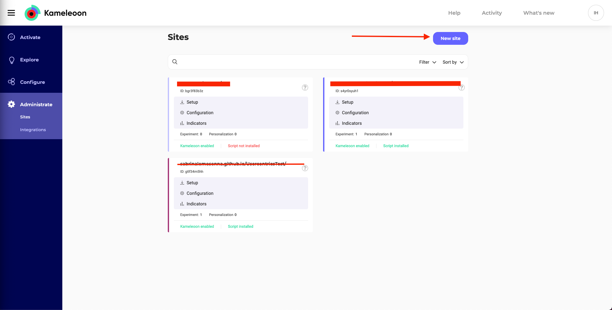
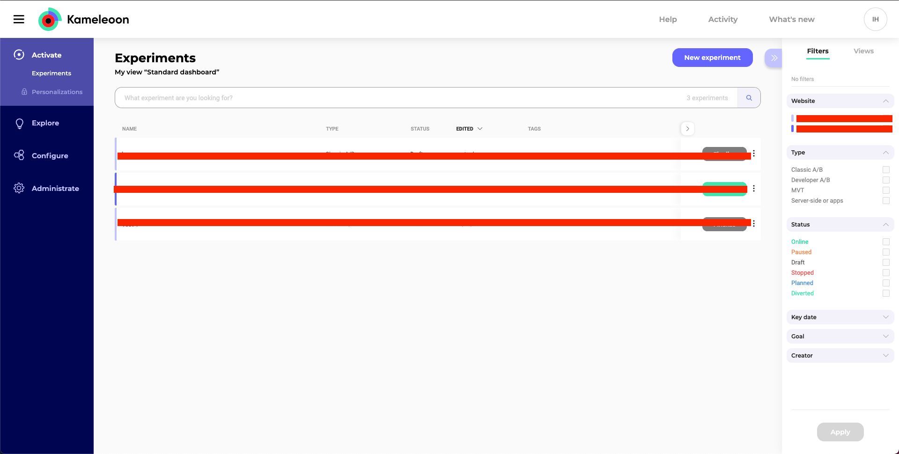
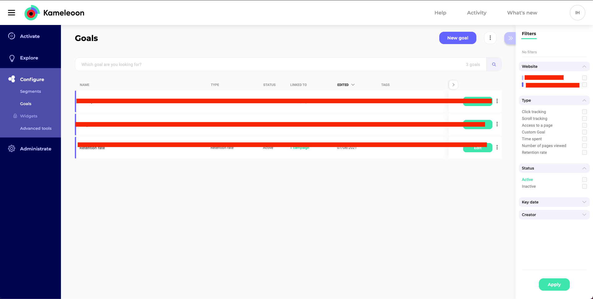
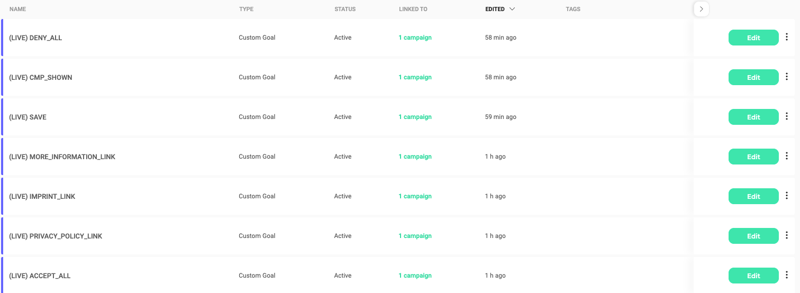
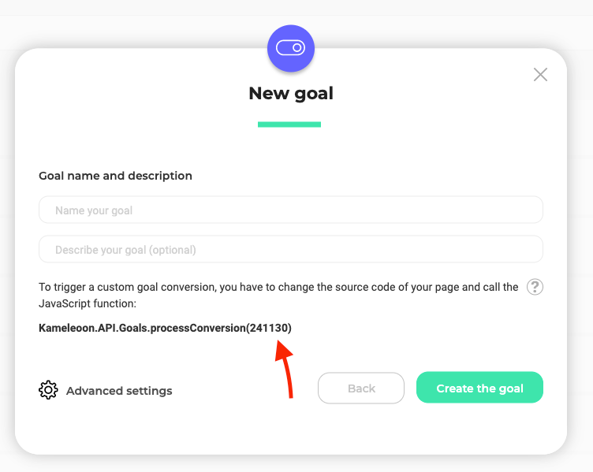
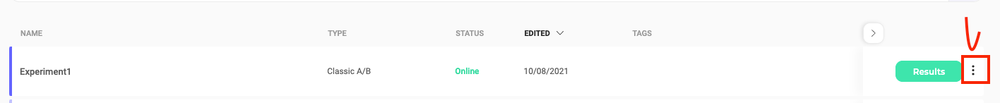
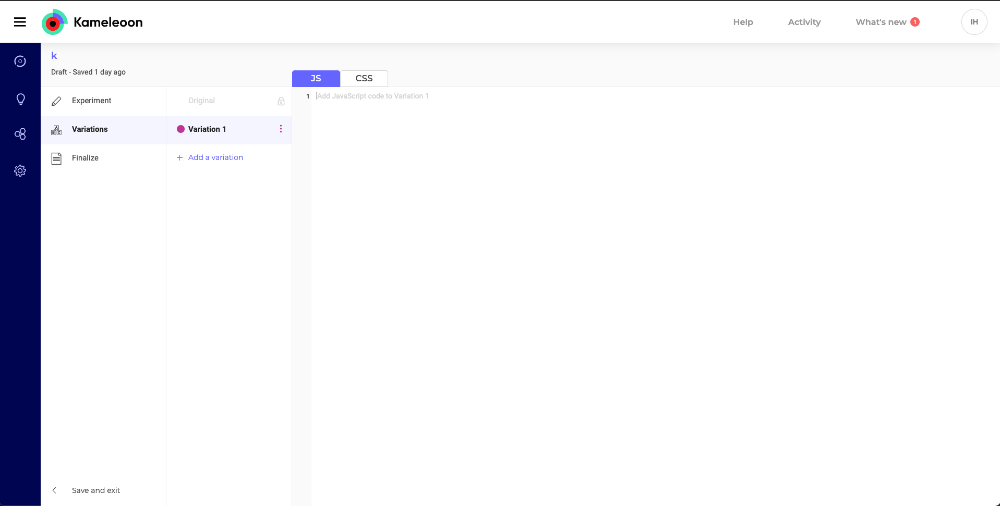

!!! note ""
    When using an A/B Testing Tool (eg. Kameleoon, Optimizely, ...), please check if you made any script adjustments on A/B testing tool script. If so, you will need to remove these adjustments on A/B testing tool script, because they break the functionality of the A/B Testing Tool.

!!! info ""
    For Kameleoon, you will need to know:
    
    * [basic knowledge about the tool](https://help.kameleoon.com/quick-start-guide/)
    
    * [creating an account](https://pages.kameleoon.com/en/demo)
    
    * [setting up the Kameleoon Script on your page](https://help.kameleoon.com/first-use-of-kameleoon/)

## Prerequisite (Creating a new site in Kameleoon)

To create a new site in Kameleoon, go to **Administrate** in the left menu and click **Sites**. You will be presented with this dashboard.



Click **New Site** to start creation on Kameleoon. You will be presented with a popup with two text fields: URL of Website and Description (which is optional).

Fill in the fields and proceed to the next step, which will present you with this page.


You will have to fill in a series of drop-down menus, starting with **“Are you installing Kameleoon via a Tag Manager?”** and ending with **“Do you want to self-host Kameleoon public resources?”**

For **Select an installation tag**, we strongly advise selecting the **Asynchronous Loading with Anti-Flickering (recommended)** option. You can find more information about this Installation tag here: [Advanced Implementation Guide - Kameleoon Developer Documentation](https://developers.kameleoon.com/tag-installation.html#asynchronous-loading-with-anti-flicker)

After filling in all the options, click **Continue**

You will receive instructions to install Kameleoon on your page. In these instructions, you will find how to install the Kameleoon code into your code, and you will also receive your **Site ID**

The Code follows this structure

``` html
  <script type="text/javascript">
    // Duration in milliseconds to wait while the Kameleoon application file is loaded
    var kameleoonLoadingTimeout = 1000;

    window.kameleoonQueue = window.kameleoonQueue || [];
    window.kameleoonStartLoadTime = new Date().getTime();
    if (! document.getElementById("kameleoonLoadingStyleSheet") && ! window.kameleoonDisplayPageTimeOut)
    {
        var kameleoonS = document.getElementsByTagName("script")[0];
        var kameleoonCc = "* { visibility: hidden !important; background-image: none !important; }";
        var kameleoonStn = document.createElement("style");
        kameleoonStn.type = "text/css";
        kameleoonStn.id = "kameleoonLoadingStyleSheet";
        if (kameleoonStn.styleSheet)
        {
            kameleoonStn.styleSheet.cssText = kameleoonCc;
        }
        else
        {
            kameleoonStn.appendChild(document.createTextNode(kameleoonCc));
        }
        kameleoonS.parentNode.insertBefore(kameleoonStn, kameleoonS);
        window.kameleoonDisplayPage = function(fromEngine)
        {
            if (!fromEngine)
            {
                window.kameleoonTimeout = true;
            }
            if (kameleoonStn.parentNode)
            {
                kameleoonStn.parentNode.removeChild(kameleoonStn);
            }
        };
        window.kameleoonDisplayPageTimeOut = window.setTimeout(window.kameleoonDisplayPage, kameleoonLoadingTimeout);
    }
  </script>
  <script type="text/javascript" src="//YOUR_SITE_ID.kameleoon.eu/kameleoon.js" async="true"></script>
```

!!! warning ""
    Add this code **BEFORE** Usercentrics' Consent Management Platform code, since your A/B testing tools **MUST** be loaded before the Consent Management Platform to do splitting properly.

!!! note ""
    You can find your site ID in the final piece of your script

    ``` html
      <script type="text/javascript" src="//YOUR_SITE_ID.kameleoon.eu/kameleoon.js" async="true"></script>
    ```

After adding your code and committing these changes to your Live/Test Environment, click Validate. After that a popup will appear, displaying “**Please wait, our chameleon is touring your website.**”

After Kameleoon validates your page, the popup will close, displaying the message “**Kameleoon is well detected on your website.**”

## A/B Testing Experiment

After taking a quick read through their Quick Start Guide, you can start creating your first A/B Testing Experiment.

!!! info ""
    An Experiment is the group of variants/versions of the variants that you want to try out with the various users.

!!! warning ""
    We recommend to run **only one Consent Experiment per site**

After you login into Kameleoon, you will be presented with the following dashboard



### Create a new goal

First, create a **New goal**. A Goal measures the efficiency of an Experiment and this Goal is what you want to improve with your campaign.

To create a Goal, go to Configure in the left menu and then click Goals. You will be presented with another dashboard.



Click **New goal** in the top right corner. A popup will appear with two fields: **Website Selection** and **Type of Goal**.

- In Website Selection, choose the website that you defined when you created the account.
- In Type of Goal, for this guide, choose Custom Goal. Currently, we support several custom events for custom goals. You can read more about them [here](../available-events.md)



Click Next, and a new popup will appear with the fields **Goal name** and **Description**. 

Give it an appropriate name and copy the aforementioned function on the text underneath the Description field → **Kameleoon.API.Goals.processConversion (and the Unique ID inside)**. Find this ID on the New goal popup at the end of the function text.



### Create an Experiment

After creating the new Goal, you will need to create an **Experiment**.

- To start a new Experiment, use the **Existing Experiment** “Experiment1” or create a new Experiment. To create a new Experiment, click “**New Experiment**” in the top right corner. A new popup will appear asking what type of experiment you want to create. For testing purposes, create a Classic A/B Experiment by clicking on “**Classic A/B**”.
- After clicking “**Classic A/B**”, a popup with the text fields “Name”, “Site Web”, and “URL of the page where you want to launch your experiment” will appear. Complete them with the correct information and then you can associate a tag if you want this Experiment to have more context. Click **Validate** and your Experiment is created.
- To make your Experiment test the variants defined in your A/B test inside the Admin Interface, you will need to click on the three vertical dots next to your Experiment and click “**Edit it in the Code Editor**”.



- This will open a new page for the Code Editor inside Kameleoon. You will be greeted with this page.



- Before adding the Variations, go to **Experiment** (just above Variations on the left menu) and click **Test specific code** in the menu on the right. Add the following code:

``` javascript
 window.UC_AB_VARIANT = "variant0";

 window.addEventListener('UC_UI_CMP_EVENT', function (data) {
     console.log("TEST: source =>", data.detail.source);
     console.log("TEST: type =>", data.detail.type);
     console.log("TEST: Variant =>", data.detail.abTestVariant);
     //These are our custom events for each basic action
     //in our Consent Management Platform
     if (data.detail.type === "CMP_SHOWN") Kameleoon.API.Goals.processConversion(Your Unique ID);
     if (data.detail.type === "ACCEPT_ALL") Kameleoon.API.Goals.processConversion(Your Unique ID);
     if (data.detail.type === "DENY_ALL") Kameleoon.API.Goals.processConversion(Your Unique ID);
     if (data.detail.type === "SAVE") Kameleoon.API.Goals.processConversion(Your Unique ID);
     if (data.detail.type === "MORE_INFORMATION_LINK") Kameleoon.API.Goals.processConversion(Your Unique ID);
     if (data.detail.type === "IMPRINT_LINK") Kameleoon.API.Goals.processConversion(Your Unique ID);
     if (data.detail.type === "PRIVACY_POLICY_LINK") Kameleoon.API.Goals.processConversion(Your Unique ID);
 });
```

!!! note ""
    The “variant0” is the default variant that we’ve defined as the empty variant, meaning that it doesn't make any changes to the Consent Management Platform. If your default variant has another name, change it accordingly. By using `window.UC_AB_VARIANT="variant0"`, you will go to your default variant.

!!! note ""
    The Event Listener will be triggered every time you fire one of our Custom Events. Find extra information regarding Custom Events for A/B Testing [here](../available-events.md)

The three `console.log` will return important information regarding your event. For example, to track `ACCEPT_ALL` as the code shows, you will be presented with these logs:

``` bash
TEST: source => FIRST_LAYER
TEST: type => ACCEPT_ALL
TEST: Variant => variant1
```

You can add more Goals to this Experiment if needed. To add a new Goal just add the following code underneath the last “if” statement.

``` javascript
if (data.detail.type === "Consent Management Platform event here") Kameleoon.API.Goals.processConversion(goalID)
```

- Go back to **Variations** and inside **Variation 1** add the following code

``` javascript
 window.UC_AB_VARIANT = "variant1";
```

!!! warning ""
    Replace `variant1` if you gave your variant another name.

- Click **Finalize** under Variations in the menu. In the **Finalize** tab, select your **Traffic Distribution** (% for each variation), your **Targeting** (where is the target of this test), and your **Tracking and Goals**. Here you will add the Goal that you have created and you can search for Goal’s Unique ID. If you have any issues searching, try using only the first digits of the Goal ID.

- After completing these three steps, click **Publish** to finalize the Experiment setup. Go back to the Experiments dashboard to see the results of the experiment by clicking in **Results**.
