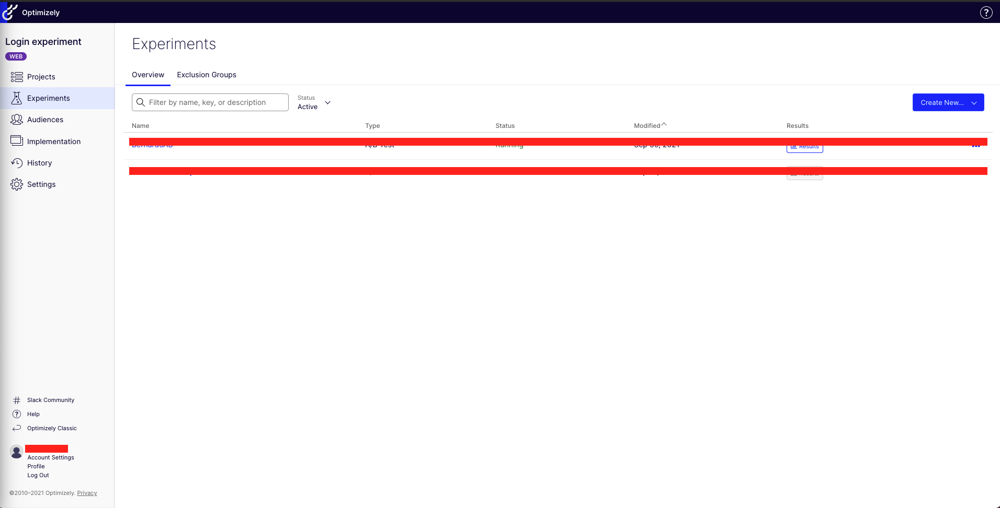
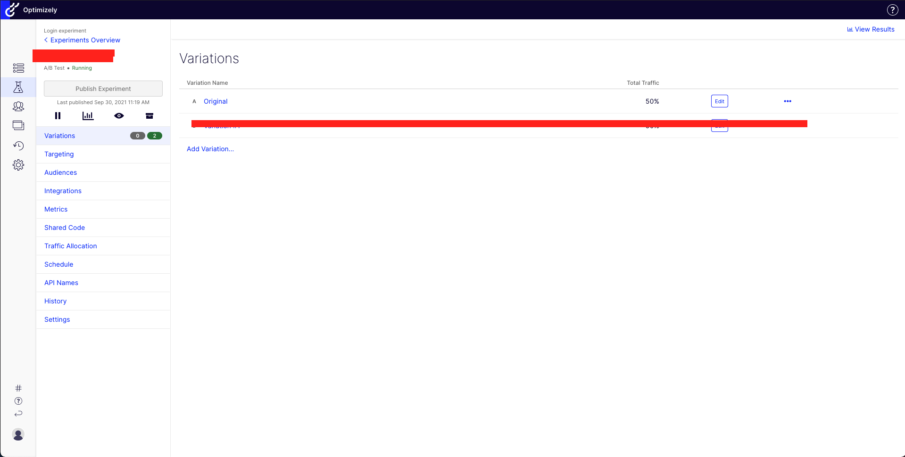
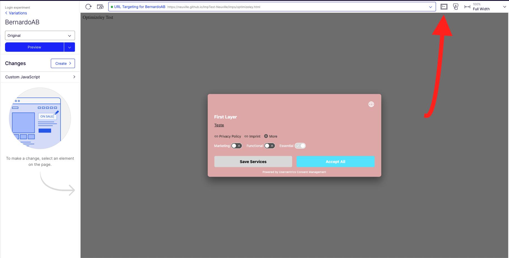

!!! note ""
    When using an A/B Testing Tool (eg. Kameleoon, Optimizely, ...), please check if you made any script adjustments on A/B testing tool script. If so, you will need to remove these adjustments on A/B testing tool script, because they break the functionality of the A/B Testing Tool.

Before approaching Optimizely, we would suggest you take a look into its documentation [Developer Documentation - Optimizely Full Stack](https://docs.developers.optimizely.com/full-stack/docs/welcome).

Optimizely is simple and easy to learn and use. For this guide, you will need to have an Optimizely account.

Assuming that you’ve followed all the steps mentioned before in the A/B Testing Documentation and you have configured the Admin Interface completed you can move to the Optimizely configuration:

- Log in to your account. After logging in, you will find the following page - the Experiments Page



- Click {==Create New…==} and then click {==A/B Test==}. A pop-up window will show with the following fields - Name, Description, Target By, and URL. Fill all the fields with the correct information and click {==Create Experiment==}

- After creating the Experiment, you will be sent to the Experiment page, on this page, you will find the following variants: `Original` and `Variant #1`.



- Click {==Edit==} on the Original variant, and you will be forwarded to your URL Target Page (The one that you’ve added before on the creation of the Experiment). When you reach to your testing page, you will see an editor surrounding it.

- Click on the following icon on the editor



- In the JavaScript tab you will add the following code

``` javascript
window.UC_AB_VARIANT  =  "variant0";
```

!!! note ""
    The “variant0” is the default variant that we’ve defined as the empty variant, meaning that it doesn't make any changes to the Consent Management Platform. If your default variant has another name, change it accordingly. By using `window.UC_AB_VARIANT="variant0"`, you will go to your default variant.

- Click {==Save & Apply==}
- On the left menu, click on the dropdown menu (where Original is selected) and change to `Variation #1`.
- Click on the same code icon as before and in the JavaScript Tab add the following code:

``` javascript
window.UC_AB_VARIANT = "variant1";
```

!!! note ""
    Replace “variant1” if you gave your variant another name. This is for the test variant that we’ve defined on the steps before the Optimizely configuration.

- Click {==Save & Apply==} and on the left menu click {==< Variations==}

After this, you will want to define your Targeting, Audiences, and Integrations as you wish.

Once you reach the Metrics Page, you can define here the metrics related to the events of our CMP. To see these events we suggest taking a look at our [events documentation](/docs/web/features/events/uc-ui-cmp-event/)

- To define a CMP Event Metric, click {==Create New Event…==}

- Select **Custom**, give it a name, description and for the API name, give one of the event names present on the **UC_UI_CMP_EVENT documentation.** In this example, you can use **CMP_SHOWN**, which will trigger every time that the CMP is shown.

- After this, copy the **API Call** that Optimizely shows into your code. If you want to add it directly on the HTML add it like this:

``` html
<script>
window['optimizely'] = window['optimizely'] || [];
window['optimizely'].push({
  type: "event",
  eventName: "CMP_SHOWN",
  tags: {
    revenue: 0, // Optional in cents as integer (500 == $5.00)
    value: 0.00 // Optional as float
  }
});
</script>
```

- After defining all the wanted metrics, go to **Shared Code**. In the **Shared Code** you will add the **following Event Listener**:

``` javascript
window.addEventListener('UC_UI_CMP_EVENT', function (data) {
	console.log("TEST: source =>", data.detail.source);
  	console.log("TEST: type =>", data.detail.type);
	console.log("TEST: Variant =>", data.detail.abTestVariant);
});
```

This Event Listener will trigger every time that one of our **Custom Events** is fired.

The three `console.log` will return important information regarding your event. For example, to track **CMP_SHOWN** as the code shows, you will be presented with these logs:

``` bash 
TEST: source => FIRST_LAYER
TEST: type => CMP_SHOWN
TEST: Variant => variant1
```

- After this, define your **Traffic Allocation** per Variant and your schedule, and you are good to go! You can still go to Variations to test your changes, or else you can publish your Experiment.

