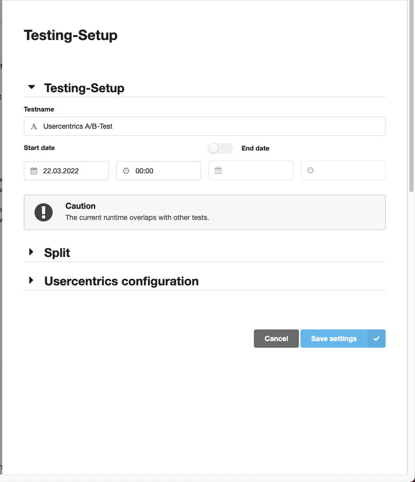

!!! note "Prerequisites"
    - You have a trbo account.
    - There are no script adjustments done on the A/B testing tool script itself. In case there are adjustments, please remove them to not break the functionality of the A/B testing tool.
    - AB Testing was already set up in the Usercentrics Admin Interface and the different variants to be tested were defined (see [here](../setup.md)).

## Setup

Assuming that you followed all the steps mentioned before in the A/B testing documentation, you can move to the trbo configuration.

Login into your trbo account. After logging in you will be sent to the main dashboard:

Click on the menu icon on the top left corner. On the menu, underneath **Setup**, click on **Usercentrics**. You will be redirected to the following page:

On this page, you will see the **Setup Steps** which need to be followed in order to successfully implement an Usercentrics trbo campaign on your page.

Within the trbo interface create and set up the variants that you want to test and assign each variant to a bucket share of your traffic.

- Click on the “**+**” on the top of the page. This will open a side modal with the creation steps for the **Usercentrics Campaign**

- Give it a **Testname**, **Start Date** and if needed an **End Date**.
- Open the **Split tab**. Here you will create your **Variant Layers**. They **must have** the **same name as your variants on Usercentrics A/B Test**. You defined these variants within the Admin Interface.
- After naming your **Variants** correctly, you will need to define the **Bucket Distribution**. We suggest having an even distribution between variants. 

- To verify your setup, **read through** the setup explanation for Usercentrics A/B testing on the **Admin Interface**, provided by trbo:

- Hit **Save Settings**

## Testing

Once you have set up the variants within the Usercentrics interface, you can test the variants by applying the **Live-Test toggle**. If you have questions about how to test the display of the selected variants via buckets, please reach out to your Client Success Manager at trbo.

Your testing was successful? Feel free to set the test to live any time.

After following these steps, you have successfully set up your A/B testing for the Usercentrics CMP with trbo.

## Performance / Analysis

To see the results of your A/B test, go to **Menu** and underneath **Performance**, click **Variation Comparison**.
On **Variation Comparison**, you will see the following Dashboard, where you can check all of the **Impressions** and **Clicks** from the available click events from Usercentrics:

To check these click events, click **Click-Type**, and then scroll down the list. After choosing the Click-Type, hit Apply, to apply the new filter

On the **Usercentrics Setup Page** you can check the full table containing all the Click Events:

