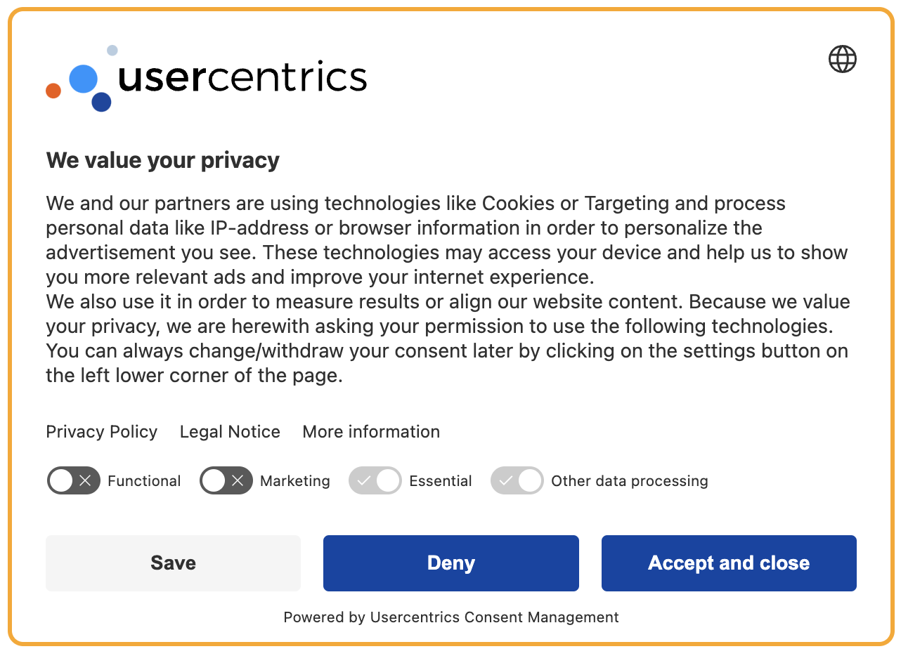
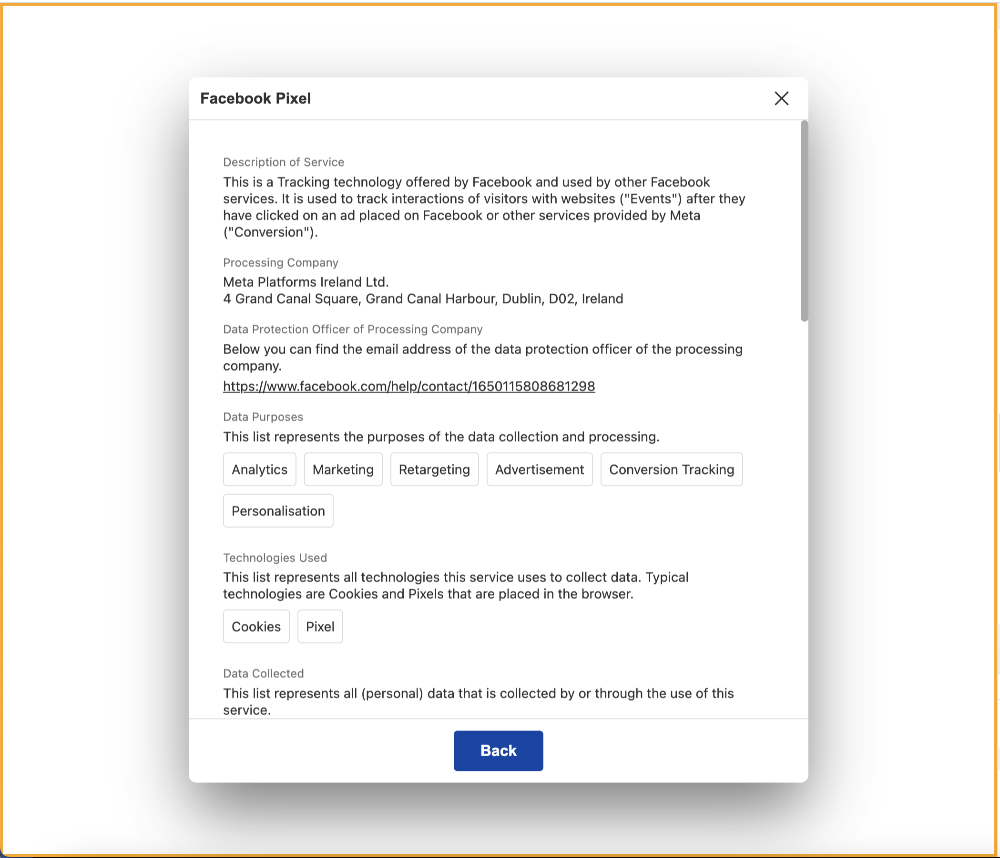
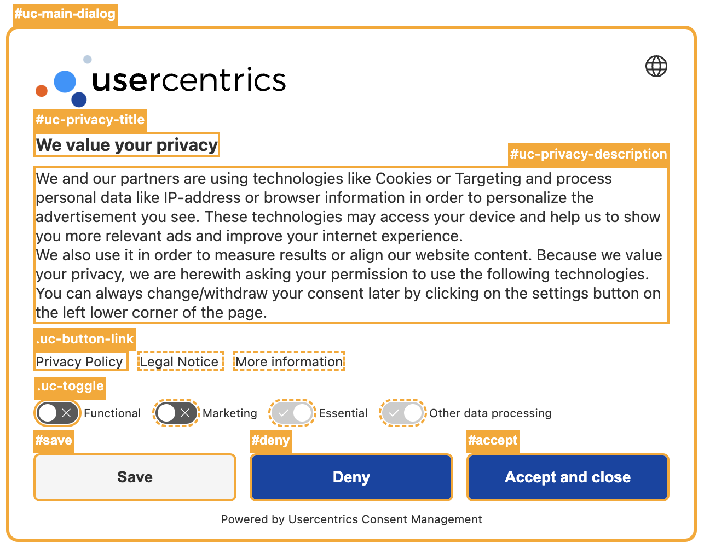
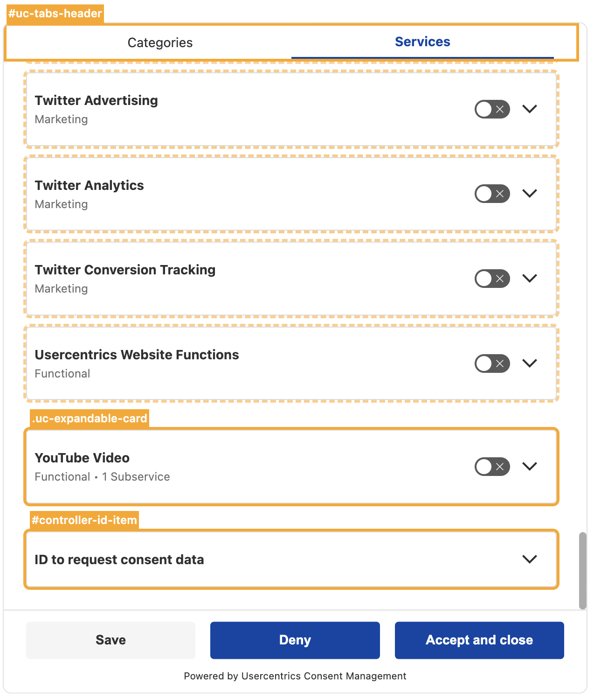
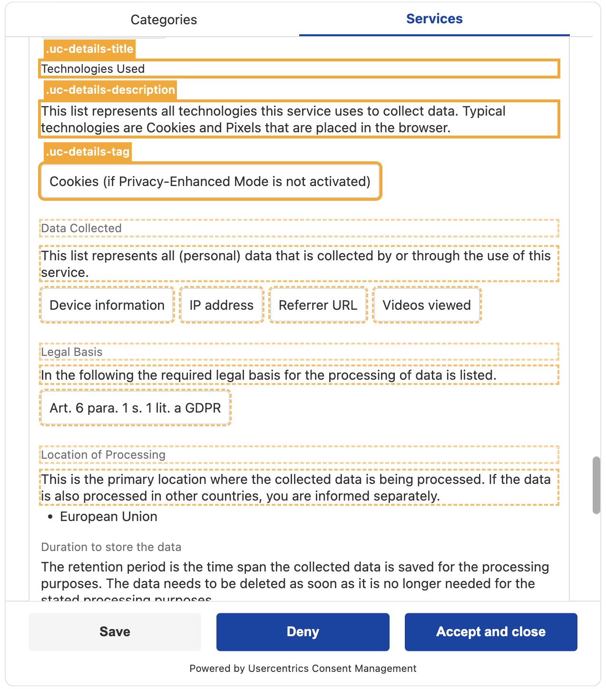
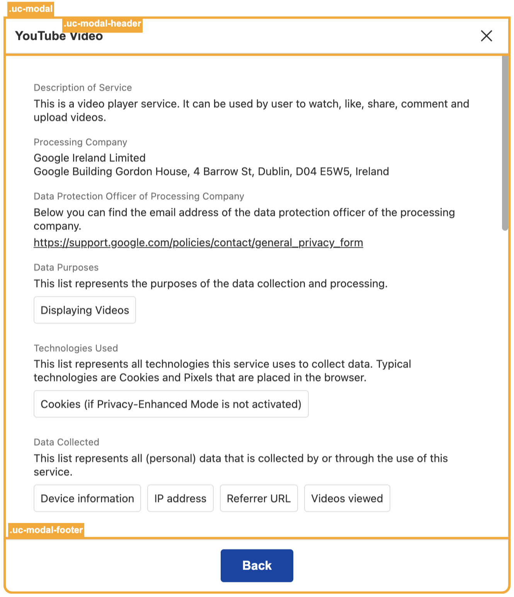

# Custom CSS usage

To offer the utmost degree of customization, **V3** allows direct addressing of all elements within the Consent Management Platform (CMP) using custom CSS.

## Applying CSS changes

To enable the utilization of custom CSS, it is necessary to input your CSS code into the 'Custom CSS' field. This field is accessible within the Usercentrics Admin Interface under the '**Appearance**' -> '**Styling**' section. It is noteworthy that a key distinction between V2 and **V3** lies in their handling of custom CSS. In V2, styling was limited to a predefined set of classes, while in V3, custom CSS is not parsed in any way, but is directly embedded within a `<style>` tag in the Shadow DOM housing the CMP.

!!! warning "Disclaimer"
    By using Custom CSS, you will be in control of your custom UI. Please be aware that your CSS adjustments will affect the layout of your CMP and possibly also of your website. You'll make these adjustments at your own risk and outside of the sphere of the Usercentrics support.

### Entry points

To enhance the usability of custom CSS, user-friendly selectors have been introduced for the most frequently requested elements that can be modified within the CMP. Presented below is a list of these selectors. 
#### CMP 

| CSS Selector           | Description                                  | Visual Guide Link                           |
|------------------------|----------------------------------------------|---------------------------------------------|
| `#uc-main-dialog`      | References the main CMP container           | [Visual Guide](#cmp-first-layer)    |
| `#uc-privacy-title`    | References the title in the main CMP text area | [Visual Guide](#cmp-first-layer) |
| `#uc-privacy-description` | References the description in the main CMP text area | [Visual Guide](#cmp-first-layer) |
| `#more`                | References the "More" action button         | [Visual Guide](#cmp-first-layer)    |
| `#deny`                | References the "Deny" action button         | [Visual Guide](#cmp-first-layer)    |
| `#accept`              | References the "Accept" action button       | [Visual Guide](#cmp-first-layer)  |
| `#save`                | References the "Save" action button         | [Visual Guide](#cmp-first-layer)    |
| `.uc-button-link`      | References every link under the CMP text area | [Visual Guide](#cmp-first-layer)  |
| `.uc-toggle`           | References every toggle in the CMP            | [Visual Guide](#cmp-first-layer)       |
| `#uc-[identifier]-[id]-toggle` | References a specific toggle in the CMP | [Visual Guide](#cmp-first-layer) |
| `#uc-tabs-header`      | References the second layer tab header       | [Visual Guide](#cmp-second-layer)   |
| `.uc-expandable-card`  | References every expandable card in the CMP   | [Visual Guide](#cmp-second-layer) |
| `#controller-id-item`  | References the Controller ID specific expandable card | [Visual Guide](#cmp-second-layer) |
| `.uc-details-title`    | References every title for every service section inside the expandable cards | [Visual Guide](#cmp-second-layer) |
| `.uc-details-description` | References every description in every service section inside the expandable cards | [Visual Guide](#cmp-second-layer) |
| `.uc-details-tag`      | References every tag in every service section inside the expandable cards | [Visual Guide](#cmp-second-layer)   |


#### Service modal
When a service (or a subservice) is opened in a standalone view, a modal is generated for this specific purpose. Multiple modals can be open at the same time and they share their internal structure with the expandable cards within the CMP. As a result, `.uc-details-[..]` namespaced selectors such as `.uc-details-title` and `.uc-details-description` are also applicable within this context. The modal-specfic entry points are:

| CSS Selector           | Description                                  |  Visual Guide Link  |
|------------------------|----------------------------------------------| |
| `.uc-modal-overlay`      | References every modal wrapper | [Visual Guide](#service-modal_2) |
| `.uc-modal`  | References every modal main container | [Visual Guide](#service-modal_2) |
| `.uc-modal-header`  | References every modal header element | [Visual Guide](#service-modal_2) |
| `.uc-modal-footer`  | References every modal footer element                 | [Visual Guide](#service-modal_2) |


!!! info "Info"
    Read more about how to style both the CMP and modals conditionally under [Conditional Styling](#conditional-styling)

!!! tip "Tip"
    It is important to emphasize that custom CSS can technically be applied to any element; however, these predefined entry points are provided to streamline the customization process for your convenience.


### Conditional styling

The selector `#uc-main-dialog` designates the primary container within the CMP. 

!!! info "Illustration"
    <figure>
        
    </figure>

This container may have additional classes that allow for the targeting of elements on specific CMP layers or under specific device and configuration conditions. To apply CSS targeting based on devices or layers, these classes can be concatenated with the selector for the main container. The following classes represent various device-related criteria, layer distinctions, language direction, and framework indicators available for customization on the main dialog container.

#### Devices

| Class | Screen size      | Breakpoint |
|-------------|------------|------------|
| `.xs` | Extra small | < 360 px        |
| `.mobile`  | Small | > 360 px        |
| `.tablet` | Medium | > 768 px      |
| `.desktop`  | Large | > 1024 px     |

#### Layers
| Class | Layer name      |
|------------|------------|
| `.first` | First layer   |
| `.second` | Second layer  |


#### Language direction
| Class            | Language Direction |
|------------------|--------------------|
| `.ltr`    |          Left-to-Right      |
| `.rtl`    |          Right-to-Left      |

#### Framework indicator 
| Class  | Legal Framework                        |
|-------|------------------------------------------|
| `.gpdr` | General Data Protection Regulation (GDPR) |
| `.tcf`  | Transparency and Consent Framework (TCF) |
| `.ccpa` | California Consumer Privacy Act (CCPA)    |


#### Examples (CMP)
```css
#uc-main-dialog.mobile.second {
    /* Custom CSS styles for the cmp container on the second layer on mobile devices */
    /* Add your styles here */
}
```

If you intend to direct your styling towards a specific element within the CMP on a particular device, you can utilize the device modifier by attaching it to the main container as the root targeting element.


```css
#uc-main-dialog.tablet .uc-expandable-card {
    /* Custom CSS styles for expandable cards on tablet */
    /* Add your styles here */
}
```

#### Service modal

The selector `.uc-modal-overlay` designates every primary modal wrapper. 

!!! info "Illustration"
    <figure>
        
    </figure>

The service modal elements exist as standalone components outside the primary CMP container. As a result, the device-related classes are also present on the modal wrappers.


#### Examples (Modal)

```css
.uc-modal-wrapper.desktop .uc-details-title {
    /* Custom CSS styles for modal service section titles on desktop */
    /* Add your styles here */
}

.uc-modal-footer button {
    /* Custom CSS styles for the modal footer button */
    /* Add your styles here */
}
```

!!! tip "Tip"
    It is worth noting that the utilization of our device modifier is optional, as you can place your own media queries for precise screen targeting within Custom CSS if this is more suitable.


### Visual guide

#### CMP First Layer

!!! info "Illustration"
    <figure>
        
    </figure>

#### CMP Second Layer

!!! info "Illustration (1 / 2)"
    <figure>
        
    </figure>

!!! info "Illustration (2 / 2)"
    <figure>
        
    </figure>

#### Service Modal

!!! info "Illustration"
    <figure>
        
    </figure>