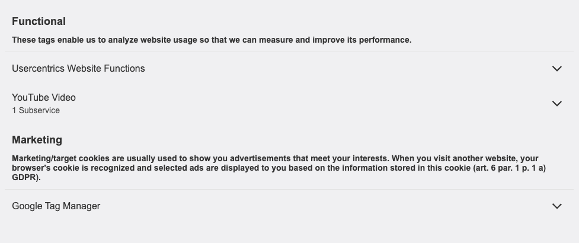
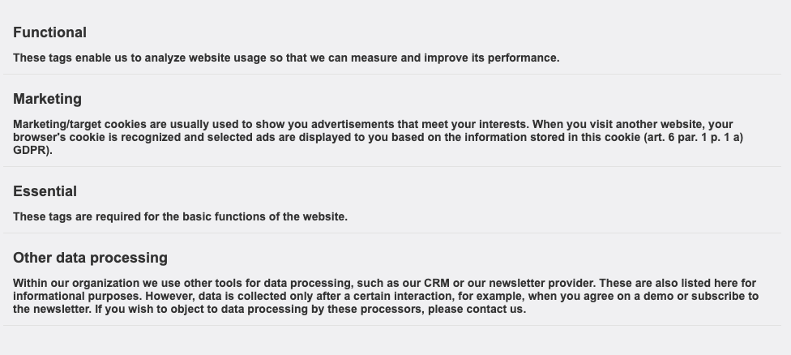
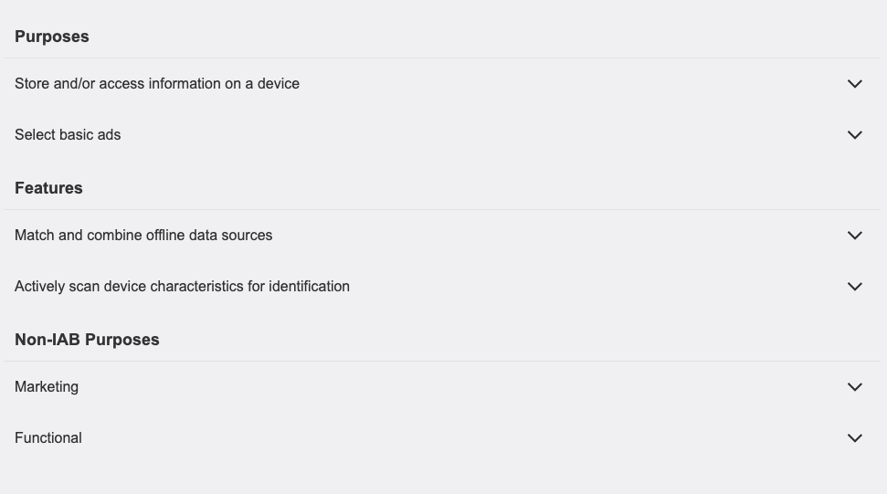
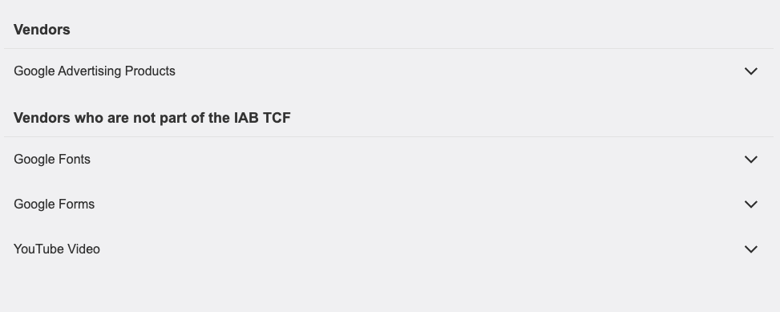
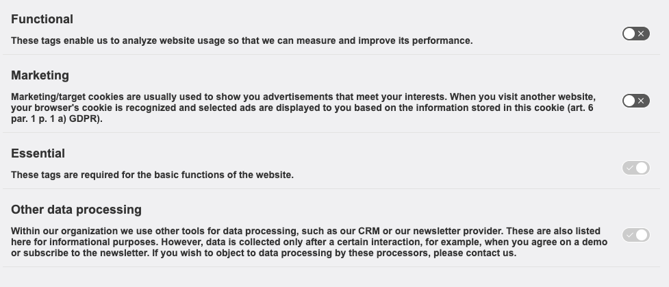

Design your privacy policy page with our embeddings so you don't have to maintain the difference between your privacy policy and your CMP. Keep your legally required information easily up to date, instead of extracting the information from our CMP and manually integrate it into your privacy policy page.

## Coming from V2?

If you already have an implementation for Embeddings on your website using our CMP V2, please refer to the [Migration Guide](../../migration/migration-from-v2.md#embeddings).

## Embedding all DPS

In order to simplify the Embeddings usage, in this new version, the embeddings were streamlined to be a reflection of the CMP itself. That means that all the information present on the CMP will also be present on the Embeddings.

#### Example

=== "GDPR"

    ``` html
    <div class="uc-embed"></div>
    ```

=== "TCF"

    ``` html
    <div class="uc-embed-tcf"></div>
    ```

## GDPR

### Embedding a specific DPS

You can also choose to only embed one single DPS instead, for that you should use the properties [`uc-embed-type`](#uc-embed-type) and [`uc-embed-service-id`](#uc-embed-service-id) for both the type of embed and the ID of the service, respectively.

#### Example

``` html
    <div 
      class="uc-embed"
      uc-embed-type="service-specific"
      uc-embed-service-id="BJz7qNsdj-7">
    </div>
```

??? info "Illustration"
    

### Embedding Categories

You can choose to either display all Categories information (that includes their respective services) or choose to only display Categories (without their respective services).

#### Example

=== "Categories (with Service information)"

    ``` html
    <div
      class="uc-embed"
      uc-embed-type="category">
    </div>
    ```

=== "Categories only"

    ``` html
    <div
      class="uc-embed"
      uc-embed-type="category-only">
    </div>
    ```

??? info "Illustration"

    === "uc-embed-type="category""

        

    === "uc-embed-type="category-only""

        


## TCF

### Embedding Purposes

When using the TCF option, you can embed Purposes using the following example.

#### Example

``` html
    <div
      class="uc-embed-tcf"
      uc-embed-type="purposes">
    </div>
```

??? info "Illustration"
    

### Embedding Vendors

When using the TCF option, you can embed Vendors using the following example.

#### Example

``` html
    <div
      class="uc-embed-tcf"
      uc-embed-type="vendors">
    </div>
```

??? info "Illustration"
    

## Other properties

!!! warning ""
    The following properties are applicable to any configuration, regardless of the legislation (GDPR and/or TCF), unless stated otherwise.

### Show/Hide Toggles

In order to show or hide all toggles, you should use the property [`uc-embed-show-toggle`](#uc-embed-show-toggle). By default this is set to false, meaning no toggles will be shown.


??? info "Illustration"

    === "uc-embed-show-toggle="true""

        

    === "uc-embed-show-toggle="false""

        

## Properties

### class

Can be either `uc-embed` if you are on GDPR and `uc-embed-tcf` if you are on TCF.

| Value        | Description         |
| ------------ | ------------------- |
| uc-embed     | Embeddings for GDPR |
| uc-embed-tcf | Embeddings for TCF  |

### uc-embed-show-toggle

You can choose to show or hide toggles on the Embeddings. Its value is `false` by default.

| Value           | Description       |
| --------------- | ----------------- |
| true            | Shows all toggles |
| false (default) | Hides all toggles |

### uc-embed-service-id

!!! warning ""
    This property is only applicablen when `class="uc-embed"`

To be used together with `uc-embed-type="service-specific"`. It should hold the Service ID to be displayed.

### uc-embed-type

Choose what type of information is to be displayed on the Embeddings. Its value is `all` by default.

| Value           | Description                                                        |
| --------------- | ------------------------------------------------------------------ |
| all (default)   | Embeds all the DPS information                                     |
| category        | Embeds categories with their respective services                   |
| category-only   | Embeds only categories                                             |
| service-specific | Embeds a single service (used together with `uc-embed-service-id`) |
| purposes        | Embeds only purposes (TCF specific)                                 |
| vendors         | Embeds only vendors (TCF specific)                                  |

<!-- Glossary of Acronyms used in the document -->
*[CMP]: Consent Management Platform
*[DPS]: Data Processing Service
*[GDPR]: General Data Protection Regulation
*[TCF]: The Transparency & Consent Framework