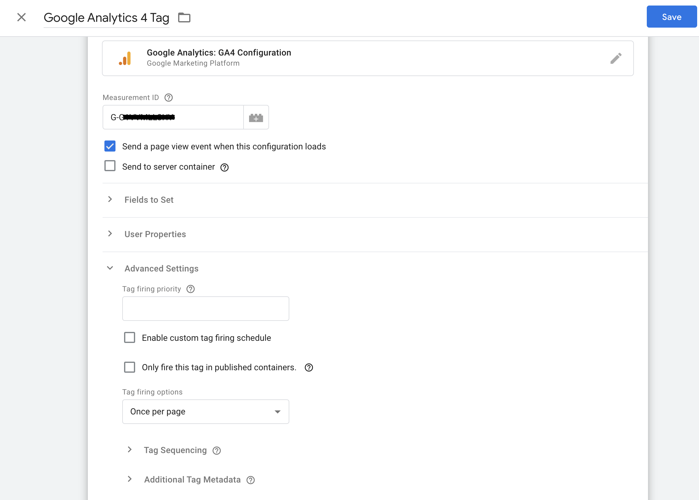
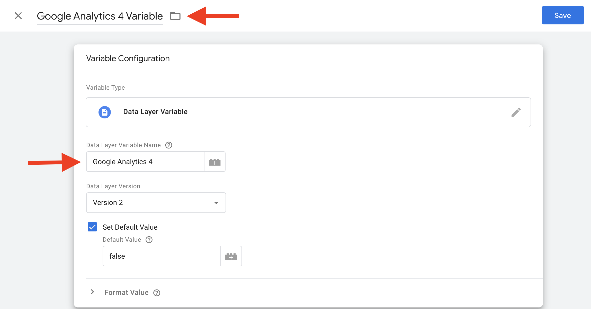
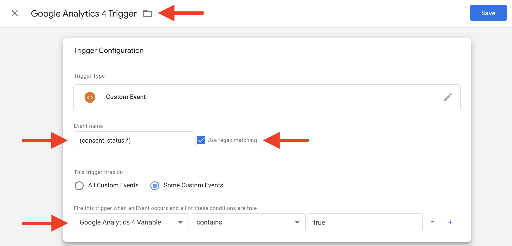
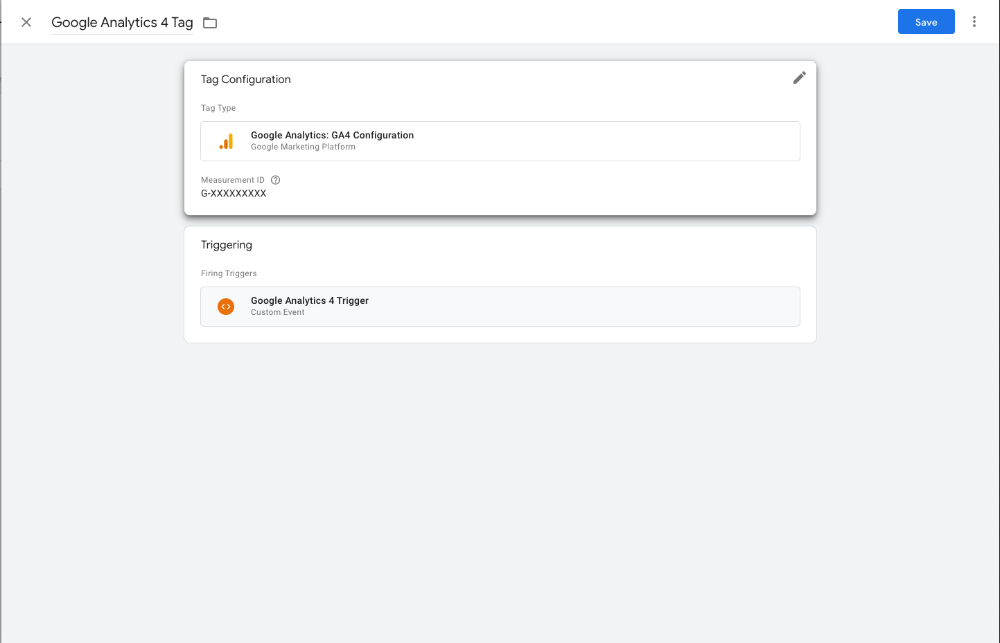

# Google Tag Manager Configuration

Get detailed information on how to configure your Google Tag Manager with the Usercentrics Browser SDK.

## Prerequisites 

In order to follow this documentation, we assume you have:

- A [Google Tag Manager account](https://www.google.com/intl/de/tagmanager/).
- Created a Google Tag Manager container on you website.
- Inserted the Google Tag Manager script into your website.
- Inserted your Usercentrics script into your website. Learn how to do this [here](direct-implementation-guide).

    !!! warning ""
        You can also directly integrate the Usercentrics Script via the Google Tag Manager. Usercentrics does <b>NOT</b> recommend this. However, you can learn how to do it [here](https://usercentrics.atlassian.net/wiki/spaces/SKB/pages/176980005/How+do+I+directly+integrate+the+Usercentrics+CMP+into+my+Google+Tag+Manager).

- [Your personal Usercentrics script](/pages/getting-started/ui/#integrate-the-javascript-tag)

## Background Information

Google Tag Manager can be tricky at times. If you're having trouble understanding it, the following information is meant to clarify some basic issues:

- Google Tag Manager helps you configure when the **Javascript tags** on your website are activated.
- Each tag needs to have at least one **trigger**.
- Triggers listen for certain website **events** (e.g. the website is fully loaded). Once this event takes place the trigger determines if the tag is activated.
- Triggers can be **firing** or **exception** triggers:
    - Exception triggers determine when a tag is NOT fired and take precedence over other triggers.
    - Firing triggers determine when a tag is fired.
- Triggers can be reliant on **variables**. The firing of a tag will be blocked, if a condition based on the value of such a variable is not met. 
- Usercentrics uses a special type of variable, a **data layer variable**, to communicate between your Google Tag Manager settings and your CMP.

## Adding Data-Processing Technologies
!!! note "Note"
    This documentation will use Google Analytics 4 as an example. However, the following process needs to be repeated separately for each technology.

- [ ] Replace "Google Analytics 4" in the naming of tags, triggers and variables with the name of the technology you are currently implementing, e.g Matomo.

!!! note ""
    If you already have a Google Analytics 4 tag in your Google Tag Manager configuration, you can jump to the [Create a new Google Analytics variable](#create-a-google-analytics-4-trigger) section.

### Google Consent Mode

!!! important "Important"
    The **Google Consent Mode** is activated by default in the Admin Interface. To deactivate the Google Consent Mode, go to the Admin Interface under Configuration / CMP Settings [CMP V2]. As the implementation differs for the Google Tags supported by the Google Consent Mode, please see our [technical documentation](../google-consent-mode/general-information.md) for more information on the Google Consent Mode and the correct templates to use with your CMP. 

### Create a new Google Analytics 4 tag

- [ ] Navigate to "Tags" in the side-menu and then click on "New".
- [ ] Add a new tag of type "Google Analytics: GA4 Configuration".
- [ ] Name it "Google Analytics 4 Tag".
- [ ] Set your Measurment ID (You can read more [here](https://support.google.com/analytics/answer/9539598?hl=en))
- [ ] Navigate to "Tag firing options" under "Advanced Settings" and select "Once per page".

    !!! help "Explanation"
        If you want a certain technology to fire more than once per page view, you should set the tag firing option to "Unlimited". "Once per page", however, is Usercentrics' recommended setup.

- [ ] Save "Google Analytics 4 Tag".

### Create a new Google Analytics 4 variable

You have to create consent default status variables for each of your non-IAB vendor script tags so that they are not triggered without consent.

- [ ] Navigate to "Variables" in the side-menu and then click on "New".
- [ ] Add a new variable of type "Data Layer Variable".
- [ ] In the top left, name the variable "Google Analytics Variable".
- [ ] Under "Data Layer Variable Name", insert "Google Analytics 4".

    !!! help "Note"
        Correct spelling, hyphenation and capitalization are mandatory for this field. Every technology must be added the way it is spelled in the Usercentrics Admin Interface. Here: "Google Analytics 4".

- [ ] Tick "Set Default Value" and set the default value to <i>false</i>.
- [ ] Save "Google Analytics 4 Variable".

### Create a Google Analytics 4 trigger

!!! important "Note"
    There are several ways to implement this logic. Usercentrics recommends the following option, however, depending on your setup, other structures might be more reasonable.  

- [ ] Navigate to "Triggers" in the side-menu and click on "New".
- [ ] Add a new trigger of type "Custom Event".
- [ ] In the top left, name the trigger "Google Analytics 4 Trigger".
- [ ] Tick "Use regex matching" next to the "Event Name" input field
- [ ] Under "Event Name", insert "(consent_status.*)".

    !!! note "Note"
        Correct spelling, hyphenation and capitalization are mandatory for this field.

- [ ] Tick "Some Custom Events".
- [ ] In the drop-down menus, set the following condition: "Google Analytics 4 Variable" contains <i>true</i>.

    !!! note "Explanation"
        The variable contains the user's consent information (variable=<i>true</i> - user opted in || variable=<i>false</i> - user opted out) for a specific technology. Hence, the trigger should only be fired (and tag therefore activated), if the variable=<i>true</i>.

- [ ] Save "Google Analytics 4 Trigger".

 
- [ ] Add the trigger to "Google Analytics 4 Tag".

!!! repeat "Note"
    Repeat this for each non-IAB vendor script in your Tag Manager.

## Testing in Preview Mode

In order to make sure your Google Tag Manager setup works, you need to test it in preview mode.

- Activate preview mode by clicking on "Preview" in the top-right corner.
- Visit your website.
- Open the development tools of your browser and navigate to the "Network" tap.
- Network requests of the implemented data-processing technologies should not be visible, unless they were defined as "Essential" in your Admin Interface.
- Press "Accept All" on the Usercentrics CMP.
- Now network requests of the implemented data-processing technologies should be visible in the "Network" tap.