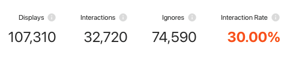
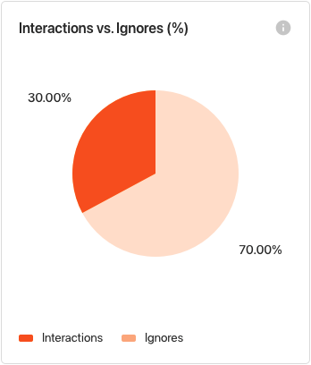
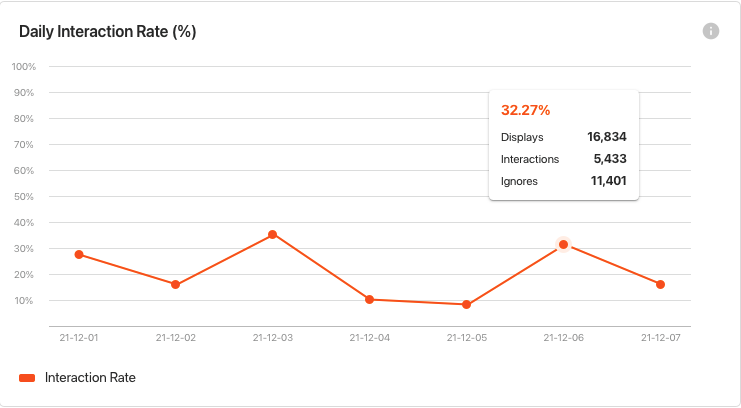
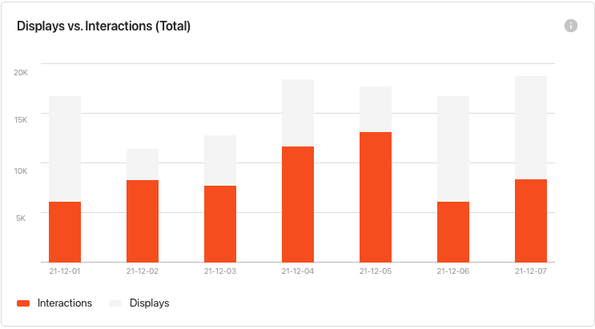
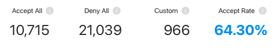
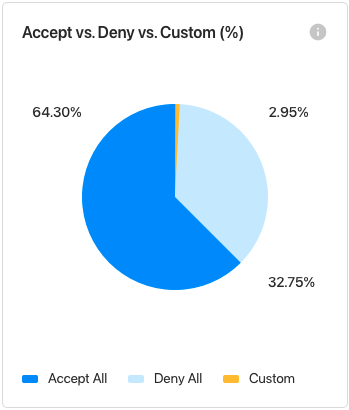
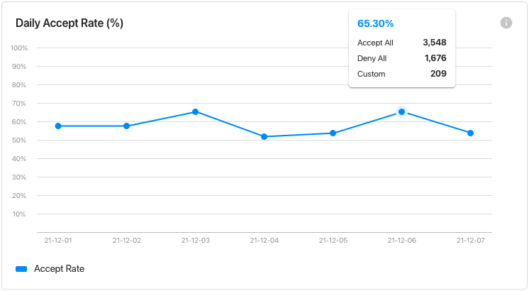
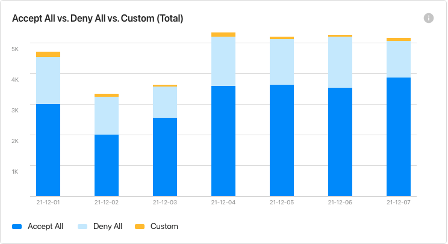
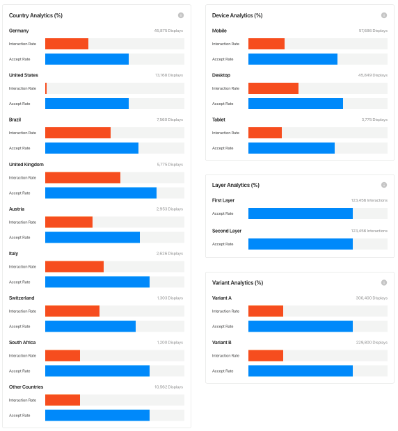

The following dashboard provide distinctive insights into your users' behaviour with the CMP.

## User Interaction KPIs
Get insights on the received responses for your CMP layers.

!!! success ""
    - **CMP Displays:** The amount of CMP_SHOWN events for the selected time range and filter
    - **CMP Interactions:** The amount of user consent interactions (${\texttt{ACCEPT_ALL} + \texttt{DENY_ALL} + \texttt{SAVE}}$)
    - **CMP Ignores:** The difference between the shown CMP and actual interactions from users (${\texttt{CMP_SHOWN} - (\texttt{ACCEPT_ALL} + \texttt{DENY_ALL} + \texttt{SAVE})}$)
    - **Interaction Rate:** How many (in %) events were actual interactions

## Interactions vs. Ignores
Get insights on the Interaction performance of your current CMP configuration.

!!! note ""
    This graph compares the number of consent interactions (ACCEPT_ALL + DENY_ALL + SAVE) vs ignores.

## Daily Interaction Rate
Get detailed insights on the Interaction rate over time.

!!! success ""
    - Daily statistics on Interactions.
    - Compare Interaction peaks with CMP shown peaks for an even better understanding of the data
    - Compare the Interaction distribution to changes you made to your setup on a certain day

## Displays vs. Interactions
Get a granular view of the total number of CMP displays vs consent interactions.

!!! note ""
    Daily total numbers on displays & interactions.

## User Acceptance KPIs
Get insights into the type of interaction the users have with the banner.

!!! success ""
    - **Accept All:** The amount of ACCEPT_ALL events for the selected time range and filter
    - **Deny All:** The amount of DENY_ALL events for the selected time range and filter
    - **Custom:** The amount of SAVE events for the selected time range and filter
    - **Accept Rate:** How many (in %) consent events were actual Accepts ($\frac{\texttt{ACCEPT_ALL}}{\texttt{ACCEPT_ALL} + \texttt{DENY_ALL} + \texttt{SAVE}}$)

## Accept vs. Deny vs. Custom
Get insights into the consent interaction distribution.

!!! note ""
    Compares the weights between the different consent interactions (ACCEPT_ALL vs DENY_ALL vs SAVE).

## Daily Accept Rate
Get detailed insights on the accept rate over time.

!!! success ""
    - Daily statistics on Accept rate.
    - Compare Accept peaks with CMP shown peaks for an even better understanding of the data
    - Compare the Accept rate distribution to changes you made to your setup on a certain day.

## Accept All vs Deny All vs Custom (Total)
Get a granular view of the total number of the different consent interactions.

!!! note ""
    Daily total numbers on Accept All vs Deny All vs Custom choice.

## Comparison Overview
Compare your interaction & acceptance rate over the different dimensions such as country, device, layer and variant (if A/B testing is activated).

!!! success ""
    - Identify optimization needs for specific devices in order to optimize the overall rates.
    - Understand if specific banner configurations are required for specific countries.
    - Understand if there is a need to further optimize the 1st or 2nd layer of your CMP.
    - Have a straightforward overview of which A/B testing variant is performing better.