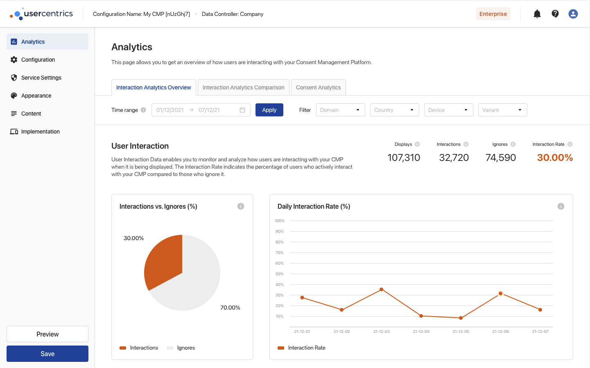

Use Interaction Analytics to get insights into how your users interact with the CMP. Keep track of important CMP KPIs to maximize data capture and study how your CMP configuration choices impact user behaviour.

