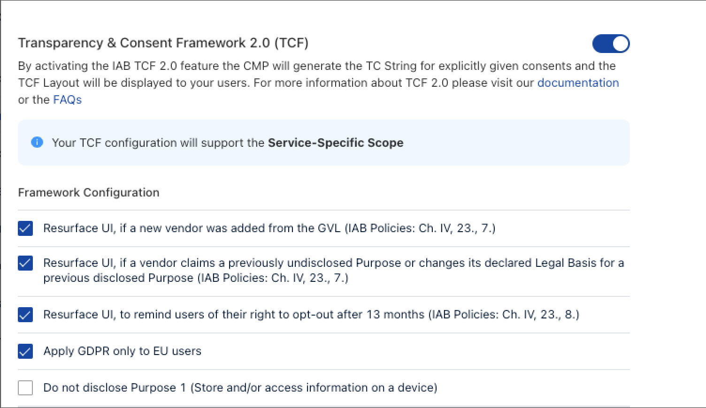

# Configure TCF 2.2 Framework Settings

To use TCF 2.2 enable the framework in the Admin Interface under “Configuration” / “Legal Specifications”.

Once the framework is activated, you are able to define any settings related to the Framework Configuration, including different Resurfacing options for the UI.

Additionally you are able to not disclose purpose 1.

