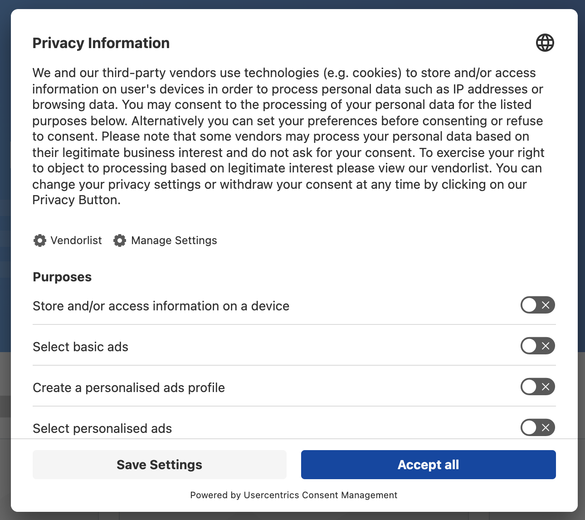
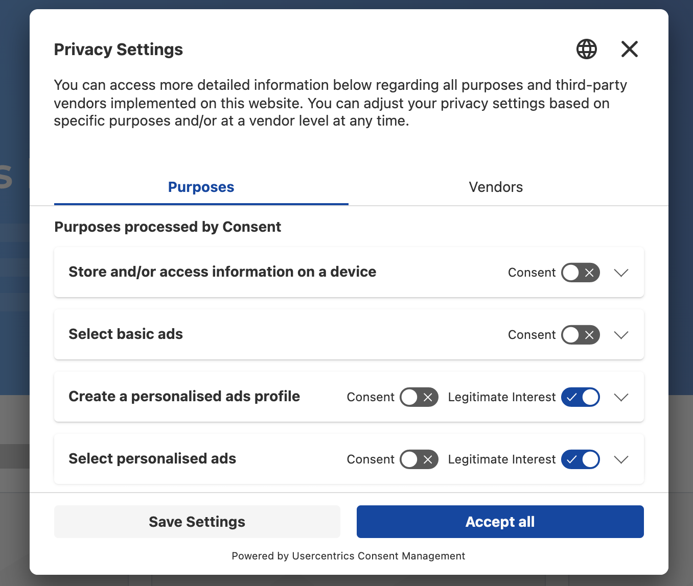
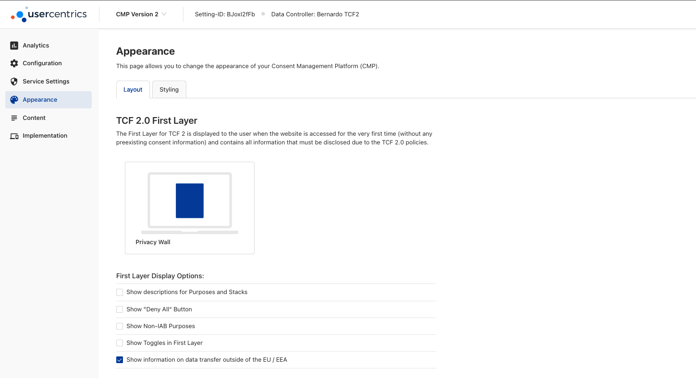
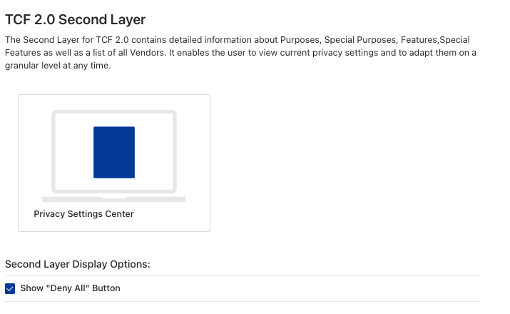
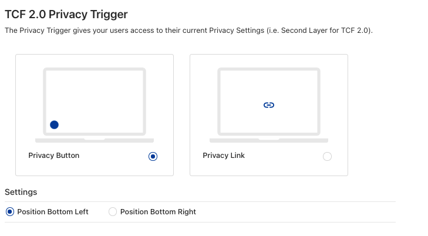
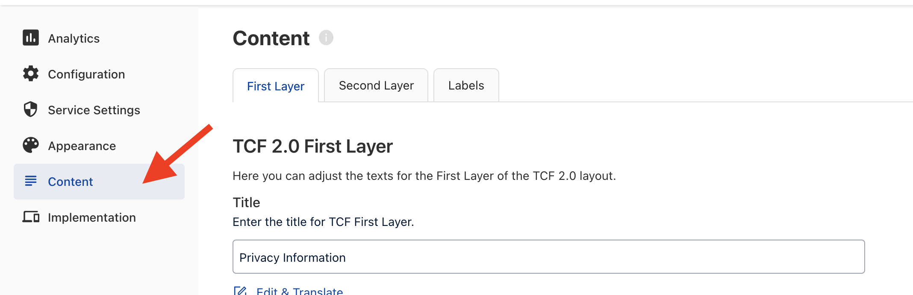

# Configure the Design / Layout

=== "The CMP UI"
    The first layer contains all the textual information required by the framework, as well as the list of purposes that apply to the vendors you configured. The user may choose on this first layer to opt in/out of certain purposes or go to the second layer to view more details.

    

    The second layer gives users details about the enabled vendors and purposes. On this layer the user has more detailed opt in/out options.

    

    You also have the choice to decide how you want to give your users access to their current Privacy Settings - via Privacy Button or Privacy Link. 

    The CMP UI is customisable and you may choose for example your background color, an overlay, fonts, headlines, logo and individual toggle and button colours.

=== "Layout"

    Under the “Appearance” → “Layout” section you may choose your layout options.

    In the "Layout" section you are able to edit what options do you want to show in each layer and also how you want to show Privacy Trigger.

    For the First Layer, you are able to display the following options:

    

    * Show Descriptions for Purposes and Stacks,
    * Show the "Deny All" Button,
    * Show Non-IAB Purposes,
    * Show Toggles in First Layer, and
    * Show information on data transfer outside of the EU / EEA

    For the Second Layer, you can choose to display the "Deny All" button:

    

    For the Privacy Trigger, we offer two choices for the layout:

    

    * Privacy Button, where you can choose to render it on Bottom Left or Bottom Right
    * Privacy Link

=== "Styling"

    Under the “Appearance” → “Styling” section you may choose your styling options.

    In the Styling section, you are presented with a significant number of options to stylize your CMP:

    * **Layout**: You can decide to choose the colors of your CMP (Background, Text, Tabs and Links). Further you can define how round the corners of the CMP will be and activate a background shadow and overlay.
    * **Logo**: You can display your own logo in the CMP,
    * **Font**: You can decide if you want to use one of the system defined fonts in the CMP or if you want to use a custom font for the CMP.
    * **Buttons**: You can define the colors of each different button and the corner radius.
    * **Toggles**: You can define the colors for each state of a toggle, whether is active, inactive or disabled.
    * **Privacy Trigger**: You can define style changes to the icon, where you can choose one of our system defined icons or if you want to use a custom icon. Additionally it is possible to set the color and size of the button for both desktop and mobile.

=== "Content"

    The CMP also offers customisation options under the “Content” section. Some texts must remain as provided due to TCF 2.2 requirements and can not be edited.

    

    Following are the customisable elements:

    * Layer titels
    * Additional banner messages
    * Data transfer outside of the EU / EEA message
    * Resurface Description for Web
    * Resurface Description for App
    * Imprint link URL
    * Privacy policy URL
    * Privacy policy link text
    * Button labels

