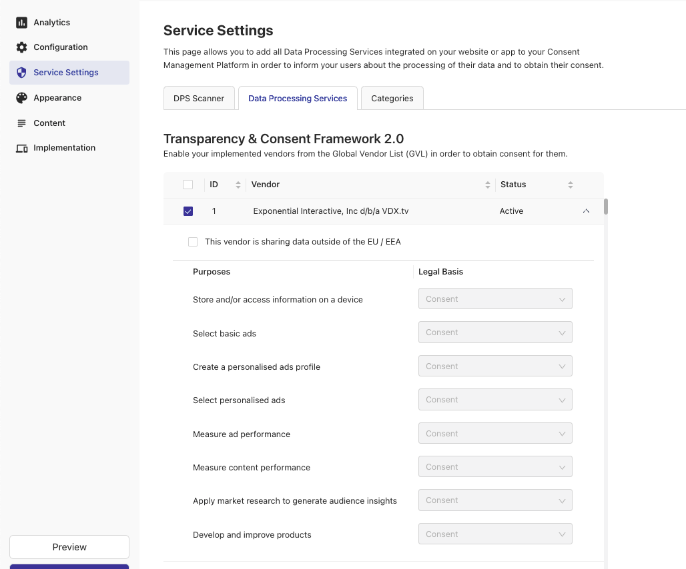
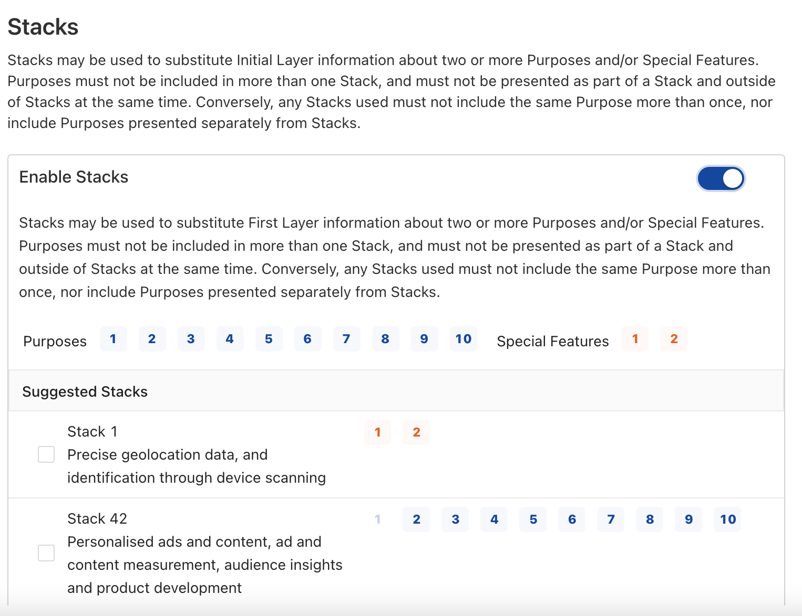
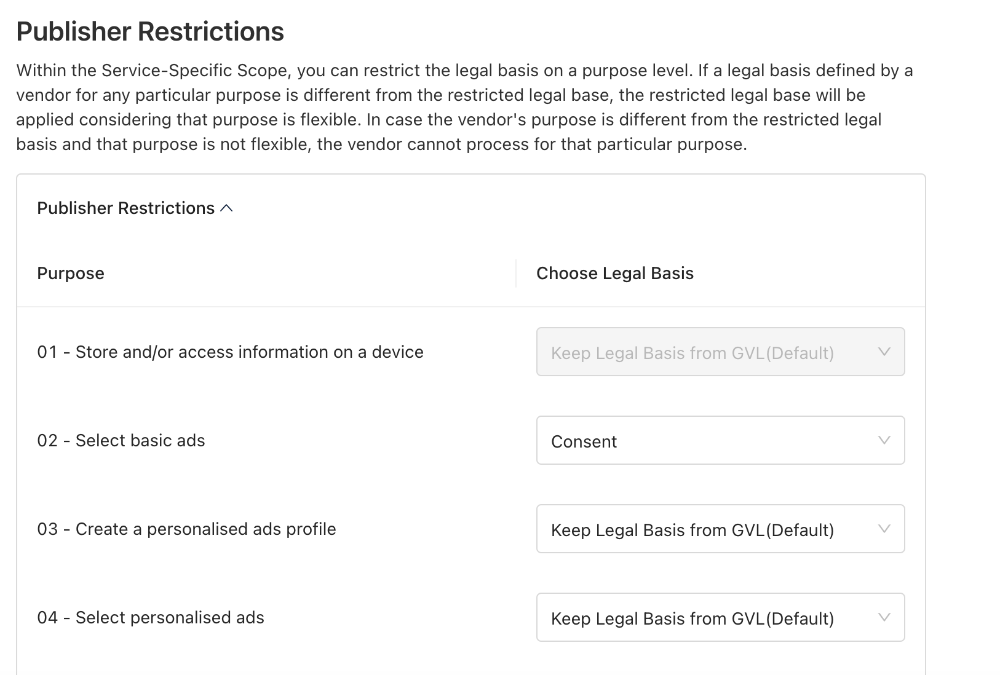
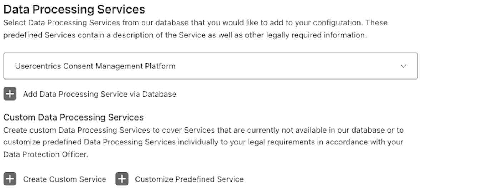

# Configure the Vendors

## Global Vendor List (GVL)

Under “Service Settings” you can configure the vendors or Data Processing Services you are using on your site. The list shown under “Transparency & Consent Framework 2.0” contains the vendors of the IAB GVL. The CMP automatically manages updates to that list. The list of available vendors is provided by the IAB and vendor information must be used as it is.

By checking the box on the left of each vendor, you can activate the vendor. This means the user will be informed in the CMP banners that you are using this vendor on your site. You can deactivate the vendor at any time by unchecking the same checkbox.

 
!!! note "Data Transfer Outside of EU/EEA"
    Inside each vendor, you can specify if the vendor is transferring data outside the EU / EEA”. The information will be displayed inside the respective vendor on the second layer of the CMP. 

***

## Stacks

Stacks are combinations of Purposes and/or Special Features of processing personal data used by the participants in the Framework.

These stacks may be used to substitute Initial Layer information about two or more Purposes and/or Special Features.

!!! note "Important"
    Purposes must not be included in more than one stack and must not be presented as part of a Stack and outside of Stacks at the same time.

!!! note ""
    Conversely, any stacks used must not include the same Purpose more than once, nor Purposes should be presented separately from stacks.

***

## Publisher Restrictions
TCF 2.2 allows you to signal restrictions on how the vendors may process personal data. It is possible to either restrict the purposes for which personal data is processed or specify the legal basis for vendors that signaled flexibility on the legal basis in the Global Vendor List.

Once a purpose has been restricted in the Admin Interface, a vendor must respect the restriction signal that disallows the processing for the specific purpose regardless of whether or not they have declared that purpose to be flexible.

!!! note "Behaviour for flexible purposes"
    In the case that a vendor declared a purpose with a default legal basis (consent or legitimate interest) but also declared this purpose as flexible, the legal basis restriction must be respected if set in the Admin Interface. That means for example if a vendor declared a purpose as legitimate interest but also declared that purpose to be flexible and the legal basis was restricted to consent, the vendor must check for the consent signal and must not apply the legitimate interest signal.

!!! hint "Disable legitimate interest"
    In case you want to disable legitimate interest for your TCF 2.2 CMP, you need to restrict all purposes to consent in the Admin Interface.

***

## Non-IAB Vendors

The configuration of non-IAB vendors works the usual way. You may define the service categories and choose from our list of fully prepared services or define your own custom services. There is nothing TCF 2.2 specific to consider with the configuration of the non-IAB services.

