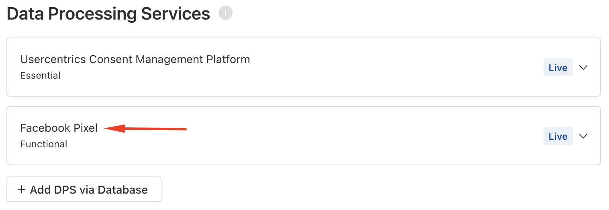

# Browser UI integration

## Add the JavaScript Tag 
To get started, simply add the Usercentrics script to the `<head>` section of your website, making sure it comes before any third-party scripts that require user consent.

If you're using a Geolocation Ruleset (specifically a Ruleset-ID instead of a Settings-ID), just replace the data-settings-id with data-ruleset-id. You can learn more about Geolocation Rules [here](/web/features/geolocation/rulesets).

=== "Settings-ID"
    ```html title="Settings-ID Javascript tag"
    <script
        id="usercentrics-cmp"
        data-settings-id="YOUR_SETTINGS_ID"
        src="https://web.cmp.usercentrics.eu/ui/loader.js"
    >
    </script>
    ```
=== "Ruleset-ID"
    ```html title="Ruleset-ID Javascript tag"
    <script
        id="usercentrics-cmp"
        data-ruleset-id="YOUR_RULESET_ID"
        src="https://web.cmp.usercentrics.eu/ui/loader.js"
    >
    </script>
    ```

!!! note 
    You can find the script implementation with the Settings-ID for your specific account in the [Usercentrics Admin Interface](https://admin.usercentrics.eu/), within the **Implementation** section.

<!-- You can refine your script with the following list, or you can use the default one already provided below.

??? "Script Properties"
    - [ ] Avoid Prefetch Services (data-avoid-prefetch-services)
    - [ ] Block Data Layer Push (data-block-data-layer-push)
    - [ ] Add ControllerId (data-controller-id)
    - [ ] Disable Server Consents (data-disable-server-consents) 
    - [ ] Disable Tracking (data-disable-tracking)
    - [ ] EU Mode (data-eu-mode)
    - [ ] Specify language (data-language)
    - [ ] Enable TCF (data-tcf-enabled)
    - [ ] Nonce (nonce)

!!! note ""
    Please note that some of the properties bellow need to be set, for example, selecting Specify Language, you will need to input your desired language. -->

!!! warning "Using The Transparency & Consent Framework (TCF)"
    If you are using TCF, please go through the configuration for TCF 2.2 before implementing the script tag on your website. Read more [here](../features/tcf2/configure-tcf-2-framework-settings).

## Adjust third-party scripts

After successfully integrating the Usercentrics script into your website, you will need to make two specific adjustments to all third-party scripts that rely on consent for implementation.

### 1. Change the script type

First, modify the `type` attribute on all scripts that necessitate consent, changing it from `type="text/javascript"` to `type="text/plain"`. This adjustment ensures that these scripts do not execute upon the page's initial load.

Additionally, if certain third-party scripts lack an explicit `type="text/javascript"` attribute, it's essential to include `type="text/plain"` to prevent their execution by default within the browser.

### 2. Assign a data attribute

Furthermore, each third-party script must be assigned a custom `data-usercentrics` attribute. This attribute serves the purpose of associating the script with the services you create in the [Usercentrics Admin Interface](https://admin.usercentrics.eu/).

The syntax for this data attribute is `data-usercentrics="Name of Data Processing Service"` where "Name of Data Processing Service" should precisely match the name of the Data Processing Service you've defined.

!!! info "Illustration - Example of Data Processing Service in Admin Interface"
    <figure>
        
    </figure>

!!! warning "Case sensitivity"
    Please ensure strict attention to uppercase and lowercase distinctions, as well as the presence of spaces within these service names, as the CMP takes all of these nuances into account.

#### Example

For illustrative purposes, here is how to modify the Facebook Pixel script.

=== "Before adjustments"
    ``` html
    <!-- Facebook Pixel Code -->
    <script>
        !function(f,b,e,v,n,t,s)
        {if(f.fbq)return;n=f.fbq=function(){n.callMethod?
        n.callMethod.apply(n,arguments):n.queue.push(arguments)};
        if(!f._fbq)f._fbq=n;n.push=n;n.loaded=!0;n.version='2.0';
        n.queue=[];t=b.createElement(e);t.async=!0;
        t.src=v;s=b.getElementsByTagName(e)[0];
        s.parentNode.insertBefore(t,s)}(window, document,'script',
        'https://connect.facebook.net/en_US/fbevents.js');
        fbq('init', '{your-pixel-id-goes-here}');
        fbq('track', 'PageView');
    </script>
    <!-- End Facebook Pixel Code -->
    ```

=== "After adjustments"
    ``` html
    <!-- Facebook Pixel Code -->
    <script type="text/plain" data-usercentrics="Facebook Pixel">
        !function(f,b,e,v,n,t,s)
        {if(f.fbq)return;n=f.fbq=function(){n.callMethod?
        n.callMethod.apply(n,arguments):n.queue.push(arguments)};
        if(!f._fbq)f._fbq=n;n.push=n;n.loaded=!0;n.version='2.0';
        n.queue=[];t=b.createElement(e);t.async=!0;
        t.src=v;s=b.getElementsByTagName(e)[0];
        s.parentNode.insertBefore(t,s)}(window, document,'script',
        'https://connect.facebook.net/en_US/fbevents.js');
        fbq('init', '{your-pixel-id-goes-here}');
        fbq('track', 'PageView');
    </script>
    <!-- End Facebook Pixel Code -->
    ```

After these modifications, the Facebook Pixel script will only run on page load if it has received the necessary consent.

!!! note "When consent is withdrawn"
    In the event that a user withdraws their consent after a service has already been loaded, it is crucial to deactivate or stop the use of that service. One approach to achieve this is to initiate a page reload, effectively halting the execution of third-party scripts that lack consent.

### Scripts that require a specific type

In certain cases, scripts may require a different type attribute than `"text/javascript"`. To accommodate such scripts, an additional JavaScript wrapper can be employed to integrate them into your webpage. This wrapper must then be adjusted following the steps outlined in the [Adjust existing scripts](#adjust-existing-scripts) section, and also include the relevant data attribute for your data processing service to enable or disable it through the CMP.

For instance, a scenario may arise where a third-party script must be configured with `type="module"` for proper execution. If this specific configuration is necessary, the following is an example of how to implement the JavaScript wrapper, which allows you to work with such a service:

#### Example

``` html
<script type="text/plain" data-usercentrics="Name Data Processing Service">
    var customScript = document.createElement('script');
    customScript.src = 'your source'; // Add source to your script
    customScript.type = 'module'; // Add type of your script
    document.head.appendChild(customScript); // or document.body.appendChild(customScript);
</script>
```